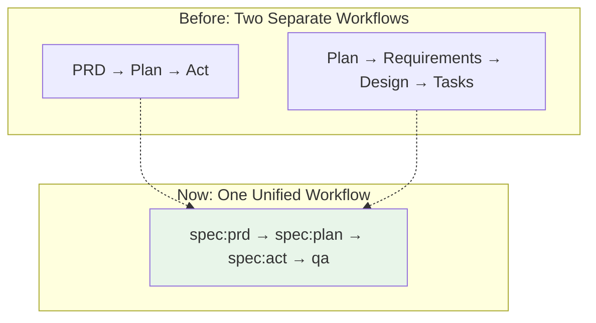

# Migration Summary: Unified Spec-Driven Methodology

## Quick Migration Guide

### What's Changed?

Your familiar commands have been **enhanced**, not replaced:

| What You Type | What Happens Now | What's New |
|---------------|------------------|------------|
| `/prd` | Runs `/spec:prd` | + EARS format<br>+ Approval gates |
| `/plan` | Runs `/spec:plan` | + Risk assessment<br>+ Design patterns |
| `/act` | Runs `/spec:act` | + Task breakdown<br>+ TDD structure |
| `/qa` | No change | Already perfect! |

### For Teams Using PRD-Plan-Act

**Good news**: Keep working exactly as before! Your commands are now enhanced with:
- More structured requirements (EARS format)
- Explicit approval checkpoints
- Better task organization
- Optional security analysis

**Migration effort**: Zero. Just keep using your commands.

### For Teams Using Original Spec-Driven

**What's better**: Business context is now integrated:
- PRDs include your requirements format
- User stories are part of the flow
- Less rigid, more practical
- Same approval gates you love

**Migration path**: Start using `/spec:prd` instead of separate requirements.

## Visual Comparison



## Examples

### Simple Feature (No Change!)
```bash
# This still works exactly as before
/prd blog tags
/plan blog  
/act
/qa
```

### Complex Feature (Enhanced!)
```bash
# Now with optional enhancements
/prd payment stripe-integration    # Now includes EARS requirements
/plan payment                       # Now includes risk assessment
/spec:advanced                      # NEW: Add security analysis
/act                               # Now with structured tasks
/qa
```

## Benefits Without Learning Curve

1. **Zero Breaking Changes**: All your muscle memory still works
2. **Gradual Enhancement**: Adopt new features when ready
3. **Better Documentation**: Automatic EARS format improves clarity
4. **Quality Gates**: Catch issues earlier with approval checkpoints
5. **Flexible Process**: Use what you need, skip what you don't

## FAQ

**Q: Do I need to learn EARS format?**
A: No! It's automatically applied when you use `/prd`. You'll see examples and learn naturally.

**Q: What about my existing PRDs?**
A: They're still valid! Enhance them gradually as needed.

**Q: Can I skip approval gates?**
A: Yes, they're checkpoints for review. Move fast when confident.

**Q: Is this more complex?**
A: No, it's the same flow with better structure. Complexity is optional.

## One Command to Remember

If you remember nothing else:
```bash
/spec:help
```
This shows all available commands and guides you through the process.

## Next Steps

1. **Keep Working**: Use your normal commands
2. **Notice Improvements**: See the enhanced outputs
3. **Explore When Ready**: Try `/spec:advanced` for complex features
4. **Ask Questions**: The methodology guides itself

Welcome to unified development - same commands, better results!