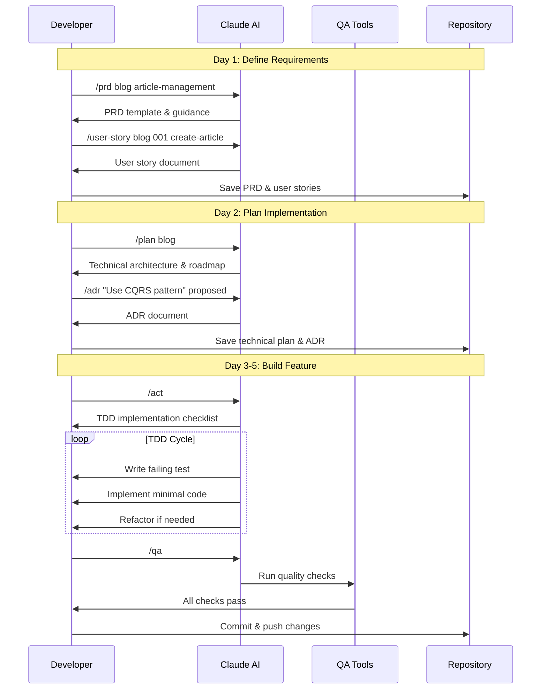

# Claude Commands for AI Workflows

## Overview
These commands help structure your AI-assisted development using the PRD → Plan → Act → QA workflow.

## Core Workflow Commands

### `/prd [context-name] [feature-name]`
Start a new feature by creating a Product Requirements Document.

**Example:**
```
/prd blog article-management
```

**What it does:**
- Creates comprehensive PRD structure
- Integrates with user stories
- Defines acceptance criteria
- Sets up context directory

### `/plan [context-name]`
Create technical implementation plan based on the PRD.

**Example:**
```
/plan blog
```

**What it does:**
- Analyzes existing PRD
- Designs technical architecture
- Updates user stories with technical specs
- Creates implementation roadmap

### `/act`
Begin TDD implementation with checklist.

**Example:**
```
/act
```

**What it does:**
- Enforces Red-Green-Refactor cycle
- Provides implementation checklist
- Tracks progress with TODOs
- Ensures test-first development

### `/qa [action] [tool]`
Run quality checks and fixes.

**Example:**
```
/qa          # Run all checks
/qa fix      # Fix all fixable issues
/qa check ecs # Check specific tool
```

**What it does:**
- Runs code quality tools
- Auto-fixes style issues
- Validates code standards
- Ensures PR readiness

## Support Commands

### `/user-story [context] [id] [title]`
Create detailed user stories.

**Example:**
```
/user-story blog 001 create-article
```

**What it does:**
- Creates comprehensive user story
- Links to PRD and technical plan
- Defines acceptance criteria
- Generates test scenarios

### `/adr [title] [status]`
Document architecture decisions.

**Example:**
```
/adr "Use CQRS pattern" accepted
```

**What it does:**
- Creates ADR document
- Documents decision rationale
- Lists alternatives considered
- Tracks decision status

### `/workflow-help`
Show workflow guidance.

### `/workflow-status`
Check current project status.

## Workflow Example



```bash
# Day 1: Define what to build
/prd blog article-management
/user-story blog 001 create-article

# Day 2: Plan the implementation
/plan blog
/adr "Use CQRS pattern" proposed

# Day 3-5: Build the feature
/act
# Implement with TDD approach

# Run quality checks
/qa

# Check progress anytime
/workflow-status
```

## Tips for Effective Use

1. **Be Specific**: The more detail in PRD, the better the plan
2. **Iterate**: Plans can be refined as you learn
3. **Document**: Capture decisions and rationale
4. **Review**: Always review AI suggestions critically

## Integration with TodoWrite

All commands automatically manage TODOs:

```bash
# /prd creates requirement todos
# /plan creates technical todos
# /act tracks implementation progress
# /qa validates completion
```

## Workflow Patterns

### Full Feature Development
```bash
/prd → /plan → /user-story → /act → /qa → /adr
```

### Quick Fix
```bash
/act → /qa
```

### Architecture Planning
```bash
/plan → /adr
```

## Getting Help

```bash
/workflow-help
# Shows available commands and workflow

/workflow-status
# Shows current progress and active tasks
```

## Best Practices

1. **Context-Driven**: Always specify context (blog, security, etc.)
2. **Test-First**: Use `/act` for strict TDD approach
3. **Document Decisions**: Use `/adr` for important choices
4. **Quality Gates**: Always run `/qa` before committing
5. **Incremental Progress**: Break work into user stories