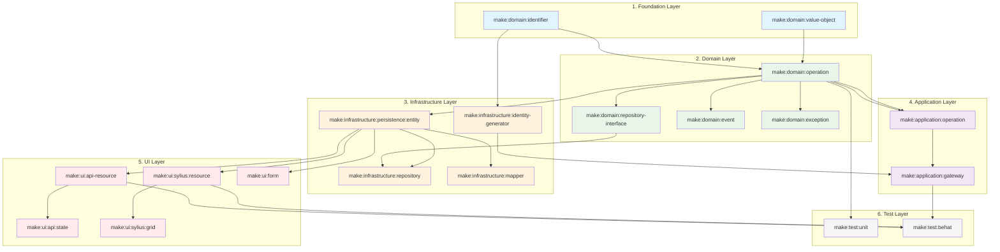

# Maker Dependencies Diagram

## Overview

This diagram shows the dependencies between different Makers and the order in which they should be executed for a complete feature generation.

## Dependencies Flow



## Execution Order for Complete Feature

### Basic CRUD Feature
1. `make:domain:identifier` - Create ID value object
2. `make:domain:value-object` - Create other value objects
3. `make:domain:operation` - Create domain operation (Creator, Updater, etc.)
4. `make:infrastructure:persistence:entity` - Create Doctrine entity
5. `make:infrastructure:repository` - Create repository implementation
6. `make:infrastructure:identity-generator` - Create ID generator
7. `make:application:operation` - Create Command/Query and Handler
8. `make:application:gateway` - Create Gateway with middleware
9. `make:ui:api-resource` - Create API resource
10. `make:ui:api:state` - Create state provider/processor
11. `make:test:behat` - Create Behat tests

### Complex Operations (Review, Publish, etc.)
1. Start with basic CRUD operations
2. Compose multiple operations:
   - Use READ operation as base for data retrieval
   - Use UPDATE operation as base for state changes
   - Add specific business logic
3. Create specific events and exceptions
4. Modify generated code to match business requirements
5. Update templates based on modifications

## Dependency Rules

### Must Have Before Creating
- **Domain Operation**: Needs identifier and value objects
- **Infrastructure Repository**: Needs domain repository interface and entity
- **Application Gateway**: Needs domain operation and identity generator
- **UI Resources**: Needs infrastructure entity
- **Tests**: Needs the layer being tested

### Can Be Created Independently
- Value Objects
- Events
- Exceptions
- Mappers (after entity exists)
- Forms

## Composite Maker Sequence

### make:ddd:feature
```
1. Analyze requirements
2. Create identifiers and value objects
3. Generate domain operations
4. Create infrastructure layer
5. Generate application layer
6. Create UI layer
7. Generate tests
8. Run QA checks
```

### make:ddd:workflow
```
1. Identify base operations needed
2. Generate base operations
3. Compose into workflow
4. Add workflow-specific events
5. Create state transitions
6. Generate tests for workflow
```

## Notes

- Each arrow represents a dependency
- Colors represent architectural layers
- Some makers can be run in parallel if no dependencies exist
- Always validate generation with QA tools after each step