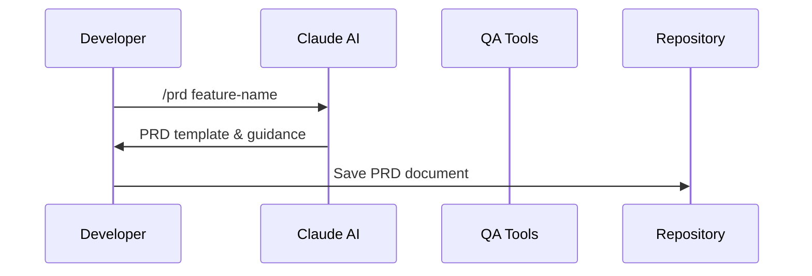
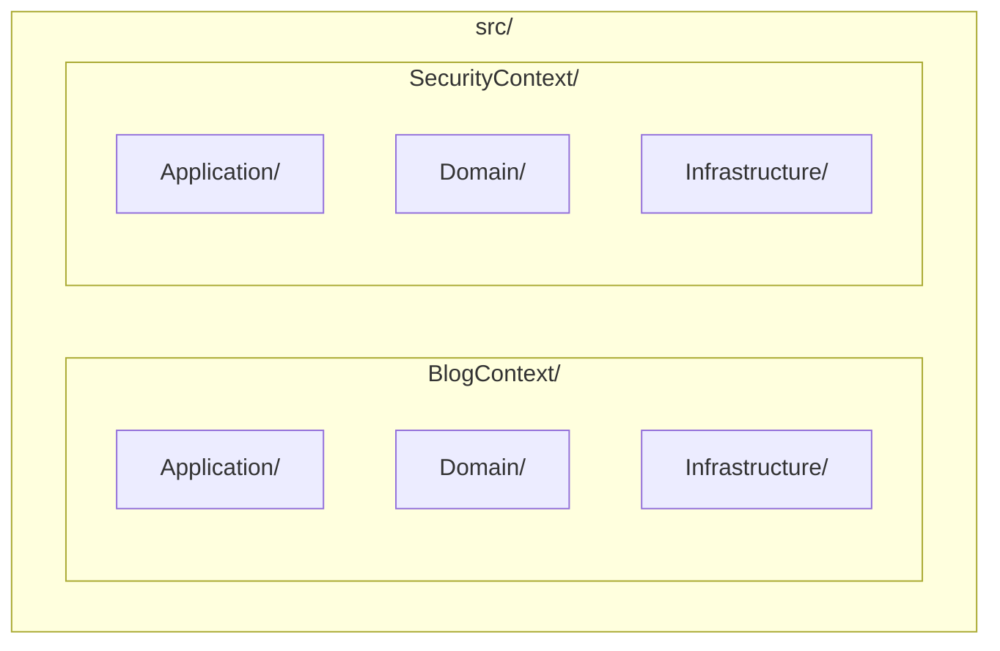
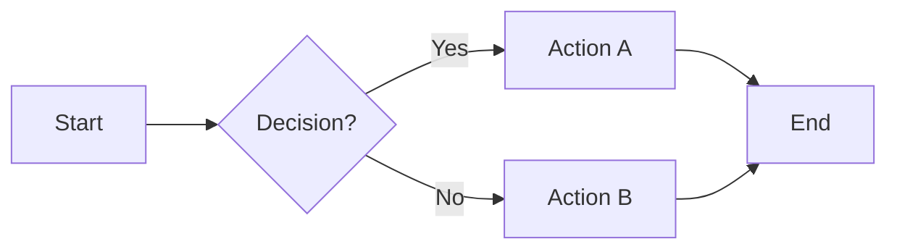
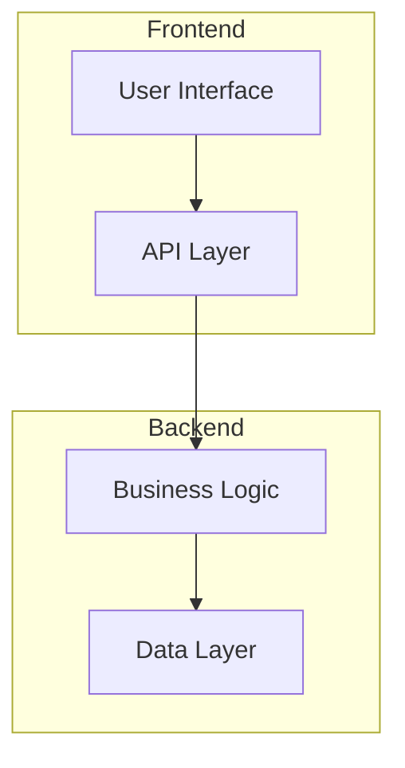

# Mermaid Diagrams Guide for Documentation

## Overview

This guide documents the Mermaid diagrams used throughout the project documentation to improve navigation and understanding of complex systems.

## Available Diagram Types

### 1. Workflow Diagrams

#### Command Workflow (workflow-help.md)
Shows the iterative PRD → Plan → Act → Report cycle with detailed breakdowns.

```mermaid
graph LR
    A[🎯 PRD<br/>Define] --> B[📋 Plan<br/>Design]
    B --> C[⚡ Act<br/>Build]
    C --> D[📊 Report<br/>Improve]
    D --> A
```



#### Development Sequence (claude-commands.md)
Illustrates the interaction between developer, AI, tools, and repository across development phases.



### 2. Architecture Diagrams

#### Documentation Structure (docs/README.md)
Visual representation of the docs/ directory structure with color-coded sections.

```mermaid
graph TD
    docs[📁 docs/] --> agent[🤖 agent/]
    docs --> architecture[🏗️ architecture/]
    docs --> examples[💡 examples/]
    docs --> plan[📋 plan/]
    docs --> prd[🎯 prd/]
    docs --> reference[📚 reference/]
```



#### Bounded Context Architecture (architecture.md)
Shows the relationship between different contexts and layers in the DDD structure.



## Diagram Conventions

### Color Coding

- **Blue (#e1f5fe)**: Shared/Infrastructure components
- **Purple (#f3e5f5)**: Infrastructure layer
- **Green (#e8f5e8)**: Domain layer  
- **Orange (#fff3e0)**: Application layer
- **Light Green (#f1f8e9)**: Plans/Technical docs
- **Pink (#fce4ec)**: PRD/Requirements

### Icons Used

- 🎯 Requirements/Goals
- 📋 Planning/Lists
- ⚡ Action/Implementation
- 📊 Analysis/Reports
- 🤖 AI/Automation
- 🏗️ Architecture
- 💡 Examples
- 📚 Reference/Documentation
- 📁 Directories/Structure
- ❌ Errors/Issues
- 🔄 Workflows/Processes

### Node Styling

```mermaid
graph TD
    A[Standard Node]
    B[🎯 Icon Node<br/>Multi-line]
    
    style A fill:#e1f5fe
    style B fill:#f3e5f5,stroke:#333,stroke-width:2px
```



## Usage Guidelines

### When to Add Mermaid Diagrams

1. **Complex Relationships**: When text descriptions become unclear
2. **Process Flows**: Multi-step workflows or sequences
3. **Structure Visualization**: Directory trees, architecture layers
4. **Decision Trees**: Branching logic or conditional flows

### Best Practices

1. **Keep it Simple**: Don't overcomplicate diagrams
2. **Consistent Styling**: Use the established color scheme
3. **Meaningful Labels**: Use descriptive, concise labels
4. **Progressive Disclosure**: Show high-level first, details second
5. **Accessibility**: Include text alternatives alongside diagrams

### Maintenance

1. **Update with Changes**: Keep diagrams current with code/structure changes
2. **Review Clarity**: Regularly check if diagrams still aid understanding
3. **Tool Compatibility**: Ensure diagrams render in all target environments

## Implementation Examples

### Adding a New Workflow Diagram

```markdown
## Process Overview



Text explanation follows...
```

### Adding Architecture Visualization

```markdown
## System Architecture



Description of components...
```

## Tools and Rendering

### Supported Platforms

- **GitHub**: Native Mermaid support in markdown
- **GitLab**: Native Mermaid support
- **VS Code**: Mermaid preview extensions
- **Documentation Sites**: Most support Mermaid rendering

### Live Editing

- **Mermaid Live Editor**: https://mermaid.live/
- **VS Code Extensions**: Mermaid Preview, Markdown Preview Enhanced
- **Online Tools**: Draw.io, Lucidchart (with export)

## Future Enhancements

### Planned Additions

1. **Gateway Flow Diagrams**: Visualize middleware pipelines
2. **CQRS Interaction Maps**: Command/Query flow visualization
3. **Event Flow Diagrams**: Domain event propagation
4. **Testing Strategy Maps**: Test coverage and dependencies

### Advanced Features

1. **Interactive Diagrams**: Clickable nodes with links
2. **Dynamic Diagrams**: Generated from code annotations
3. **Integration Flows**: Cross-system communication patterns

## Troubleshooting

### Common Issues

1. **Syntax Errors**: Use Mermaid Live Editor to validate
2. **Rendering Problems**: Check platform-specific limitations
3. **Layout Issues**: Adjust node positioning and styling

### Best Practices for Fixes

1. **Validate Syntax**: Always test in live editor first
2. **Fallback Content**: Include text descriptions
3. **Version Control**: Track diagram changes with meaningful commits

---

This guide helps maintain consistency and quality in our visual documentation approach using Mermaid diagrams.