# TDD Implementation Guide

## Overview

This guide provides a comprehensive approach to Test-Driven Development (TDD) implementation following the Red-Green-Refactor cycle with architecture-specific best practices.

## TDD Cycle Overview

```mermaid
graph LR
    A[🔴 RED<br/>Write Failing Test] --> B[🟢 GREEN<br/>Make Test Pass]
    B --> C[♻️ REFACTOR<br/>Improve Code]
    C --> A
    
    A1[Define Expected Behavior<br/>Test First] -.-> A
    B1[Minimal Implementation<br/>Just Enough Code] -.-> B
    C1[Clean Code<br/>Maintain Green Tests] -.-> C
```



## Implementation Phases

### Phase 1: 🔴 RED - Write a Failing Test

#### Objectives
1. **Define the expected behavior** - What should the code do?
2. **Write the test first** - Before any implementation
3. **Run the test** - Confirm it fails for the right reason
4. **Keep tests simple** - One behavior per test

#### Example: Domain Object Test
```php
final class ArticleTest extends TestCase
{
    public function testCreateArticleWithValidData(): void
    {
        // Arrange
        $id = new ArticleId('550e8400-e29b-41d4-a716-446655440000');
        $title = new Title('My Article Title');
        $content = new Content('Article content here');
        $status = ArticleStatus::DRAFT;
        
        // Act
        $article = new Article($id, $title, $content, $status);
        
        // Assert
        self::assertEquals($id, $article->id);
        self::assertEquals($title, $article->title);
        self::assertEquals($content, $article->content);
        self::assertEquals($status, $article->status);
        self::assertTrue($article->status->isDraft());
    }
}
```

### Phase 2: 🟢 GREEN - Make Test Pass

#### Objectives
1. **Write minimal code** - Just enough to make the test pass
2. **No extra features** - Don't anticipate future needs
3. **Fast feedback** - Get to green quickly
4. **Validate test** - Ensure it passes for the right reason

#### Example: Minimal Implementation
```php
final class Article
{
    public function __construct(
        public readonly ArticleId $id,
        public readonly Title $title,
        public readonly Content $content,
        public readonly ArticleStatus $status,
    ) {}
}
```

### Phase 3: ♻️ REFACTOR - Improve Code

#### Objectives
1. **Clean up the code** - Improve structure without changing behavior
2. **Maintain green tests** - All tests must continue to pass
3. **Apply patterns** - Use established architectural patterns
4. **Remove duplication** - DRY principle

#### Example: Add Domain Logic
```php
final class Article
{
    private array $domainEvents = [];

    public function __construct(
        public readonly ArticleId $id,
        public readonly Title $title,
        public readonly Content $content,
        public readonly ArticleStatus $status,
    ) {
        // Add domain logic after basic structure works
        $this->domainEvents[] = new ArticleCreated($this->id);
    }

    public function publish(): void
    {
        if (!$this->status->isDraft()) {
            throw new \DomainException('Only draft articles can be published');
        }
        
        $this->status = ArticleStatus::PUBLISHED;
        $this->domainEvents[] = new ArticlePublished($this->id);
    }

    public function getDomainEvents(): array
    {
        return $this->domainEvents;
    }
}
```

## TDD Best Practices

### Test Structure

#### Arrange-Act-Assert Pattern
```php
public function testSomeBehavior(): void
{
    // Arrange - Set up test data and dependencies
    $dependency = $this->createMock(SomeInterface::class);
    $service = new SomeService($dependency);
    
    // Act - Execute the behavior being tested
    $result = $service->doSomething();
    
    // Assert - Verify the expected outcome
    self::assertTrue($result->isValid());
}
```

#### Test Naming Convention
```php
// Pattern: test[MethodName][Scenario][ExpectedBehavior]
public function testCreateArticle_WithValidData_ReturnsArticleInstance(): void
public function testCreateArticle_WithInvalidTitle_ThrowsException(): void
public function testPublishArticle_WhenDraft_ChangesStatusToPublished(): void
public function testPublishArticle_WhenAlreadyPublished_ThrowsDomainException(): void
```

### Architecture-Specific TDD

#### Domain Layer Testing
```php
// Test domain objects in isolation
final class ArticleTest extends TestCase
{
    public function testArticleCreation(): void
    {
        // No mocks needed - pure domain logic
        $article = new Article(
            new ArticleId('uuid-here'),
            new Title('Test Article'),
            new Content('Test content'),
            ArticleStatus::DRAFT
        );
        
        self::assertTrue($article->status->isDraft());
    }
}
```

#### Application Layer Testing
```php
// Test use cases with mocked dependencies
final class CreateArticleHandlerTest extends TestCase
{
    public function testHandleCreateArticleCommand(): void
    {
        // Arrange
        $repository = $this->createMock(ArticleRepositoryInterface::class);
        $generator = $this->createMock(GeneratorInterface::class);
        $handler = new CreateArticleHandler($repository, $generator);
        
        $command = new CreateArticleCommand('Title', 'Content');
        
        // Configure mocks
        $generator->expects(self::once())
            ->method('generate')
            ->willReturn('generated-uuid');
            
        $repository->expects(self::once())
            ->method('save')
            ->with(self::isInstanceOf(Article::class));
        
        // Act
        $result = $handler($command);
        
        // Assert
        self::assertInstanceOf(Article::class, $result);
    }
}
```

#### Infrastructure Layer Testing
```php
// Integration tests with real dependencies
final class DoctrineArticleRepositoryTest extends TestCase
{
    use RefreshDatabaseTrait;
    
    public function testSaveAndRetrieveArticle(): void
    {
        // Arrange
        $repository = self::getContainer()->get(ArticleRepositoryInterface::class);
        $article = new Article(
            new ArticleId('uuid-here'),
            new Title('Test Article'),
            new Content('Test content'),
            ArticleStatus::DRAFT
        );
        
        // Act
        $repository->save($article);
        $retrieved = $repository->findById(new ArticleId('uuid-here'));
        
        // Assert
        self::assertEquals($article->id, $retrieved->id);
        self::assertEquals($article->title, $retrieved->title);
    }
}
```

## TDD Implementation Workflow

### 1. Feature Planning
```bash
# Start with a plan
/plan

# Identify first testable unit
# Usually a domain object or value object
```

### 2. Test-First Development
```bash
# Create test directory structure mirroring src/
mkdir -p tests/BlogContext/Unit/Domain/CreateArticle/
mkdir -p tests/BlogContext/Integration/Infrastructure/

# Write first failing test
touch tests/BlogContext/Unit/Domain/CreateArticle/ArticleTest.php
```

### 3. TDD Cycle Execution
```bash
# 1. RED: Write failing test
vendor/bin/phpunit tests/BlogContext/Unit/Domain/CreateArticle/ArticleTest.php
# Expect: Test fails (class doesn't exist)

# 2. GREEN: Create minimal implementation
touch src/BlogContext/Domain/CreateArticle/Article.php
# Write minimal code to pass test

# 3. REFACTOR: Improve code structure
# Add domain logic, events, validation
# Ensure all tests still pass
```

### 4. Continuous Validation
```bash
# Run tests frequently
vendor/bin/phpunit

# Run quality checks
composer qa

# Commit when tests pass and QA is clean
```

## Testing Strategies by Layer

### Domain Layer
- **Pure unit tests** - No external dependencies
- **Fast execution** - No I/O operations
- **Comprehensive coverage** - Test all business rules
- **Value object validation** - Test edge cases

### Application Layer  
- **Mock external dependencies** - Focus on orchestration
- **Command/Query handlers** - Test business flow
- **Gateway testing** - Test middleware pipeline
- **Event emission** - Verify domain events

### Infrastructure Layer
- **Integration tests** - Real database, real services
- **Repository testing** - Actual persistence
- **Adapter testing** - External service integration
- **Configuration testing** - Service container setup

## Common TDD Patterns

### Test Data Builders
```php
final class ArticleTestBuilder
{
    private string $id = '550e8400-e29b-41d4-a716-446655440000';
    private string $title = 'Default Title';
    private string $content = 'Default content';
    private ArticleStatus $status = ArticleStatus::DRAFT;

    public static function create(): self
    {
        return new self();
    }

    public function withTitle(string $title): self
    {
        $this->title = $title;
        return $this;
    }

    public function withStatus(ArticleStatus $status): self
    {
        $this->status = $status;
        return $this;
    }

    public function build(): Article
    {
        return new Article(
            new ArticleId($this->id),
            new Title($this->title),
            new Content($this->content),
            $this->status
        );
    }
}

// Usage in tests
public function testArticleCreation(): void
{
    $article = ArticleTestBuilder::create()
        ->withTitle('Custom Title')
        ->withStatus(ArticleStatus::PUBLISHED)
        ->build();
        
    self::assertEquals('Custom Title', $article->title->getValue());
}
```

### Mock Configuration
```php
private function createMockRepository(): ArticleRepositoryInterface
{
    $repository = $this->createMock(ArticleRepositoryInterface::class);
    
    $repository->method('nextIdentity')
        ->willReturn(new ArticleId('generated-uuid'));
        
    $repository->method('save')
        ->willReturnCallback(function (Article $article) {
            // Simulate successful save
            return $article;
        });
        
    return $repository;
}
```

### Assertion Helpers
```php
private function assertDomainEventEmitted(Article $article, string $eventClass): void
{
    $events = $article->getDomainEvents();
    $eventFound = false;
    
    foreach ($events as $event) {
        if ($event instanceof $eventClass) {
            $eventFound = true;
            break;
        }
    }
    
    self::assertTrue($eventFound, "Expected event {$eventClass} was not emitted");
}
```

## Quality Gates

### Before Moving to Next Test
- [ ] Current test passes
- [ ] No existing tests broken
- [ ] Code follows architecture patterns
- [ ] No obvious code smells

### Before Refactoring
- [ ] All tests are green
- [ ] Test coverage is adequate
- [ ] Dependencies are properly injected
- [ ] Domain logic is in domain layer

### Before Committing
- [ ] All tests pass
- [ ] QA checks pass (ECS, PHPStan, etc.)
- [ ] Documentation updated if needed
- [ ] Git commit message follows semantic format

## TDD Anti-Patterns to Avoid

### ❌ Testing Implementation Details
```php
// Bad: Testing private methods
public function testPrivateCalculation(): void
{
    $reflection = new \ReflectionClass(Calculator::class);
    $method = $reflection->getMethod('privateCalculate');
    $method->setAccessible(true);
    
    // Don't do this
}
```

### ❌ Writing Tests After Implementation
```php
// Bad: Implementation-first approach
class SomeService
{
    public function doSomething(): void
    {
        // Implementation written first
    }
}

// Then writing test to match implementation
```

### ❌ Overly Complex Tests
```php
// Bad: Testing too many behaviors at once
public function testComplexScenario(): void
{
    // 50 lines of setup
    // Multiple assertions
    // Multiple behaviors tested
}
```

### ✅ Good TDD Practices
```php
// Good: Test behavior, not implementation
public function testCalculateTotal_WithMultipleItems_ReturnsSumOfPrices(): void
{
    $calculator = new PriceCalculator();
    $items = [
        new Item(10.00),
        new Item(20.00),
        new Item(5.50)
    ];
    
    $total = $calculator->calculateTotal($items);
    
    self::assertEquals(35.50, $total);
}
```

## Integration with Project Workflow

### With act Command
The `/act` command should:
1. Check for existing tests
2. Start TDD cycle automatically
3. Create failing test first
4. Guide through implementation
5. Run QA checks after each cycle

### With Architecture Patterns
- Follow domain-driven design principles
- Use established patterns from `docs/reference/`
- Maintain clean architecture boundaries
- Ensure proper dependency injection

### With Quality Tools
- Run PHPUnit after each TDD cycle
- Use ECS for code style consistency
- Apply PHPStan for type safety
- Leverage Rector for modernization

---

This guide ensures consistent, high-quality TDD implementation across the project while maintaining architectural integrity.