# Pattern Recognition Guide for AI Agents

## Overview

This guide prevents AI agents from creating inconsistent patterns by helping recognize and reuse existing architectural patterns in the codebase. It provides a systematic approach to pattern analysis before implementation.

## 🚨 Core Principle

**ALWAYS search for existing similar files before creating new components.** In a well-structured application like this one, there's a high probability that a similar pattern already exists.

## 🔍 Pattern Recognition Workflow

```mermaid
flowchart TD
    A["🎯 New Feature Required"] 
    --> B["🔍 Search for Similar Files"]
    B --> C{Files Found?}
    C -->|No| D["📋 Document New Pattern"]
    C -->|Yes| E["📊 Analyze Existing Patterns"]
    E --> F["🎨 Identify Pattern Categories"]
    F --> G["✅ Choose Best Model"]
    G --> H["🚀 Implement with Chosen Pattern"]
    D --> H
    
    style A fill:#e1f5fe
    style B fill:#fff3e0
    style E fill:#f3e5f5
    style G fill:#e8f5e9
    style H fill:#ffebee
```



## 🗺️ Gateway Request Pattern Map

Based on analysis of existing BlogContext Gateway Request classes:

```mermaid
graph TB
    subgraph "🎯 Gateway Request Patterns"
        A["Simple Pattern<br/>📁 GetArticle/Request.php"]
        B["Complex Pattern<br/>📁 CreateArticle/Request.php"]
        C["⚠️ WRONG Pattern<br/>❌ My Previous Implementation"]
    end
    
    subgraph "🔧 Pattern Characteristics"
        D["Basic ID validation<br/>✅ InvalidArgumentException<br/>🎯 Use for: ID-based operations"]
        E["Rich validation<br/>✅ Symfony Validator Attributes<br/>🎯 Use for: Complex forms"]
        F["Manual validation<br/>❌ GatewayException<br/>🚫 Don't create new patterns"]
    end
    
    A --> D
    B --> E
    C --> F
    
    style A fill:#e8f5e8
    style B fill:#e8f5e8
    style C fill:#ffebee
    style D fill:#e8f5e8
    style E fill:#e8f5e8
    style F fill:#ffebee
```



## 📋 Pattern Recognition Checklist

### Before Creating Any Component

- [ ] **Search command**: `find src/ -name "*Request.php" | head -10`
- [ ] **Analyze structure**: Read at least 3 similar files
- [ ] **Identify patterns**: Look for validation approaches
- [ ] **Choose model**: Pick the closest existing pattern
- [ ] **Verify consistency**: Ensure new code follows chosen pattern

### For Gateway Request Classes Specifically

- [ ] **Simple operations** (Get, Delete, Single ID) → Use `GetArticle/Request.php` pattern
- [ ] **Complex operations** (Create, Update, Multiple fields) → Use `CreateArticle/Request.php` pattern
- [ ] **Never create** hybrid validation patterns
- [ ] **Always use** existing exception types
- [ ] **Match signatures** of existing constructors and methods

## 🎯 Existing Pattern Analysis

### Pattern A: Simple Validation (GetArticle/Request.php)

**When to use**: Single ID operations, simple parameters

```php
final readonly class Request implements GatewayRequest
{
    public function __construct(
        public string $id,
    ) {}

    public static function fromData(array $data): self
    {
        if (empty($data['id'] ?? '')) {
            throw new \InvalidArgumentException('Article ID is required');
        }
        return new self($data['id']);
    }
}
```

**Characteristics**:
- ✅ Simple constructor
- ✅ Basic validation with `\InvalidArgumentException`
- ✅ Minimal complexity
- ✅ Direct error messages

### Pattern B: Complex Validation (CreateArticle/Request.php)

**When to use**: Multiple fields, business rules, form-like operations

```php
final readonly class Request implements GatewayRequest
{
    public function __construct(
        #[Assert\NotBlank(message: 'Title is required')]
        #[Assert\Length(min: 5, max: 200)]
        public string $title,
        // ... more fields with validation attributes
    ) {}

    public static function fromData(array $data): self
    {
        return new self(
            title: $data['title'] ?? throw new \InvalidArgumentException('Title is required'),
            // ... other fields
        );
    }
}
```

**Characteristics**:
- ✅ Symfony Validator attributes
- ✅ Rich validation with detailed constraints
- ✅ Business rule validation methods
- ✅ `\InvalidArgumentException` in `fromData()`

## ❌ Case Study: My Error with Review Operations

### What I Did Wrong

I created a **third pattern** that didn't exist in the codebase:

```php
// ❌ WRONG: Created inconsistent pattern
public static function fromData(array $data): self
{
    if ('' === $articleId) {
        throw new GatewayException('Article ID is required', 400, new \InvalidArgumentException(...));
    }
    // ... manual validation with HTTP codes
}
```

**Problems**:
1. **Inconsistent exception handling**: Used `GatewayException` instead of `\InvalidArgumentException`
2. **HTTP codes in business logic**: Added 400 status codes inappropriately
3. **Manual validation**: Reimplemented validation instead of using existing patterns
4. **Breaking changes**: Modified `GatewayException` constructor to fit new pattern

### What I Should Have Done

**For `SubmitForReview/Request.php`** (Simple: ID + optional author):
```php
// ✅ CORRECT: Follow GetArticle pattern
public static function fromData(array $data): self
{
    if (empty($data['articleId'] ?? '')) {
        throw new \InvalidArgumentException('Article ID is required');
    }
    return new self($data['articleId'], $data['authorId'] ?? null);
}
```

**For `ApproveArticle/Request.php`** and **`RejectArticle/Request.php`**:
```php
// ✅ CORRECT: Follow GetArticle pattern with additional validation
public static function fromData(array $data): self
{
    if (empty($data['articleId'] ?? '')) {
        throw new \InvalidArgumentException('Article ID is required');
    }
    if (empty($data['reviewerId'] ?? '')) {
        throw new \InvalidArgumentException('Reviewer ID is required');
    }
    // For reject: validate reason is provided
    return new self($data['articleId'], $data['reviewerId'], $data['reason'] ?? null);
}
```

## 🎯 Decision Matrix for Gateway Requests

| Operation Type | Complexity | Best Model | Exception Type |
|---------------|------------|------------|----------------|
| Get by ID | Simple | `GetArticle/Request.php` | `\InvalidArgumentException` |
| Delete by ID | Simple | `GetArticle/Request.php` | `\InvalidArgumentException` |
| Submit for Review | Simple | `GetArticle/Request.php` | `\InvalidArgumentException` |
| Approve/Reject | Simple+ | `GetArticle/Request.php` | `\InvalidArgumentException` |
| Create Article | Complex | `CreateArticle/Request.php` | Symfony Validator + `\InvalidArgumentException` |
| Update Article | Complex | `CreateArticle/Request.php` | Symfony Validator + `\InvalidArgumentException` |

## 🔧 Quick Commands for Pattern Discovery

### Find Gateway Requests
```bash
find src/ -path "*/Gateway/*/Request.php" | sort
```

### Analyze Exception Usage
```bash
grep -r "InvalidArgumentException" src/*/Application/Gateway/
grep -r "GatewayException" src/*/Application/Gateway/
```

### Check Validation Patterns
```bash
grep -r "Assert\\" src/*/Application/Gateway/*/Request.php
grep -r "fromData" src/*/Application/Gateway/*/Request.php
```

## 🚫 Anti-Patterns to Avoid

### 1. Creating New Exception Patterns
```php
// ❌ DON'T create new exception handling patterns
throw new GatewayException('Message', 400, new \InvalidArgumentException(...));

// ✅ DO use existing patterns
throw new \InvalidArgumentException('Message');
```

### 2. Mixing Validation Approaches
```php
// ❌ DON'T mix Symfony validation with manual validation
#[Assert\NotBlank]
public string $title;
// ... then manual validation in fromData()

// ✅ DO pick one approach consistently
```

### 3. Modifying Core Classes for New Patterns
```php
// ❌ DON'T modify GatewayException to fit new pattern
public function __construct(string $message, int $code, \Throwable $previous) // WRONG

// ✅ DO use existing constructor signature
public function __construct(string $message, \Exception $exception) // EXISTING
```

## 📝 Implementation Protocol

### Step 1: Pattern Discovery
1. **Identify the operation type** (Simple ID, Complex form, etc.)
2. **Search for similar operations** in the same context
3. **Analyze 2-3 existing files** of the same type
4. **Document the pattern** you'll follow

### Step 2: Pattern Application
1. **Copy the structure** from the chosen model
2. **Adapt field names** and validation rules
3. **Keep exception types** consistent
4. **Match method signatures** exactly

### Step 3: Pattern Validation
1. **Compare with model** side by side
2. **Verify exception consistency** across files
3. **Check method signatures** match patterns
4. **Test with existing patterns** to ensure compatibility

## 🎓 Learning from the Error

### Key Lessons

1. **Pattern recognition before implementation** prevents architectural inconsistency
2. **Exception handling patterns** are part of the architecture and shouldn't be modified
3. **Simple operations** should use simple patterns, not create complex ones
4. **When in doubt**, always choose the simpler existing pattern

### Questions to Ask

Before creating any Gateway Request:
- "What existing file is most similar to what I need?"
- "How do existing files handle validation for this type of operation?"
- "What exception types are used consistently?"
- "Can I adapt an existing pattern instead of creating a new one?"

## 🔄 Pattern Evolution

### When New Patterns Are Acceptable

1. **Business requirement** that doesn't fit existing patterns
2. **Architectural decision** documented and approved
3. **Consistent with** overall codebase principles
4. **Backward compatible** with existing patterns

### When to Stick to Existing Patterns

1. **Similar functionality** already exists
2. **Simple operations** that fit existing models
3. **Code consistency** is more important than minor optimizations
4. **Team familiarity** with established patterns

## 📚 References

- **Gateway Pattern Documentation**: `@docs/reference/gateway-pattern.md`
- **Existing Implementations**: `src/BlogContext/Application/Gateway/*/Request.php`
- **Validation Examples**: `src/BlogContext/Application/Gateway/CreateArticle/Request.php`
- **Simple Examples**: `src/BlogContext/Application/Gateway/GetArticle/Request.php`

## 🎯 Success Metrics

A successful pattern recognition and implementation:
- ✅ **Reuses existing validation approach**
- ✅ **Maintains exception consistency**
- ✅ **Follows established structure**
- ✅ **Doesn't require core class modifications**
- ✅ **Feels familiar** to developers who know existing patterns

Remember: **In a well-architected codebase, consistency is more valuable than individual optimizations.**