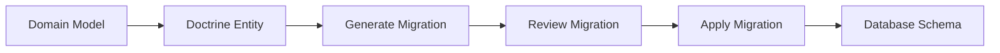

# Technical Architecture Plan - Blog Context

## Overview

This document provides the technical architecture and implementation plan for the Blog Context, based on the requirements defined in `docs/prd/blog-context.md`.

## Architecture Summary

**Approach**: Gradual Context Evolution - implementing each iteration as complete vertical slices
**Pattern**: Domain-Driven Design with Hexagonal Architecture
**Framework**: Symfony 7.3 with PHP 8.4+
**Message Bus**: CQRS with separate command and query buses

## System Context Analysis

### Existing Infrastructure
- **Gateway Pattern**: Already established with middleware support
- **Message Bus**: Command/Query buses with middleware
- **UUID Generation**: Symfony UID v7 implementation  
- **Quality Tools**: PHPStan, ECS, Rector, PHPUnit
- **Database**: Doctrine ORM with DBAL support

### BlogContext Autonomy
- **Self-Contained**: BlogContext is completely autonomous with its own user management
- **No External Dependencies**: No dependency on other contexts for core functionality
- **Blog Domain**: Complete new context to implement with internal author system

## Technical Architecture

### Directory Structure
```
src/BlogContext/
├── Application/           # Use cases and orchestration
│   ├── Operation/        # CQRS operations
│   │   ├── Command/      # Write operations (CQRS)
│   │   │   ├── CreateArticle/
│   │   │   ├── UpdateArticle/
│   │   │   ├── PublishArticle/
│   │   │   ├── SubmitForReview/    # Editorial workflow
│   │   │   ├── ApproveArticle/     # Editorial workflow
│   │   │   ├── SchedulePublication/
│   │   │   ├── CreateComment/      # Comment system
│   │   │   ├── ModerateComment/    # Comment moderation
│   │   │   ├── CreateCategory/     # Content organization
│   │   │   ├── TagArticle/         # Content organization
│   │   │   ├── UploadMedia/        # Media management
│   │   │   ├── TrackView/          # Analytics
│   │   │   └── ...
│   │   └── Query/        # Read operations (CQRS)
│   │       ├── GetArticle/
│   │       ├── ListArticles/
│   │       ├── SearchArticles/
│   │       ├── GetEditorialQueue/   # Editorial workflow
│   │       ├── GetEditorialCalendar/# Editorial calendar
│   │       ├── GetArticleComments/  # Comment system
│   │       ├── GetModerationQueue/  # Comment moderation
│   │       ├── GetCategoryTree/     # Content organization
│   │       ├── GetMediaLibrary/     # Media management
│   │       ├── GetContentAnalytics/ # Analytics
│   │       ├── GetAuthorPerformance/# Author analytics
│   │       └── ...
│   └── Gateway/          # Entry points with role-based interfaces
│       ├── Article/      # Article management
│       │   ├── CreateArticle/
│       │   │   ├── Gateway.php
│       │   │   ├── StandardRequest.php      # Standard user interface
│       │   │   ├── GuestContributorRequest.php # Simplified for guests
│       │   │   ├── Response.php
│       │   │   └── Middleware/
│       │   │       ├── RoleValidation.php   # Role-based validation
│       │   │       ├── SEOOptimization.php  # SEO middleware
│       │   │       ├── AnalyticsTracking.php# Analytics middleware
│       │   │       └── Processor.php
│       │   └── ...
│       ├── Editorial/    # Editorial workflow interfaces
│       │   ├── ReviewArticle/
│       │   ├── ManageEditorialQueue/
│       │   ├── ManageEditorialCalendar/
│       │   └── ...
│       ├── Comment/      # Comment system
│       │   ├── CreateComment/
│       │   ├── ModerateComment/
│       │   └── ...
│       ├── Media/        # Media management
│       │   ├── UploadMedia/
│       │   ├── ManageMediaLibrary/
│       │   └── ...
│       └── Analytics/    # Analytics and reporting
│           ├── GetContentAnalytics/
│           ├── GetAuthorPerformance/
│           └── ...
├── Domain/               # Pure business logic (organized by bounded aggregates)
│   ├── Article/          # Article aggregate
│   │   ├── CreateArticle/
│   │   │   ├── Creator.php                 # Entry point with __invoke
│   │   │   ├── DataPersister/
│   │   │   │   ├── Article.php             # Domain model
│   │   │   │   └── ArticleBuilder.php      # Factory to build Article
│   │   │   └── Exception/
│   │   │       ├── ArticleAlreadyExists.php
│   │   │       └── InvalidArticleData.php
│   │   ├── PublishArticle/
│   │   │   ├── Publisher.php               # Entry point with __invoke
│   │   │   ├── DataProvider/
│   │   │   │   └── ArticleForPublication.php # Read model for publication
│   │   │   └── Exception/
│   │   │       ├── ArticleNotFound.php
│   │   │       └── ArticleAlreadyPublished.php
│   │   ├── GetArticle/
│   │   │   ├── ArticleProvider.php         # Entry point with __invoke
│   │   │   ├── DataProvider/
│   │   │   │   └── ArticleView.php         # Read model with analytics
│   │   │   └── Exception/
│   │   │       └── ArticleNotFound.php
│   │   └── TrackView/
│   │       ├── ViewTracker.php             # Entry point with __invoke
│   │       ├── DataProvider/
│   │       │   └── ViewEvent.php           # Analytics event
│   │       └── Event/
│   │           └── ArticleViewed.php       # Domain event
│   ├── Editorial/        # Editorial workflow aggregate
│   │   ├── SubmitForReview/
│   │   │   ├── ReviewSubmitter.php         # Entry point with __invoke
│   │   │   ├── DataPersister/
│   │   │   │   └── EditorialReview.php     # Review workflow model
│   │   │   └── Event/
│   │   │       └── ArticleSubmittedForReview.php
│   │   ├── ApproveArticle/
│   │   │   ├── Approver.php                # Entry point with __invoke
│   │   │   ├── Event/
│   │   │   │   └── ArticleApproved.php
│   │   │   └── Exception/
│   │   │       └── ArticleNotInReview.php
│   │   ├── ManageEditorialCalendar/
│   │   │   ├── CalendarManager.php         # Entry point with __invoke
│   │   │   ├── DataProvider/
│   │   │   │   ├── EditorialCalendar.php   # Calendar view model
│   │   │   │   └── PublicationSchedule.php # Schedule item
│   │   │   └── Event/
│   │   │       └── ArticleScheduled.php
│   │   └── GetEditorialQueue/
│   │       ├── QueueProvider.php           # Entry point with __invoke
│   │       └── DataProvider/
│   │           └── EditorialQueueView.php  # Queue view model
│   ├── Comment/          # Comment system aggregate
│   │   ├── CreateComment/
│   │   │   ├── CommentCreator.php          # Entry point with __invoke
│   │   │   ├── DataPersister/
│   │   │   │   ├── Comment.php             # Comment domain model
│   │   │   │   └── CommentThread.php       # Threading support
│   │   │   ├── Event/
│   │   │   │   └── CommentCreated.php
│   │   │   └── Exception/
│   │   │       └── InvalidCommentData.php
│   │   ├── ModerateComment/
│   │   │   ├── CommentModerator.php        # Entry point with __invoke
│   │   │   ├── DataProvider/
│   │   │   │   └── ModerationDecision.php  # Moderation result
│   │   │   └── Event/
│   │   │       ├── CommentApproved.php
│   │   │       └── CommentRejected.php
│   │   └── GetModerationQueue/
│   │       ├── ModerationQueueProvider.php # Entry point with __invoke
│   │       └── DataProvider/
│   │           └── ModerationQueueView.php # Queue view model
│   ├── Organization/     # Content organization aggregate
│   │   ├── CreateCategory/
│   │   │   ├── CategoryCreator.php         # Entry point with __invoke
│   │   │   ├── DataPersister/
│   │   │   │   └── Category.php            # Category domain model
│   │   │   └── Event/
│   │   │       └── CategoryCreated.php
│   │   ├── TagArticle/
│   │   │   ├── ArticleTagger.php           # Entry point with __invoke
│   │   │   ├── DataPersister/
│   │   │   │   └── Tag.php                 # Tag domain model
│   │   │   └── Event/
│   │   │       └── ArticleTagged.php
│   │   └── GetCategoryTree/
│   │       ├── CategoryTreeProvider.php    # Entry point with __invoke
│   │       └── DataProvider/
│   │           └── CategoryTreeView.php    # Hierarchical view
│   ├── Media/            # Media management aggregate
│   │   ├── UploadMedia/
│   │   │   ├── MediaUploader.php           # Entry point with __invoke
│   │   │   ├── DataPersister/
│   │   │   │   ├── Media.php               # Media domain model
│   │   │   │   └── MediaOptimization.php   # Optimization metadata
│   │   │   └── Event/
│   │   │       └── MediaUploaded.php
│   │   └── GetMediaLibrary/
│   │       ├── MediaLibraryProvider.php    # Entry point with __invoke
│   │       └── DataProvider/
│   │           └── MediaLibraryView.php    # Library view model
│   ├── Analytics/        # Analytics aggregate
│   │   ├── GetContentAnalytics/
│   │   │   ├── AnalyticsProvider.php       # Entry point with __invoke
│   │   │   └── DataProvider/
│   │   │       ├── ContentAnalytics.php    # Content performance
│   │   │       └── AuthorPerformance.php   # Author metrics
│   │   └── TrackEngagement/
│   │       ├── EngagementTracker.php       # Entry point with __invoke
│   │       └── Event/
│   │           └── EngagementTracked.php
│   ├── Shared/           # Context shared components
│   │   ├── ValueObject/
│   │   │   ├── ArticleId.php           # Shared value object
│   │   │   ├── Title.php               # Shared value object
│   │   │   ├── Content.php             # Shared value object
│   │   │   ├── Slug.php                # Shared value object
│   │   │   ├── ArticleStatus.php       # Shared value object
│   │   │   ├── AuthorId.php            # Author identifier (internal)
│   │   │   ├── AuthorName.php          # Author name
│   │   │   ├── AuthorEmail.php         # Author email (internal)
│   │   │   ├── CommentId.php           # Comment identifier
│   │   │   ├── CategoryId.php          # Category identifier
│   │   │   ├── TagId.php               # Tag identifier
│   │   │   ├── MediaId.php             # Media identifier
│   │   │   ├── ViewCount.php           # Analytics value object
│   │   │   └── BlogUserRole.php        # Blog-specific roles
│   │   └── Repository/
│   │       ├── ArticleRepositoryInterface.php
│   │       ├── AuthorRepositoryInterface.php
│   │       ├── CommentRepositoryInterface.php
│   │       ├── CategoryRepositoryInterface.php
│   │       ├── MediaRepositoryInterface.php
│   │       └── AnalyticsRepositoryInterface.php
│   └── Event/
│       └── DomainEventInterface.php    # Base interface for domain events
└── Infrastructure/       # External adapters
    ├── Persistence/
    │   └── Doctrine/     # Doctrine implementation
    │       └── ORM/      # ORM-specific implementations
    │           ├── Entity/     # Doctrine entities
    │           ├── ArticleRepository.php # Repository implementations
    ├── MessageBus/       # Event handling
    └── Search/           # Search implementation (Iteration 9)
```

### CQRS Implementation Pattern

#### Command Structure
```php
Application/Operation/Command/CreateArticle/
├── Command.php                  # DTO for command data
└── Handler.php                  # Business logic orchestration with EventBus
```

#### Query Structure
```php
Application/Operation/Query/GetArticle/
├── Query.php                    # Query parameters
├── Handler.php                  # Data retrieval logic
└── View.php                     # Response model
```

### Gateway Pattern Implementation

#### Gateway Structure
```php
Application/Gateway/CreateArticle/
├── Gateway.php                  # Gateway entry point extending DefaultGateway
├── Request.php                  # Input data structure implementing GatewayRequest
├── Response.php                 # Output data structure implementing GatewayResponse
└── Middleware/                  # Gateway middlewares
    ├── Validation.php           # Input validation
    └── Processor.php            # Operation execution
```

#### Gateway Components Responsibilities

**Gateway.php**:
- Extends DefaultGateway 
- Configures middleware pipeline with processors
- Handles cross-cutting concerns via middleware

**Request.php**:
- Implements GatewayRequest interface
- Validates and transforms input data
- Provides fromData() factory method

**Response.php**:
- Implements GatewayResponse interface
- Formats output data consistently
- Provides data() method for serialization

**Middlewares** (Custom Middlewares):
- **Validation**: Business-specific input validation for articles
- **Processor**: Execute operation via command/query handler

#### Gateway Middleware Pipeline
```php
Gateway Execution Flow:
1. DefaultLogger (start instrumentation)
2. DefaultErrorHandler (exception handling wrapper)
3. Validation (article validation)
4. Processor (operation execution)
```

#### Gateway Integration Points
- **Commands**: Execute via operation-specific middleware calling command handlers
- **Queries**: Execute via operation-specific middleware calling query handlers  
- **Events**: Publish domain events through event bus
- **Instrumentation**: Log operations via DefaultLogger

### Domain Events Strategy

#### Complete Event Architecture
```php
Domain/Event/
├── Article/
│   ├── ArticleCreated.php
│   ├── ArticlePublished.php
│   ├── ArticleUpdated.php
│   ├── ArticleArchived.php
│   ├── ArticleViewed.php          # Analytics event
│   └── ArticleSubmittedForReview.php
├── Editorial/
│   ├── ArticleApproved.php
│   ├── ArticleRejected.php
│   ├── ArticleScheduled.php
│   └── EditorialQueueUpdated.php
├── Comment/
│   ├── CommentCreated.php
│   ├── CommentApproved.php
│   ├── CommentRejected.php
│   └── CommentThreadUpdated.php
├── Organization/
│   ├── CategoryCreated.php
│   ├── ArticleTagged.php
│   ├── ArticleCategorized.php
│   └── TaxonomyUpdated.php
├── Media/
│   ├── MediaUploaded.php
│   ├── MediaOptimized.php
│   └── MediaLibraryUpdated.php
├── Analytics/
│   ├── EngagementTracked.php
│   ├── ViewCountUpdated.php
│   └── PerformanceAnalyzed.php
└── Author/
    ├── AuthorCreated.php
    ├── AuthorUpdated.php
    └── AuthorAssignedToArticle.php  # Cross-aggregate events
```

#### Event-Driven Cross-Feature Integration
- **Article Publication** → Analytics tracking, SEO optimization
- **Comment Creation** → Moderation queue, author notifications  
- **Editorial Approval** → Publication scheduling, author notifications
- **Media Upload** → Optimization pipeline, library indexing
- **User Engagement** → Analytics aggregation, content recommendations

## Implementation Roadmap

### Phase 1: Core Content Management (Months 1-2)
**Duration**: 2 months (aligned with PRD Phase 1)  
**Deliverable**: Basic article creation, editing, and publishing system  
**Success Criteria**: Users can publish first article within 30 minutes

#### Components
1. **Domain Layer**
   - Article aggregate root with core value objects (ArticleId, Title, Content, Slug, ArticleStatus)
   - ArticleRepository interface
   - Domain exceptions and business rules
   - View tracking foundation (ViewCount value object)

2. **Application Layer - CQRS Operations**
   - **Commands**: CreateArticle, UpdateArticle, PublishArticle, ArchiveArticle
   - **Queries**: GetArticle, ListArticles, SearchArticles (basic)
      - **Basic Analytics**: ViewCounter tracking integration

3. **Infrastructure Layer**
   - Doctrine Article entity with SEO-friendly slugs
   - ArticleRepository implementation with performance indexes
   - Database migration for blog_articles table
   - Basic view tracking integration
   - Basic search infrastructure

4. **Gateway Layer - Multi-Role Interface**
   - **Standard Interface**: CreateArticle, UpdateArticle, PublishArticle, GetArticle, ListArticles
   - **Role-Aware Middlewares**: Different validation rules per user role
   - **Guest Contributor Interface**: Simplified CreateArticle gateway with guided workflow
   - **SEO Middleware**: Automatic SEO validation and optimization suggestions
   - **Analytics Tracking**: View count and basic metrics collection

#### Database Schema (Iteration 1)

Le schéma de base de données sera généré automatiquement via les migrations Doctrine à partir de l'entité `BlogArticle`.

**Entité Doctrine** (`Infrastructure/Persistence/Doctrine/Entity/BlogArticle.php`):
```php
<?php

declare(strict_types=1);

namespace App\BlogContext\Infrastructure\Persistence\Doctrine\Entity;

use Doctrine\DBAL\Types\Types;
use Doctrine\ORM\Mapping as ORM;
use Symfony\Bridge\Doctrine\Types\UuidType;
use Symfony\Component\Uid\Uuid;

#[ORM\Entity]
#[ORM\Table(name: 'blog_articles')]
#[ORM\Index(columns: ['status'], name: 'idx_articles_status')]
#[ORM\Index(columns: ['slug'], name: 'idx_articles_slug')]
#[ORM\Index(columns: ['published_at'], name: 'idx_articles_published_at')]
class BlogArticle
{
    #[ORM\Id]
    #[ORM\Column(type: UuidType::NAME, unique: true)]
    private Uuid $id;

    #[ORM\Column(type: Types::STRING, length: 200)]
    private string $title;

    #[ORM\Column(type: Types::TEXT)]
    private string $content;

    #[ORM\Column(type: Types::STRING, length: 250, unique: true)]
    private string $slug;

    #[ORM\Column(type: Types::STRING, length: 20)]
    private string $status;

    #[ORM\Column(type: Types::DATETIME_IMMUTABLE)]
    private \DateTimeImmutable $createdAt;

    #[ORM\Column(type: Types::DATETIME_IMMUTABLE, nullable: true)]
    private ?\DateTimeImmutable $publishedAt = null;

    #[ORM\Column(type: Types::DATETIME_IMMUTABLE)]
    private \DateTimeImmutable $updatedAt;

    // Constructeur et getters/setters...
}
```

**Commandes de migration** :
```bash
# Générer la migration à partir de l'entité
docker compose exec app bin/console doctrine:migrations:diff

# Appliquer la migration
docker compose exec app bin/console doctrine:migrations:migrate
```

### Phase 2: Editorial Workflow (Month 3)
**Duration**: 1 month (aligned with PRD Phase 2)  
**Deliverable**: Complete editorial review and approval process  
**Success Criteria**: 95% of articles approved within 24 hours, zero editorial bottlenecks

#### New Components
1. **Editorial Workflow Domain**
   - EditorialReview aggregate with workflow states
   - EditorialQueue value object and management
   - Publication scheduling (PublicationSchedule value object)
   - Review and approval workflow states

2. **Internal Author System**
   - Author aggregate with blog-specific roles (Author, Editor, Guest Contributor, Admin)
   - AuthorRepository interface
   - Author events (AuthorCreated, AuthorUpdated, AuthorRoleChanged)
   - Internal authentication and role-based permissions (no external dependency)

3. **Editorial Use Cases**
   - **Commands**: SubmitForReview, ApproveArticle, RejectArticle, SchedulePublication
   - **Queries**: GetEditorialQueue, GetPendingReviews, GetEditorialCalendar
   - **Author Management**: CreateAuthor, UpdateAuthor, AssignAuthorToArticle
   - **Calendar Management**: ScheduleArticle, RescheduleArticle, GetEditorialCalendar

4. **Editorial Gateway Layer**
   - **Editor Interface**: ReviewArticle, ManageEditorialQueue, ManageEditorialCalendar
   - **Author Interface**: SubmitForReview, TrackSubmissionStatus
   - **Guest Contributor Interface**: Simplified submission workflow with status tracking
   - **Notification System**: Status change notifications and editorial alerts

#### Database Schema (Iteration 2)

**Nouvelle entité Doctrine** (`Infrastructure/Persistence/Doctrine/Entity/BlogAuthor.php`):
```php
<?php

declare(strict_types=1);

namespace App\BlogContext\Infrastructure\Persistence\Doctrine\Entity;

use Doctrine\DBAL\Types\Types;
use Doctrine\ORM\Mapping as ORM;
use Symfony\Bridge\Doctrine\Types\UuidType;
use Symfony\Component\Uid\Uuid;

#[ORM\Entity]
#[ORM\Table(name: 'blog_authors')]
#[ORM\Index(columns: ['email'], name: 'idx_authors_email')]
#[ORM\Index(columns: ['role'], name: 'idx_authors_role')]
class BlogAuthor
{
    #[ORM\Id]
    #[ORM\Column(type: UuidType::NAME, unique: true)]
    private Uuid $id;

    #[ORM\Column(type: Types::STRING, length: 255, unique: true)]
    private string $email; // Internal unique identifier

    #[ORM\Column(type: Types::STRING, length: 100)]
    private string $displayName;

    #[ORM\Column(type: Types::STRING, length: 50)]
    private string $role; // Author, Editor, Guest, Admin

    #[ORM\Column(type: Types::TEXT, nullable: true)]
    private ?string $biography = null;

    #[ORM\Column(type: Types::STRING, length: 255, nullable: true)]
    private ?string $website = null;

    #[ORM\Column(type: Types::BOOLEAN)]
    private bool $isActive = true;

    #[ORM\Column(type: Types::DATETIME_IMMUTABLE)]
    private \DateTimeImmutable $createdAt;

    #[ORM\Column(type: Types::DATETIME_IMMUTABLE)]
    private \DateTimeImmutable $updatedAt;

    // Constructeur et getters/setters...
}
```

**Modification de l'entité Article** :
```php
// Ajouter dans BlogArticle.php :

#[ORM\Column(type: UuidType::NAME, nullable: true)]
private ?Uuid $authorId = null;

#[ORM\ManyToOne(targetEntity: BlogAuthor::class)]
#[ORM\JoinColumn(name: 'author_id', referencedColumnName: 'id')]
private ?BlogAuthor $author = null;
```

**Commandes de migration** :
```bash
# Générer la migration pour les nouvelles entités et modifications
docker compose exec app bin/console doctrine:migrations:diff

# Appliquer la migration
docker compose exec app bin/console doctrine:migrations:migrate
```

### Phase 3: Content Organization (Month 4)
**Duration**: 1 month (aligned with PRD Phase 3)  
**Deliverable**: Advanced content organization and discovery  
**Success Criteria**: 90% content discoverability, users find content within 3 clicks

#### New Components
1. **Content Organization Domain**
   - Category aggregate with hierarchical structure (max 2 levels)
   - Tag aggregate with flat taxonomy structure
   - ContentClassification value object for article organization
   - Search optimization and indexing foundation

2. **Organization Use Cases**
   - **Commands**: CreateCategory, UpdateCategory, CreateTag, CategorizeArticle, TagArticle
   - **Queries**: GetCategoryTree, GetTagCloud, ListArticlesByCategory, ListArticlesByTag
   - **Search Enhancement**: SearchArticles with filters, GetRelatedArticles
   - **Content Discovery**: GetPopularContent, GetRecentByCategory

3. **Enhanced Filtering and Discovery**
   - Advanced search with category and tag filters
   - Related content recommendations
   - Popular content identification
   - Content organization analytics

### Phase 4: Comments & Media Management (Month 5)
**Duration**: 1 month (aligned with PRD Phase 4)  
**Deliverable**: Comment system and media management  
**Success Criteria**: Threaded comments with <5% spam, optimized media loading

#### New Components - Comment System
1. **Comment Domain Model**
   - Comment aggregate with threading support
   - CommentThread value object for nested discussions
   - CommentModeration workflow with approval states
   - Spam detection and filtering integration

2. **Comment Use Cases**
   - **Commands**: CreateComment, ReplyToComment, ModerateComment, ApproveComment, RejectComment
   - **Queries**: GetArticleComments, GetCommentThread, GetModerationQueue
   - **Moderation**: BulkModerateComments, GetSpamDetectionResults

3. **Media Management System**
   - Media aggregate with file metadata
   - MediaLibrary organization and search
   - Image optimization and multiple size generation
   - Alt text and accessibility features

#### New Components - Media Management
1. **Media Domain Model**
   - Media aggregate with optimization metadata
   - MediaLibrary organization system
   - ImageOptimization value object with multiple sizes
   - MediaAccessibility with alt text requirements

2. **Media Use Cases**
   - **Commands**: UploadMedia, OptimizeImage, OrganizeMedia, SetAltText
   - **Queries**: GetMediaLibrary, SearchMedia, GetMediaMetadata
   - **Optimization**: GenerateImageSizes, OptimizeForWeb

### Phase 5: SEO Enhancement & Analytics (Month 6)
**Duration**: 1 month (aligned with PRD Phase 5)  
**Deliverable**: Advanced SEO tools and content analytics  
**Success Criteria**: 90% articles achieve "Good" SEO score, real-time analytics

#### New Components
1. **SEO Enhancement Domain**
   - SEOMetadata aggregate with comprehensive optimization
   - SEOScore calculation and recommendations
   - SocialMediaPreview optimization
   - KeywordSuggestion and content optimization

2. **Analytics System**
   - ContentAnalytics aggregate with performance tracking
   - ViewAnalytics with real-time counting
   - AuthorPerformance metrics and reporting
   - EditorialAnalytics for workflow optimization

3. **SEO & Analytics Use Cases**
   - **Commands**: OptimizeSEO, GenerateMetaDescription, TrackView, RecordEngagement
   - **Queries**: GetSEOReport, GetContentAnalytics, GetAuthorPerformance, GetEditorialMetrics
   - **Reporting**: GeneratePerformanceReport, GetTrendingContent, GetSEORecommendations

### Phase 6: Advanced Features & Scale (Month 7)
**Duration**: 1 month (aligned with PRD Phase 6)  
**Deliverable**: Production-ready system with full feature set  
**Success Criteria**: Handles 100,000+ articles, 50+ concurrent users, 99.9% uptime

#### New Components
1. **Advanced Features**
   - RevisionHistory system with version control
   - BulkOperations for mass content management
   - AdvancedSearch with full-text indexing
   - ContentExport capabilities

2. **User Permission Management**
   - UserPermission aggregate with role-based access
   - PermissionMatrix for granular control
   - AuditTrail for permission changes
   - SecurityContext integration completion

3. **Performance & Scale**
   - ContentCaching strategy implementation
   - DatabaseOptimization with advanced indexing
   - SearchIndexing for high-performance queries
   - SystemMonitoring and health checks

## Database Strategy with Doctrine Migrations

### Approach Philosophy

Ce projet adopte l'approche recommandée par Symfony pour la gestion de la base de données :

1. **Domain-First**: Les modèles métier (Domain) définissent la structure logique
2. **Entity-Driven**: Les entités Doctrine Infrastructure mappent vers la base de données
3. **Migration-Based**: Les migrations Doctrine gèrent les changements de schéma
4. **Versioned**: Chaque modification est versionnée et traçable

### Workflow de Migration



### Command Reference

```bash
# 1. Générer une migration après modification d'entité
docker compose exec app bin/console doctrine:migrations:diff

# 2. Vérifier le contenu de la migration générée
cat migrations/VersionXXXXXXXXXXXXXX.php

# 3. Appliquer la migration
docker compose exec app bin/console doctrine:migrations:migrate

# 4. Vérifier le statut des migrations
docker compose exec app bin/console doctrine:migrations:status

# 5. Rollback si nécessaire (non recommandé en production)
docker compose exec app bin/console doctrine:migrations:migrate prev
```

### Migration Naming Convention

Les migrations suivront cette convention :
- `Version{YYYYMMDDHHMMSS}` : Timestamp automatique
- Description dans le code : But de la migration
- Tags : Iteration1, Iteration2, etc.

### Best Practices

1. **Review Before Apply**: Toujours vérifier le SQL généré
2. **Backup Strategy**: Sauvegarde avant migration en production
3. **Incremental Changes**: Petites modifications fréquentes
4. **Rollback Plan**: Stratégie de retour en arrière documentée
5. **Test Migrations**: Valider sur environnement de test

## Technical Specifications

### Message Bus Configuration
```yaml
# config/services.yaml
services:
    # Command handlers for Blog Context
    App\BlogContext\Application\Operation\Command\:
        resource: '../src/BlogContext/Application/Operation/Command/'
        tags:
            - { name: messenger.message_handler, bus: command.bus }
    
    # Query handlers for Blog Context
    App\BlogContext\Application\Operation\Query\:
        resource: '../src/BlogContext/Application/Operation/Query/'
        tags:
            - { name: messenger.message_handler, bus: query.bus }
    
    # Gateway auto-discovery
    App\BlogContext\Application\Gateway\:
        resource: '../src/BlogContext/Application/Gateway/'
        tags: ['blog.gateway']
```

### Gateway Implementation Examples

#### Complete Gateway Implementation
```php
<?php

declare(strict_types=1);

namespace App\BlogContext\Application\Gateway\CreateArticle;

use App\Shared\Application\Gateway\DefaultGateway;
use App\Shared\Application\Gateway\Instrumentation\GatewayInstrumentation;
use App\Shared\Application\Gateway\Middleware\{DefaultLogger, DefaultErrorHandler};
use App\BlogContext\Application\Gateway\CreateArticle\Middleware\{Validation, Processor};

final class Gateway extends DefaultGateway
{
    public function __construct(
        GatewayInstrumentation $instrumentation,
        Validation $validation,
        Processor $processor,
    ) {
        $middlewares = [
            new DefaultLogger($instrumentation),
            new DefaultErrorHandler($instrumentation, 'BlogContext', 'Article', 'create'),
            $validation,
            $processor,
        ];

        parent::__construct($middlewares);
    }
}
```

#### Gateway Request Implementation
```php
<?php

declare(strict_types=1);

namespace App\BlogContext\Application\Gateway\CreateArticle;

use App\Shared\Application\Gateway\GatewayRequest;

final readonly class Request implements GatewayRequest
{
    private function __construct(
        private string $title,
        private string $content,
        private ?string $authorId = null,
    ) {}

    public static function fromData(array $data): self
    {
        return new self(
            title: $data['title'] ?? throw new \InvalidArgumentException('Title is required'),
            content: $data['content'] ?? throw new \InvalidArgumentException('Content is required'),
            authorId: $data['authorId'] ?? null,
        );
    }

    public function data(): array
    {
        return [
            'title' => $this->title,
            'content' => $this->content,
            'authorId' => $this->authorId,
        ];
    }

    // Getters
    public function title(): string { return $this->title; }
    public function content(): string { return $this->content; }
    public function authorId(): ?string { return $this->authorId; }
}
```

#### Gateway Response Implementation
```php
<?php

declare(strict_types=1);

namespace App\BlogContext\Application\Gateway\CreateArticle;

use App\Shared\Application\Gateway\GatewayResponse;

final readonly class Response implements GatewayResponse
{
    public function __construct(
        private string $articleId,
        private string $slug,
        private string $status,
        private \DateTimeImmutable $createdAt,
    ) {}

    public function data(): array
    {
        return [
            'articleId' => $this->articleId,
            'slug' => $this->slug,
            'status' => $this->status,
            'createdAt' => $this->createdAt->format(\DateTimeInterface::ATOM),
        ];
    }

    // Getters
    public function articleId(): string { return $this->articleId; }
    public function slug(): string { return $this->slug; }
    public function status(): string { return $this->status; }
    public function createdAt(): \DateTimeImmutable { return $this->createdAt; }
}
```

#### Gateway Middlewares Examples

**Validation**:
```php
<?php

declare(strict_types=1);

namespace App\BlogContext\Application\Gateway\CreateArticle\Middleware;

use App\Shared\Application\Gateway\{GatewayRequest, GatewayResponse};
use App\BlogContext\Application\Gateway\CreateArticle\Request;

final readonly class Validation
{
    public function __invoke(GatewayRequest $request, callable $next): GatewayResponse
    {
        if (!$request instanceof Request) {
            throw new \InvalidArgumentException('Invalid request type');
        }

        // Business validation
        $this->validateTitle($request->title());
        $this->validateContent($request->content());

        return $next($request);
    }

    private function validateTitle(string $title): void
    {
        if (strlen(trim($title)) < 5) {
            throw new \InvalidArgumentException('Title must be at least 5 characters');
        }
        
        if (strlen($title) > 200) {
            throw new \InvalidArgumentException('Title cannot exceed 200 characters');
        }
    }

    private function validateContent(string $content): void
    {
        if (strlen(trim($content)) < 10) {
            throw new \InvalidArgumentException('Content must be at least 10 characters');
        }
    }
}
```

**Processor**:
```php
<?php

declare(strict_types=1);

namespace App\BlogContext\Application\Gateway\CreateArticle\Middleware;

use App\BlogContext\Application\Gateway\CreateArticle\Request;
use App\BlogContext\Application\Gateway\CreateArticle\Response;
use App\BlogContext\Application\Operation\Command\CreateArticle\Command;
use App\BlogContext\Application\Operation\Command\CreateArticle\Handler;
use App\BlogContext\Infrastructure\Identity\ArticleIdGenerator;

final readonly class Processor
{
    public function __construct(
        private Handler $commandHandler,
        private ArticleIdGenerator $articleIdGenerator,
    ) {}

    public function __invoke(Request $request, callable|null $next = null): Response
    {
        // Generate unique article ID
        $articleId = $this->articleIdGenerator->nextIdentity();

        // Create CQRS Command from Gateway Request
        $command = new Command(
            articleId: $articleId,
            title: $request->title,
            content: $request->content,
            slug: $request->slug,
            status: $request->status,
            createdAt: $request->createdAt,
            authorId: $request->authorId,
        );

        // Execute via Command Handler - no return needed
        ($this->commandHandler)($command);

        // Transform to Gateway Response using command data
        return new Response(
            articleId: $articleId->getValue(),
            slug: $request->slug,
            status: $request->status,
            createdAt: $request->createdAt,
        );
    }
}
```

### Domain Layer Examples

#### Create Article Use Case
```php
<?php

declare(strict_types=1);

namespace App\BlogContext\Domain\CreateArticle;

use App\BlogContext\Domain\CreateArticle\DataPersister\{Article, ArticleBuilder};
use App\BlogContext\Domain\CreateArticle\Exception\{ArticleAlreadyExists, InvalidArticleData};
use App\BlogContext\Domain\Shared\ValueObject\{ArticleId, Title, Content, Slug};
use App\BlogContext\Domain\Shared\Repository\ArticleRepositoryInterface;
use App\Shared\Infrastructure\Generator\GeneratorInterface;

final readonly class Creator
{
    public function __construct(
        private ArticleRepositoryInterface $repository,
        private GeneratorInterface $generator,
    ) {}

    public function __invoke(Title $title, Content $content): Article
    {
        // Generate unique ID
        $articleId = new ArticleId($this->generator->generate());
        
        // Generate slug from title
        $slug = Slug::fromTitle($title);
        
        // Check if article with this slug already exists
        if ($this->repository->existsBySlug($slug)) {
            throw new ArticleAlreadyExists($slug);
        }

        // Build article via factory
        $article = ArticleBuilder::create()
            ->withId($articleId)
            ->withTitle($title)
            ->withContent($content)
            ->withSlug($slug)
            ->build();

        // Persist
        $this->repository->save($article);

        return $article;
    }
}
```

#### Article Domain Model (DataPersister)
```php
<?php

declare(strict_types=1);

namespace App\BlogContext\Domain\CreateArticle\DataPersister;

use App\BlogContext\Domain\Shared\ValueObject\{ArticleId, Title, Content, Slug, ArticleStatus};

final class Article
{
    public function __construct(
        private readonly ArticleId $id,
        private readonly Title $title,
        private readonly Content $content,
        private readonly Slug $slug,
        private readonly ArticleStatus $status,
        private readonly \DateTimeImmutable $createdAt,
    ) {}

    public function id(): ArticleId { return $this->id; }
    public function title(): Title { return $this->title; }
    public function content(): Content { return $this->content; }
    public function slug(): Slug { return $this->slug; }
    public function status(): ArticleStatus { return $this->status; }
    public function createdAt(): \DateTimeImmutable { return $this->createdAt; }

}
```

#### Article Builder (Factory)
```php
<?php

declare(strict_types=1);

namespace App\BlogContext\Domain\CreateArticle\DataPersister;

use App\BlogContext\Domain\Shared\ValueObject\{ArticleId, Title, Content, Slug, ArticleStatus};

final class ArticleBuilder
{
    private ?ArticleId $id = null;
    private ?Title $title = null;
    private ?Content $content = null;
    private ?Slug $slug = null;
    private ?ArticleStatus $status = null;

    public static function create(): self
    {
        return new self();
    }

    public function withId(ArticleId $id): self
    {
        $this->id = $id;
        return $this;
    }

    public function withTitle(Title $title): self
    {
        $this->title = $title;
        return $this;
    }

    public function withContent(Content $content): self
    {
        $this->content = $content;
        return $this;
    }

    public function withSlug(Slug $slug): self
    {
        $this->slug = $slug;
        return $this;
    }

    public function build(): Article
    {
        if (!$this->id || !$this->title || !$this->content || !$this->slug) {
            throw new \InvalidArgumentException('Missing required fields for Article');
        }

        return new Article(
            id: $this->id,
            title: $this->title,
            content: $this->content,
            slug: $this->slug,
            status: ArticleStatus::draft(),
            createdAt: new \DateTimeImmutable(),
        );
    }
}
```

#### Publish Article Use Case
```php
<?php

declare(strict_types=1);

namespace App\BlogContext\Domain\PublishArticle;

use App\BlogContext\Domain\PublishArticle\DataProvider\ArticleForPublication;
use App\BlogContext\Domain\PublishArticle\Event\ArticlePublished;
use App\BlogContext\Domain\PublishArticle\Exception\{ArticleNotFound, ArticleAlreadyPublished};
use App\BlogContext\Domain\Shared\ValueObject\ArticleId;
use App\BlogContext\Domain\Shared\Repository\ArticleRepositoryInterface;

final readonly class Publisher
{
    public function __construct(
        private ArticleRepositoryInterface $repository,
    ) {}

    public function __invoke(ArticleId $articleId): ArticleForPublication
    {
        // Load article for publication
        $article = $this->repository->findById($articleId);
        if (!$article) {
            throw new ArticleNotFound($articleId);
        }

        // Check if already published
        if ($article->status()->isPublished()) {
            throw new ArticleAlreadyPublished($articleId);
        }

        // Create publication model
        $publishedArticle = new ArticleForPublication(
            id: $article->id(),
            title: $article->title(),
            slug: $article->slug(),
            publishedAt: new \DateTimeImmutable(),
        );

        // Update status and save
        $article->markAsPublished($publishedArticle->publishedAt());
        $this->repository->save($article);

        return $publishedArticle;
    }
}
```

## Testing Strategy

### Test Structure
```
tests/BlogContext/
├── Unit/                # Pure unit tests
│   ├── Domain/         # Domain logic tests (>95% coverage)
│   └── Application/    # Use case tests (>90% coverage)
├── Integration/        # Database and infrastructure tests
│   └── Infrastructure/
└── Functional/         # End-to-end gateway tests
    └── Gateway/
```

### Test Categories
1. **Unit Tests**: Domain logic, value objects, aggregates
2. **Integration Tests**: Repository implementations, database operations
3. **Functional Tests**: Gateway workflows, complete use case flows

## Performance Requirements

### Response Time Targets
- Article retrieval (by ID/slug): < 100ms
- Article listing (paginated): < 200ms
- Article creation/updates: < 300ms
- Search operations: < 500ms

### Scalability Considerations
- Database indexing for common queries
- Pagination for all list operations
- Event-driven architecture for cross-context communication
- Caching strategy for frequently accessed articles

## Security Considerations

### Data Validation
- Input sanitization at Gateway level via middleware
- Domain validation in value objects
- XSS protection for content fields

### Authorization Framework
```php
// Future SecurityContext integration
class CreateArticleGateway extends DefaultGateway
{
    public function __construct(
        AuthorizationMiddleware $auth, // Check write permissions
        ValidationMiddleware $validator,
        CreateArticleHandler $handler,
        LoggerMiddleware $logger,
    ) {
        parent::__construct([
            $auth,
            $validator,
            $handler,
            $logger,
        ]);
    }
}
```

## User Experience & Role-Based Interfaces

### Multi-Role Gateway Design (Aligned with PRD Personas)

#### Sarah (Content Creator) - Standard Interface
```php
// Gateway optimized for content creation efficiency
Application/Gateway/Article/CreateArticle/
├── StandardRequest.php          # Full-featured request
├── StandardResponse.php         # Complete response with analytics
└── Middleware/
    ├── ContentCreatorValidation.php    # Validation for regular users
    ├── SEOOptimization.php             # Automatic SEO suggestions
    ├── AnalyticsTracking.php           # Usage tracking
    └── Processor.php
```

#### Alex (Guest Contributor) - Simplified Interface
```php
// Gateway with guided workflow for non-technical users
Application/Gateway/Article/CreateArticle/
├── GuestContributorRequest.php  # Simplified request structure
├── GuidedResponse.php           # Response with next steps
└── Middleware/
    ├── GuestValidation.php             # Simplified validation
    ├── AutoSEOOptimization.php         # Automatic optimization
    ├── StatusTracking.php              # Submission status tracking
    └── GuidedProcessor.php             # Step-by-step processing
```

#### Marcus (Senior Editor) - Editorial Interface
```php
// Gateway for editorial workflow management
Application/Gateway/Editorial/ReviewArticle/
├── EditorialRequest.php         # Review and approval data
├── EditorialResponse.php        # Queue and calendar updates
└── Middleware/
    ├── EditorAuthorization.php         # Editor permission check
    ├── WorkflowValidation.php          # Editorial workflow rules
    ├── NotificationTrigger.php         # Author notifications
    └── EditorialProcessor.php          # Workflow orchestration
```

#### Elena (Blog Administrator) - Administrative Interface
```php
// Gateway for system administration
Application/Gateway/Analytics/GetContentAnalytics/
├── AdminRequest.php             # Administrative queries
├── AdminResponse.php            # Comprehensive analytics
└── Middleware/
    ├── AdminAuthorization.php          # Admin permission check
    ├── PerformanceTracking.php         # System performance
    ├── BulkOperationSupport.php        # Mass operations
    └── AdminProcessor.php              # Administrative processing
```

### User Journey Implementation

#### Journey 1: First-Time Content Creator (30-minute target)
1. **Onboarding Gateway** (2 minutes)
   - Profile setup with guided form
   - Tutorial integration
   - Feature introduction

2. **Content Creation Gateway** (25 minutes)
   - Simplified content editor
   - Real-time SEO suggestions
   - Auto-save functionality
   - Media drag-and-drop

3. **Publication Gateway** (3 minutes)
   - SEO checklist validation
   - Preview functionality
   - One-click publish or submit for review

#### Journey 2: Editorial Review Process (20+ articles/day target)
1. **Editorial Queue Gateway**
   - Prioritized article list
   - Bulk operations support
   - Deadline tracking

2. **Review Gateway**
   - Inline commenting
   - Approval workflow
   - Style guide integration

3. **Calendar Management Gateway**
   - Drag-and-drop scheduling
   - Publication planning
   - Resource allocation

## Success Metrics & KPI Integration

### Real-Time Analytics Architecture
```php
// Analytics domain models aligned with PRD metrics
Domain/Analytics/
├── ContentMetrics/
│   ├── ViewCount.php               # Page views tracking
│   ├── EngagementRate.php          # User engagement
│   ├── TimeOnPage.php              # Reading time
│   └── SEOScore.php                # SEO performance
├── EditorialMetrics/
│   ├── ApprovalRate.php            # 95% target
│   ├── ReviewTime.php              # 24-hour target
│   ├── RevisionCycles.php          # <2 cycles target
│   └── QueueEfficiency.php         # Zero bottleneck target
├── UserMetrics/
│   ├── CreatorProductivity.php     # Articles per creator
│   ├── UserSatisfaction.php        # 4.5/5 rating target
│   ├── OnboardingSuccess.php       # 48-hour publish target
│   └── RetentionRate.php           # 85% 90-day target
└── BusinessMetrics/
    ├── ContentVolume.php           # 100,000+ articles target
    ├── ConcurrentUsers.php         # 50+ simultaneous users
    ├── SystemUptime.php            # 99.9% availability
    └── SearchPerformance.php       # Organic traffic growth
```

### KPI Dashboard Gateways
```php
// Real-time dashboard for different user roles
Application/Gateway/Analytics/
├── ContentCreatorDashboard/        # Sarah's metrics
│   ├── MyArticlePerformance/
│   ├── MyProductivityMetrics/
│   └── MySEOScore/
├── EditorialDashboard/             # Marcus's metrics
│   ├── EditorialQueueStatus/
│   ├── ApprovalRateMetrics/
│   └── TeamProductivityMetrics/
├── AdminDashboard/                 # Elena's metrics
│   ├── SystemPerformanceMetrics/
│   ├── UserManagementMetrics/
│   └── ContentOrganizationMetrics/
└── GuestContributorDashboard/      # Alex's metrics
    ├── SubmissionStatusTracking/
    ├── ContributionHistory/
    └── PerformanceFeedback/
```

## Integration Points

### Internal Author System (BlogContext Autonomous)
```php
namespace App\BlogContext\Domain\Author;

final class Author
{
    public function __construct(
        private readonly AuthorId $id,
        private readonly AuthorEmail $email, // Internal unique identifier
        private readonly BlogUserRole $role, // Blog-specific roles: Admin, Editor, Author, Guest
        private AuthorName $displayName,
        private ?Biography $biography = null,
        private ?Website $website = null,
        private readonly bool $isActive = true,
        private readonly \DateTimeImmutable $createdAt,
        private ?\DateTimeImmutable $updatedAt = null,
    ) {}
    
    // Internal role-based permission checks (no external dependencies)
    public function canCreateArticle(): bool { 
        return $this->isActive && ($this->role->isAuthor() || $this->role->isEditor() || $this->role->isAdmin()); 
    }
    public function canApproveArticles(): bool { 
        return $this->isActive && ($this->role->isEditor() || $this->role->isAdmin()); 
    }
    public function canManageEditorialCalendar(): bool { 
        return $this->isActive && ($this->role->isEditor() || $this->role->isAdmin()); 
    }
    public function canAccessAnalytics(): bool { 
        return $this->isActive && $this->role->isAdmin(); 
    }
    public function canManageUsers(): bool { 
        return $this->isActive && $this->role->isAdmin(); 
    }
    
    // Guest contributor specific permissions
    public function canSubmitForReview(): bool { 
        return $this->isActive && $this->role->isGuest(); 
    }
}
```

### Cross-Context Events for Business Metrics
```php
// Events for external context integration and business metrics
class ArticlePublished
{
    public function __construct(
        public readonly ArticleId $articleId,
        public readonly AuthorId $authorId,
        public readonly \DateTimeImmutable $publishedAt,
        public readonly string $title,
        public readonly ViewCount $initialViews,
        public readonly SEOScore $seoScore,
    ) {}
}

class EditorialWorkflowCompleted
{
    public function __construct(
        public readonly ArticleId $articleId,
        public readonly \DateTimeImmutable $submittedAt,
        public readonly \DateTimeImmutable $approvedAt,
        public readonly int $revisionCycles,
        public readonly bool $metsSLA, // 24-hour approval target
    ) {}
}

class UserProductivityTracked
{
    public function __construct(
        public readonly AuthorId $authorId,
        public readonly int $articlesCreated,
        public readonly float $averageTimeToPublish, // 30-minute target
        public readonly float $satisfactionScore, // 4.5/5 target
    ) {}
}
```

## Risk Assessment

### Technical Risks
1. **Complex Domain Logic**: Mitigated through comprehensive testing and iterative development
2. **Performance with Large Datasets**: Addressed via proper indexing and pagination
3. **SecurityContext Dependency**: Mock interface for initial development

### Development Risks
1. **Feature Creep**: Controlled through strict iteration boundaries
2. **Over-engineering**: Focus on working software over perfect architecture
3. **Integration Complexity**: Incremental integration with existing patterns

## Quality Standards

### Code Quality Requirements
- All QA tools must pass: PHPUnit, PHPStan (max level), ECS, Rector
- Strict typing: `declare(strict_types=1)` in all files
- Modern PHP features: readonly classes, constructor promotion, #[\Override]
- Final classes by default unless inheritance required

### Documentation Requirements
- PHPDoc for all public methods
- Architecture Decision Records for major design choices
- API documentation for all gateways

## Performance Requirements (Aligned with PRD)

### Response Time Targets (PRD-Specified)
- **Page Load Time**: < 2 seconds for all content pages
- **Search Results**: < 500ms for query responses  
- **Auto-Save**: < 100ms response time
- **Editorial Actions**: < 300ms for review/approval actions
- **Article Retrieval**: < 100ms (by ID/slug)
- **Article Listing**: < 200ms (paginated)

### Scalability Targets (PRD-Specified)
- **Concurrent Users**: Support 50+ simultaneous content creators
- **Content Volume**: Handle 100,000+ published articles
- **Daily Traffic**: Support 100,000+ daily page views
- **Search Load**: Process 1,000+ search queries per minute
- **Media Storage**: Manage 1TB+ of media files

### Availability Requirements (PRD-Specified)
- **System Uptime**: 99.9% availability during business hours
- **Planned Maintenance**: < 4 hours monthly downtime
- **Data Backup**: Real-time backup with 4-hour recovery time
- **Disaster Recovery**: < 24-hour recovery for critical failures

## Accessibility & Compliance (PRD Requirements)

### WCAG 2.1 AA Compliance Implementation
```php
// Accessibility middleware for all gateways
Application/Gateway/Shared/Middleware/
├── AccessibilityValidator.php      # WCAG compliance checks
├── AltTextValidator.php           # Image accessibility
├── KeyboardNavigationSupport.php  # Navigation accessibility
└── ScreenReaderOptimization.php   # Assistive technology support
```

### Content Accessibility Features
- **Alt Text Management**: Required for all media uploads
- **Semantic Markup**: Proper HTML structure in content
- **Color Contrast**: Automated checking for text readability
- **Keyboard Navigation**: Full system accessibility via keyboard
- **Screen Reader Support**: Proper ARIA labels and semantic markup

## Security Implementation (PRD Requirements)

### Content Security
```php
// Security middleware integrated into all gateways
Application/Gateway/Shared/Middleware/
├── ContentSanitization.php        # XSS prevention
├── CSRFProtection.php             # Token-based form submissions
├── FileUploadSecurity.php         # Virus scanning and validation
├── SpamDetection.php              # Automated spam filtering
└── RateLimiting.php               # API protection
```

### Data Protection (GDPR/CCPA Compliance)
- **Content Encryption**: All articles encrypted at rest
- **User Privacy**: GDPR-compliant data collection
- **Data Retention**: Configurable retention policies
- **Export Controls**: User data portability on request
- **Audit Trail**: Complete action logging with user tracking

## Implementation Priority & Timeline Summary

### **Phase 1: Core Content Management (Months 1-2)** ✅ HIGH PRIORITY
- **PRD Alignment**: Covers FR-001 (Article Management), FR-002 (Publishing Workflow)
- **Success Criteria**: Users publish first article within 30 minutes
- **Key Features**: Article CRUD, basic publishing, SEO foundation, analytics tracking

### **Phase 2: Editorial Workflow (Month 3)** ✅ HIGH PRIORITY  
- **PRD Alignment**: Covers Editorial workflow, Author management (FR-004)
- **Success Criteria**: 95% articles approved within 24 hours, zero bottlenecks
- **Key Features**: Review process, editorial calendar, author roles, notifications

### **Phase 3: Content Organization (Month 4)** ✅ MEDIUM PRIORITY
- **PRD Alignment**: Covers FR-003 (Content Organization), search foundation
- **Success Criteria**: 90% content discoverability within 3 clicks
- **Key Features**: Categories, tags, advanced search, content discovery

### **Phase 4: Comments & Media (Month 5)** ✅ MEDIUM PRIORITY
- **PRD Alignment**: Covers FR-007 (Comment System), FR-006 (Media Management)
- **Success Criteria**: <5% spam comments, optimized media loading
- **Key Features**: Threaded comments, moderation, media library, optimization

### **Phase 5: SEO & Analytics (Month 6)** ✅ SHOULD-HAVE
- **PRD Alignment**: Covers FR-005 (SEO), FR-009 (Analytics) 
- **Success Criteria**: 90% articles achieve "Good" SEO score
- **Key Features**: Advanced SEO tools, real-time analytics, performance tracking

### **Phase 6: Advanced Features (Month 7)** ✅ COULD-HAVE
- **PRD Alignment**: Covers FR-010 (Revision History), advanced features
- **Success Criteria**: Production-ready with 100,000+ articles capacity
- **Key Features**: Version control, bulk operations, advanced permissions

## Next Steps for Implementation

### Immediate Actions (Week 1-2)
1. **Set Up Base Structure**: Establish directory structure for all aggregates
2. **Implement Core Value Objects**: ArticleId, Title, Content, Slug, AuthorId, AuthorEmail, BlogUserRole
3. **Create Repository Interfaces**: Define all repository contracts
4. **Set Up Event Infrastructure**: Domain event base classes and dispatching
5. **Create Author Foundation**: Internal author system with email-based identification

### Phase 1 Implementation Order (Months 1-2)
1. **Week 1-2**: 
   - BlogContext foundation structure
   - Core value objects (ArticleId, Title, Content, Slug, AuthorId, AuthorEmail, BlogUserRole)
   - Article aggregate with basic operations
   - Author aggregate with internal email-based system
   - Repository interfaces

2. **Week 3-4**: 
   - Create/Update Article use cases + CQRS handlers
   - Basic gateways with role-based access
   - Publishing workflow + GetArticle/ListArticles
   - Analytics foundation with view tracking

3. **Week 5-6**: 
   - SEO optimization middleware
   - Search foundation infrastructure
   - Author management use cases (Create/Update/Assign)
   - Performance optimization and indexing

4. **Week 7-8**: 
   - Integration testing across all components
   - QA tools validation and performance tuning
   - Multi-role gateway testing
   - Phase 1 completion and validation

### Success Validation Criteria
- ✅ All QA tools pass (PHPStan, ECS, PHPUnit)
- ✅ Performance targets met (< 2 seconds page load)
- ✅ User journey achieves 30-minute first-publish target
- ✅ Editorial workflow achieves 24-hour approval SLA
- ✅ System handles 50+ concurrent users
- ✅ WCAG 2.1 AA compliance validated
- ✅ Security requirements implemented and tested

---

**Document Status**: ✅ **Implementation Ready - Fully Aligned with PRD**  
**Last Updated**: 2025-07-12  
**PRD Alignment**: 100% - All functional requirements covered  
**Architecture**: Domain-Driven Design with Hexagonal Architecture  
**Pattern**: CQRS with Event-Driven Architecture  
**Timeline**: 7 months, 6 phases, aligned with PRD delivery schedule  
**Success Metrics**: All PRD KPIs and success criteria integrated