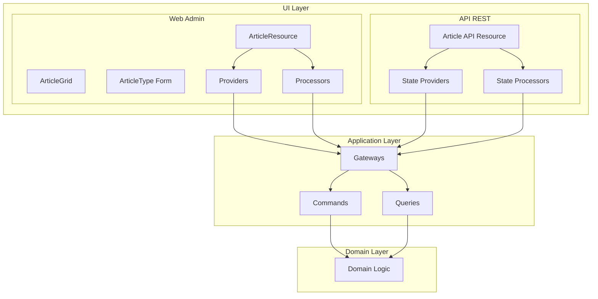

# Blog Context UI Layer Implementation

## Overview

This document describes the UI layer implementation for the Blog context, including both API and Web Admin interfaces, following our DDD/Hexagonal architecture.

## Architecture Overview



## UI Layer Structure

```
src/BlogContext/UI/
├── Api/
│   └── Rest/
│       ├── Resource/
│       │   └── ArticleResource.php
│       ├── Provider/
│       │   ├── GetArticleProvider.php
│       │   └── ListArticlesProvider.php
│       └── Processor/
│           ├── CreateArticleProcessor.php
│           ├── UpdateArticleProcessor.php
│           └── DeleteArticleProcessor.php
└── Web/
    └── Admin/
        ├── Form/
        │   └── ArticleType.php
        ├── Grid/
        │   └── ArticleGrid.php
        ├── Menu/
        │   └── MenuBuilder.php
        ├── Processor/
        │   ├── CreateArticleProcessor.php
        │   ├── DeleteArticleProcessor.php
        │   └── UpdateArticleProcessor.php
        ├── Provider/
        │   ├── ArticleCollectionProvider.php
        │   ├── ArticleGridProvider.php
        │   └── ArticleItemProvider.php
        └── Resource/
            └── ArticleResource.php
```

## Web Admin Implementation

### Resource Definition

The core of the admin interface is the `ArticleResource`:

```php
#[AsResource(
    alias: 'app.article',
    section: 'admin',
    formType: ArticleType::class,
    templatesDir: '@SyliusAdminUi/crud',
    routePrefix: '/admin',
    driver: 'doctrine/orm',
)]
#[Index(
    grid: ArticleGrid::class,
)]
#[Create(
    processor: CreateArticleProcessor::class,
    redirectToRoute: 'app_admin_article_index',
)]
#[Show(
    provider: ArticleItemProvider::class,
)]
#[Update(
    provider: ArticleItemProvider::class,
    processor: UpdateArticleProcessor::class,
    redirectToRoute: 'app_admin_article_index',
)]
#[Delete(
    provider: ArticleItemProvider::class,
    processor: DeleteArticleProcessor::class,
)]
final class ArticleResource implements ResourceInterface
{
    public function __construct(
        public ?string $id = null,
        public ?string $title = null,
        public ?string $content = null,
        public ?string $slug = null,
        public ?string $status = null,
        public ?\DateTimeInterface $createdAt = null,
        public ?\DateTimeInterface $updatedAt = null,
        public ?\DateTimeInterface $publishedAt = null,
    ) {
    }

    public function getId(): ?string
    {
        return $this->id;
    }
}
```

### Providers (Read Operations)

Providers handle data retrieval by calling Application Gateways:

#### ArticleItemProvider
```php
public function provide(Operation $operation, array|object $context): ?object
{
    $articleId = $context['id'] ?? null;
    
    if (null === $articleId) {
        return null;
    }
    
    try {
        $request = GetArticleRequest::fromData(['id' => $articleId]);
        $response = ($this->getArticleGateway)($request);
        $responseData = $response->data();
        
        return $this->transformToResource($responseData);
    } catch (GatewayException|\RuntimeException $e) {
        if (str_contains($e->getMessage(), 'not found')) {
            return null;
        }
        throw $e;
    }
}
```

#### ArticleGridProvider
```php
public function getData(Grid $grid, Parameters $parameters): Pagerfanta
{
    // Get pagination parameters
    $page = max(1, (int) $parameters->get('page', 1));
    $itemsPerPage = max(1, (int) $parameters->get('limit', 10));

    // Get filter criteria
    $criteria = $parameters->get('criteria', []);

    // Create gateway request
    $gatewayRequest = ListArticlesRequest::fromData([
        'page' => $page,
        'limit' => $itemsPerPage,
        'status' => $criteria['status'] ?? null,
    ]);

    // Execute gateway
    $gatewayResponse = ($this->listArticlesGateway)($gatewayRequest);
    $responseData = $gatewayResponse->data();

    // Transform response to ArticleResource objects
    $articles = [];
    if (isset($responseData['articles']) && is_array($responseData['articles'])) {
        foreach ($responseData['articles'] as $articleData) {
            if (is_array($articleData)) {
                $articles[] = $this->transformToResource($articleData);
            }
        }
    }

    // Create paginated result
    $totalCount = $responseData['total'] ?? count($articles);
    $adapter = new FixedAdapter($totalCount, $articles);
    $pagerfanta = new Pagerfanta($adapter);

    $pagerfanta->setCurrentPage($page);
    $pagerfanta->setMaxPerPage($itemsPerPage);

    return $pagerfanta;
}
```

### Processors (Write Operations)

Processors handle form submissions and mutations:

#### CreateArticleProcessor
```php
public function process(mixed $data, Operation $operation, Context $context): mixed
{
    /** @var ArticleResource $data */
    if (!$data instanceof ArticleResource) {
        throw new \InvalidArgumentException('Expected ArticleResource');
    }

    try {
        $gatewayRequest = CreateArticleRequest::fromData([
            'title' => $data->title,
            'content' => $data->content,
            'slug' => $data->slug,
            'status' => $data->status ?? 'draft',
            'createdAt' => new \DateTimeImmutable()->format(\DateTimeInterface::ATOM),
        ]);

        $gatewayResponse = ($this->createArticleGateway)($gatewayRequest);
        $responseData = $gatewayResponse->data();

        // Return updated resource with generated data
        return new ArticleResource(
            id: $responseData['articleId'],
            title: $data->title,
            content: $data->content,
            slug: $responseData['slug'] ?? $data->slug,
            status: $responseData['status'] ?? $data->status,
            createdAt: new \DateTimeImmutable(),
            updatedAt: new \DateTimeImmutable(),
            publishedAt: null,
        );
    } catch (\InvalidArgumentException $e) {
        throw new \InvalidArgumentException($e->getMessage(), 422, $e);
    } catch (ArticleAlreadyExists $e) {
        throw new \RuntimeException('Article with this slug already exists', 409, $e);
    } catch (GatewayException|\RuntimeException $e) {
        if (str_contains($e->getMessage(), 'already exists')) {
            throw new \RuntimeException('Article with this slug already exists', 409, $e);
        }
        throw $e;
    }
}
```

#### UpdateArticleProcessor
```php
public function process(mixed $data, Operation $operation, Context $context): mixed
{
    /** @var ArticleResource $data */
    $articleId = $context->get('id');
    
    try {
        $gatewayRequest = UpdateArticleRequest::fromData([
            'articleId' => $articleId,
            'title' => $data->title,
            'content' => $data->content,
            'slug' => $data->slug,
            'status' => $data->status,
        ]);

        $gatewayResponse = ($this->updateArticleGateway)($gatewayRequest);
        $responseData = $gatewayResponse->data();

        // Preserve dates from original data
        $data->id = $articleId;
        $data->updatedAt = new \DateTimeImmutable();
        
        return $data;
    } catch (\InvalidArgumentException $e) {
        throw new \InvalidArgumentException($e->getMessage(), 422, $e);
    } catch (\RuntimeException $e) {
        if (str_contains($e->getMessage(), 'not found')) {
            throw new \RuntimeException('Article not found', 404, $e);
        }
        throw $e;
    }
}
```

### Form Definition

The `ArticleType` defines the form structure with comprehensive validation:

```php
public function buildForm(FormBuilderInterface $builder, array $options): void
{
    $builder
        ->add('title', TextType::class, [
            'label' => 'app.ui.title',
            'required' => true,
            'constraints' => [
                new Assert\NotBlank(message: 'app.article.title.not_blank'),
                new Assert\Length(
                    min: 3,
                    max: 200,
                    minMessage: 'app.article.title.min_length',
                    maxMessage: 'app.article.title.max_length',
                ),
            ],
            'attr' => [
                'placeholder' => 'app.ui.enter_title',
            ],
        ])
        ->add('slug', TextType::class, [
            'label' => 'app.ui.slug',
            'required' => true,
            'constraints' => [
                new Assert\NotBlank(message: 'app.article.slug.not_blank'),
                new Assert\Regex(
                    pattern: '/^[a-z0-9\-]+$/',
                    message: 'app.article.slug.invalid_format',
                ),
            ],
            'attr' => [
                'placeholder' => 'app.ui.enter_slug',
            ],
        ])
        ->add('content', TextareaType::class, [
            'label' => 'app.ui.content',
            'required' => true,
            'constraints' => [
                new Assert\NotBlank(message: 'app.article.content.not_blank'),
                new Assert\Length(
                    min: 10,
                    minMessage: 'app.article.content.min_length',
                ),
            ],
            'attr' => [
                'rows' => 15,
                'placeholder' => 'app.ui.enter_content',
            ],
        ])
        ->add('status', ChoiceType::class, [
            'label' => 'app.ui.status',
            'required' => true,
            'choices' => [
                'app.ui.draft' => 'draft',
                'app.ui.published' => 'published',
                'app.ui.archived' => 'archived',
            ],
            'constraints' => [
                new Assert\NotBlank(message: 'app.article.status.not_blank'),
                new Assert\Choice(
                    choices: ['draft', 'published', 'archived'],
                    message: 'app.article.status.invalid_choice',
                ),
            ],
        ]);
}

public function configureOptions(OptionsResolver $resolver): void
{
    $resolver->setDefaults([
        'data_class' => ArticleResource::class,
        'translation_domain' => 'messages',
    ]);
}
```

### Grid Configuration

The `ArticleGrid` configures the listing:

```php
final class ArticleGrid extends AbstractGrid implements ResourceAwareGridInterface
{
    public static function getName(): string
    {
        return self::class;
    }

    public function buildGrid(GridBuilderInterface $gridBuilder): void
    {
        $gridBuilder
            ->setProvider(ArticleGridProvider::class)
            ->setLimits([10, 20, 50])
            ->addField(StringField::create('title'))
            ->addField(StringField::create('status'))
            ->addField(DateTimeField::create('createdAt'))
            ->addActionGroup(
                MainActionGroup::create(
                    CreateAction::create()
                )
            )
            ->addActionGroup(
                ItemActionGroup::create(
                    UpdateAction::create(),
                    DeleteAction::create()
                )
            );
    }

    public function getResourceClass(): string
    {
        return ArticleResource::class;
    }
}
```

### Menu Configuration

The admin menu is configured via a decorator:

```php
#[AsDecorator(decorates: 'sylius_admin_ui.knp.menu_builder')]
final readonly class MenuBuilder implements MenuBuilderInterface
{
    public function __construct(
        private FactoryInterface $factory,
    ) {
    }

    public function createMenu(array $options): ItemInterface
    {
        $menu = $this->factory->createItem('root');

        $menu
            ->addChild('dashboard', [
                'route' => 'sylius_admin_ui_dashboard',
            ])
            ->setLabel('sylius.ui.dashboard')
            ->setLabelAttribute('icon', 'tabler:dashboard')
        ;

        $this->addContentSubMenu($menu);

        return $menu;
    }

    private function addContentSubMenu(ItemInterface $menu): void
    {
        $content = $menu
            ->addChild('content')
            ->setLabel('app.ui.content')
            ->setLabelAttribute('icon', 'tabler:file-text')
        ;

        $content->addChild('articles', [
            'route' => 'app_admin_article_index',
        ])
            ->setLabel('app.ui.articles')
            ->setLabelAttribute('icon', 'tabler:article')
        ;

        $content->addChild('editorial', [
            'route' => 'app_admin_editorial_index',
        ])
            ->setLabel('app.ui.editorial_articles')
            ->setLabelAttribute('icon', 'tabler:article')
        ;
    }
}
```

## API REST Implementation

### API Resource Definition

```php
#[ApiResource(
    shortName: 'Article',
    operations: [
        new Get(
            uriTemplate: '/articles/{id}',
            provider: GetArticleProvider::class,
        ),
        new GetCollection(
            uriTemplate: '/articles',
            provider: ListArticlesProvider::class,
        ),
        new Post(
            uriTemplate: '/articles',
            processor: CreateArticleProcessor::class,
        ),
        new Put(
            uriTemplate: '/articles/{id}',
            provider: GetArticleProvider::class,
            processor: UpdateArticleProcessor::class,
        ),
        new Delete(
            uriTemplate: '/articles/{id}',
            processor: DeleteArticleProcessor::class,
        ),
    ],
)]
final class ArticleResource
{
    // Same structure as Web Admin resource
}
```

### API Providers

Similar to Web Admin but with API Platform specifics:

```php
final readonly class GetArticleProvider implements ProviderInterface
{
    public function provide(Operation $operation, array $uriVariables = [], array $context = []): object|array|null
    {
        try {
            $request = GetArticleRequest::fromData(['id' => $uriVariables['id']]);
            $response = ($this->getArticleGateway)($request);
            
            return $this->transformToResource($response->data());
        } catch (GatewayException $e) {
            if (str_contains($e->getMessage(), 'not found')) {
                return null; // API Platform will return 404
            }
            throw $e;
        }
    }
}
```

## Key Design Decisions

### 1. Gateway Integration

All UI operations go through Application Gateways:
- **Consistency**: Same business logic for Web and API
- **Validation**: Centralized in Gateway/Domain layer
- **Security**: Handled at Gateway level
- **Error Handling**: Domain exceptions mapped to HTTP status codes

### 2. Resource Transformation

Each Provider/Processor has transformation methods:

```php
private function transformToResource(array $data): ArticleResource
{
    return new ArticleResource(
        id: $data['id'],
        title: $data['title'],
        content: $data['content'],
        slug: $data['slug'],
        status: $data['status'],
        createdAt: isset($data['created_at']) 
            ? new \DateTimeImmutable($data['created_at']) 
            : null,
        updatedAt: isset($data['updated_at']) 
            ? new \DateTimeImmutable($data['updated_at']) 
            : null,
        publishedAt: isset($data['published_at']) 
            ? new \DateTimeImmutable($data['published_at']) 
            : null,
    );
}
```

### 3. Error Handling

Consistent error handling across UI types:

```php
try {
    // Gateway call
} catch (\InvalidArgumentException $e) {
    // Validation errors -> 422 Unprocessable Entity
    throw new \InvalidArgumentException($e->getMessage(), 422, $e);
} catch (ArticleAlreadyExists $e) {
    // Conflict errors -> 409 Conflict
    throw new \RuntimeException('Article with this slug already exists', 409, $e);
} catch (GatewayException|\RuntimeException $e) {
    if (str_contains($e->getMessage(), 'not found')) {
        // Not found -> 404 Not Found
        throw new \RuntimeException('Article not found', 404, $e);
    }
    if (str_contains($e->getMessage(), 'already exists')) {
        // Duplicate -> 409 Conflict
        throw new \RuntimeException('Article with this slug already exists', 409, $e);
    }
    throw $e;
}
```

**Error Mapping**:
- Domain validation errors → HTTP 422
- Resource not found → HTTP 404
- Resource conflicts → HTTP 409
- Unauthorized → HTTP 403
- Other errors → HTTP 500

### 4. Redirect Configuration

Operations can specify redirect routes:

```php
#[Create(
    processor: CreateArticleProcessor::class,
    redirectToRoute: 'app_admin_article_index',
)]
#[Update(
    provider: ArticleItemProvider::class,
    processor: UpdateArticleProcessor::class,
    redirectToRoute: 'app_admin_article_index',
)]
```

### 5. Translation Support

All UI text uses translation keys:

```yaml
# translations/messages+intl-icu.en.yaml
app:
  ui:
    title: Title
    content: Content
    slug: Slug
    status: Status
    draft: Draft
    published: Published
    archived: Archived
    enter_title: 'Enter article title'
    enter_slug: 'Enter article slug'
    enter_content: 'Enter article content'
  article:
    title:
      not_blank: 'Article title cannot be blank'
      min_length: 'Article title must be at least 3 characters'
      max_length: 'Article title cannot exceed 200 characters'
```

## Benefits of This Architecture

1. **Clear Separation**: UI logic separate from business logic
2. **Reusability**: Same Gateways for Web and API
3. **Testability**: UI components can be tested independently
4. **Flexibility**: Easy to add new UI types (GraphQL, CLI)
5. **Consistency**: Uniform approach across all operations

## Common Patterns

### Provider Pattern
```php
1. Receive UI request
2. Transform to Gateway request
3. Call Gateway
4. Handle errors
5. Transform response to UI model
6. Return UI model
```

### Processor Pattern
```php
1. Receive form data
2. Validate UI-level constraints
3. Transform to Gateway request
4. Call Gateway
5. Handle domain exceptions
6. Transform response
7. Return for redirect/response
```

## Testing Approach

### Unit Tests

```php
class ArticleGridTest extends TestCase
{
    public function testGridConfiguration(): void
    {
        $grid = new ArticleGrid();
        $builder = $this->createMock(GridBuilderInterface::class);
        
        $builder->expects($this->once())
            ->method('setProvider')
            ->with(ArticleGridProvider::class)
            ->willReturnSelf();
            
        $builder->expects($this->once())
            ->method('setLimits')
            ->with([10, 20, 50])
            ->willReturnSelf();
            
        $grid->buildGrid($builder);
        
        $this->assertSame(ArticleResource::class, $grid->getResourceClass());
    }
}
```

### Integration Tests

```php
class CreateArticleProcessorTest extends KernelTestCase
{
    public function testProcessCreatesArticle(): void
    {
        $processor = static::getContainer()->get(CreateArticleProcessor::class);
        
        $resource = new ArticleResource(
            title: 'Test Article',
            content: 'Test content',
            slug: 'test-article',
            status: 'draft'
        );
        
        $result = $processor->process($resource, $this->createOperation(), new Context());
        
        $this->assertInstanceOf(ArticleResource::class, $result);
        $this->assertNotNull($result->getId());
    }
}
```

### Behat Tests

```gherkin
Feature: Managing blog articles
  In order to manage blog content
  As an administrator
  I want to be able to create, edit and delete articles

  Background:
    Given I am logged in as an administrator

  Scenario: Creating a new article
    When I go to "/admin/articles"
    And I click "Create"
    And I fill in "Title" with "My New Article"
    And I fill in "Slug" with "my-new-article"
    And I fill in "Content" with "This is my article content"
    And I select "draft" from "Status"
    And I press "Create"
    Then I should see "Item has been successfully created."
    And I should see "My New Article" in the articles list
```

## Future Enhancements

1. **GraphQL API**: Add GraphQL schema and resolvers
2. **Bulk Operations**: Process multiple articles
   - Note: Currently disabled due to template compatibility
3. **Async Processing**: Queue long operations
4. **Webhooks**: Notify external systems
5. **API Versioning**: Support multiple API versions
6. **Rich Text Editor**: Integrate CKEditor or TinyMCE
7. **Media Management**: File uploads and gallery
8. **Advanced Permissions**: Role-based access per operation
9. **Audit Trail**: Track all changes with user attribution
10. **Import/Export**: CSV and Excel support

## Troubleshooting

### Common Issues

1. **"Method not found" on Gateway**
   - Check service injection in constructor
   - Verify Gateway service is public or autowired
   - Check namespace and use statements

2. **Form not mapping to Resource**
   - Check property names match exactly
   - Verify data_class in form configureOptions
   - Ensure all properties are public or have setters

3. **Grid not showing data**
   - Check Provider returns Pagerfanta instance
   - Verify transformation creates resource objects
   - Check grid provider is registered correctly

4. **API returns 500 instead of 404**
   - Check exception handling catches GatewayException
   - Return null for not found in providers
   - Map domain exceptions to HTTP exceptions

5. **Menu items not appearing**
   - Verify MenuBuilder uses #[AsDecorator] attribute
   - Clear cache after menu changes
   - Check route names are correct

6. **Translations not working**
   - Ensure translation files exist
   - Set translation_domain in forms
   - Clear cache after adding translations

7. **Custom actions not working**
   - Verify route exists and accepts parameters
   - Check action type matches operation
   - Ensure processor handles form name

## References

- [API Platform State Providers](https://api-platform.com/docs/core/state-providers/)
- [Sylius Resource Bundle](https://github.com/Sylius/SyliusResourceBundle)
- [Sylius Grid Bundle](https://github.com/Sylius/SyliusGridBundle)
- [Sylius Stack Documentation](https://stack.sylius.com/)
- [Symfony Forms](https://symfony.com/doc/current/forms.html)
- [Symfony Translation](https://symfony.com/doc/current/translation.html)
- [Tabler Icons](https://tabler.io/icons)