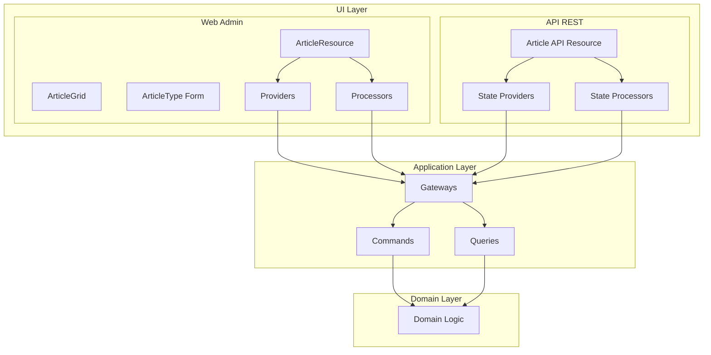

# Blog Context UI Layer Implementation

## Overview

This document describes the UI layer implementation for the Blog context, including both API and Web Admin interfaces, following our DDD/Hexagonal architecture.

## Architecture Overview



## UI Layer Structure

```
src/BlogContext/UI/
├── Api/
│   └── Rest/
│       ├── Resource/
│       │   └── ArticleResource.php
│       ├── Provider/
│       │   ├── GetArticleProvider.php
│       │   └── ListArticlesProvider.php
│       └── Processor/
│           ├── CreateArticleProcessor.php
│           ├── UpdateArticleProcessor.php
│           └── DeleteArticleProcessor.php
└── Web/
    └── Admin/
        ├── Form/
        │   └── ArticleType.php
        ├── Grid/
        │   └── ArticleGrid.php
        ├── Menu/
        │   └── MenuBuilder.php
        ├── Processor/
        │   ├── CreateArticleProcessor.php
        │   ├── DeleteArticleProcessor.php
        │   └── UpdateArticleProcessor.php
        ├── Provider/
        │   ├── ArticleCollectionProvider.php
        │   ├── ArticleGridProvider.php
        │   └── ArticleItemProvider.php
        └── Resource/
            └── ArticleResource.php
```

## Web Admin Implementation

### Resource Definition

The core of the admin interface is the `ArticleResource`:

```php
#[AsResource(
    alias: 'app.article',
    section: 'admin',
    formType: ArticleType::class,
    templatesDir: '@SyliusAdminUi/crud',
    routePrefix: '/admin',
    driver: 'doctrine/orm',
)]
final class ArticleResource implements ResourceInterface
{
    public function __construct(
        public ?string $id = null,
        public ?string $title = null,
        public ?string $content = null,
        public ?string $slug = null,
        public ?string $status = null,
        public ?\DateTimeInterface $createdAt = null,
        public ?\DateTimeInterface $updatedAt = null,
        public ?\DateTimeInterface $publishedAt = null,
    ) {
    }
}
```

### Providers (Read Operations)

Providers handle data retrieval by calling Application Gateways:

#### ArticleItemProvider
```php
public function provide(Operation $operation, array $uriVariables = [], array $context = []): ?object
{
    $articleId = $uriVariables['id'] ?? null;
    
    try {
        $request = GetArticleRequest::fromData(['id' => $articleId]);
        $response = ($this->getArticleGateway)($request);
        
        return $this->transformToResource($response->data());
    } catch (GatewayException $e) {
        if (str_contains($e->getMessage(), 'not found')) {
            return null;
        }
        throw $e;
    }
}
```

#### ArticleGridProvider
```php
public function provide(Operation $operation, array|object $context): iterable
{
    $request = ListArticlesRequest::fromData([
        'page' => 1,
        'limit' => 1000,
    ]);
    
    $response = ($this->listArticlesGateway)($request);
    
    return $this->transformCollection($response->data());
}
```

### Processors (Write Operations)

Processors handle form submissions and mutations:

#### CreateArticleProcessor
```php
public function process(mixed $data, Operation $operation, array $uriVariables = [], array $context = []): mixed
{
    try {
        $request = CreateArticleRequest::fromData([
            'title' => $data->title,
            'content' => $data->content,
            'slug' => $data->slug,
            'status' => $data->status ?? 'draft',
            'createdAt' => (new \DateTimeImmutable())->format(\DateTimeInterface::ATOM),
        ]);

        $response = ($this->createArticleGateway)($request);
        
        return $this->createResourceFromResponse($data, $response->data());
    } catch (\InvalidArgumentException $e) {
        throw new HttpException(422, $e->getMessage(), $e);
    }
}
```

### Form Definition

The `ArticleType` defines the form structure:

```php
public function buildForm(FormBuilderInterface $builder, array $options): void
{
    $builder
        ->add('title', TextType::class, [
            'label' => 'Title',
            'required' => true,
        ])
        ->add('slug', TextType::class, [
            'label' => 'Slug',
            'required' => true,
        ])
        ->add('content', TextareaType::class, [
            'label' => 'Content',
            'required' => true,
            'attr' => ['rows' => 10],
        ])
        ->add('status', ChoiceType::class, [
            'label' => 'Status',
            'choices' => [
                'Draft' => 'draft',
                'Published' => 'published',
                'Archived' => 'archived',
            ],
            'required' => true,
        ]);
}
```

### Grid Configuration

The `ArticleGrid` configures the listing:

```php
public function buildGrid(GridBuilder $gridBuilder): void
{
    $gridBuilder
        ->orderBy('updatedAt', direction: 'desc')
        ->addField(
            StringField::create('title')
                ->setLabel('Title')
                ->setSortable(true)
        )
        ->addField(
            StringField::create('status')
                ->setLabel('Status')
                ->setSortable(true)
        )
        ->addField(
            DateTimeField::create('createdAt')
                ->setLabel('Created')
                ->setSortable(true)
        )
        ->addActionGroup(
            MainActionGroup::create(
                ShowAction::create(),
                UpdateAction::create(),
                DeleteAction::create(),
            )
        );
}
```

## API REST Implementation

### API Resource Definition

```php
#[ApiResource(
    shortName: 'Article',
    operations: [
        new Get(
            uriTemplate: '/articles/{id}',
            provider: GetArticleProvider::class,
        ),
        new GetCollection(
            uriTemplate: '/articles',
            provider: ListArticlesProvider::class,
        ),
        new Post(
            uriTemplate: '/articles',
            processor: CreateArticleProcessor::class,
        ),
        new Put(
            uriTemplate: '/articles/{id}',
            provider: GetArticleProvider::class,
            processor: UpdateArticleProcessor::class,
        ),
        new Delete(
            uriTemplate: '/articles/{id}',
            processor: DeleteArticleProcessor::class,
        ),
    ],
)]
final class ArticleResource
{
    // Same structure as Web Admin resource
}
```

### API Providers

Similar to Web Admin but with API Platform specifics:

```php
final readonly class GetArticleProvider implements ProviderInterface
{
    public function provide(Operation $operation, array $uriVariables = [], array $context = []): object|array|null
    {
        try {
            $request = GetArticleRequest::fromData(['id' => $uriVariables['id']]);
            $response = ($this->getArticleGateway)($request);
            
            return $this->transformToResource($response->data());
        } catch (GatewayException $e) {
            if (str_contains($e->getMessage(), 'not found')) {
                return null; // API Platform will return 404
            }
            throw $e;
        }
    }
}
```

## Key Design Decisions

### 1. Gateway Integration

All UI operations go through Application Gateways:
- **Consistency**: Same business logic for Web and API
- **Validation**: Centralized in Gateway/Domain layer
- **Security**: Handled at Gateway level

### 2. Resource Transformation

Each Provider/Processor has transformation methods:

```php
private function transformToResource(array $data): ArticleResource
{
    return new ArticleResource(
        id: $data['id'],
        title: $data['title'],
        content: $data['content'],
        slug: $data['slug'],
        status: $data['status'],
        createdAt: isset($data['created_at']) 
            ? new \DateTimeImmutable($data['created_at']) 
            : null,
        updatedAt: isset($data['updated_at']) 
            ? new \DateTimeImmutable($data['updated_at']) 
            : null,
        publishedAt: isset($data['published_at']) 
            ? new \DateTimeImmutable($data['published_at']) 
            : null,
    );
}
```

### 3. Error Handling

Consistent error handling across UI types:

```php
try {
    // Gateway call
} catch (\InvalidArgumentException $e) {
    throw new HttpException(422, $e->getMessage(), $e);
} catch (ArticleAlreadyExists $e) {
    throw new HttpException(409, 'Article with this slug already exists', $e);
} catch (GatewayException $e) {
    if (str_contains($e->getMessage(), 'not found')) {
        throw new HttpException(404, 'Article not found', $e);
    }
    throw $e;
}
```

### 4. Redirect Configuration

Update operations redirect to index:

```php
#[Update(
    provider: ArticleItemProvider::class,
    processor: UpdateArticleProcessor::class,
    redirectToRoute: 'app_admin_article_index',
)]
```

## Benefits of This Architecture

1. **Clear Separation**: UI logic separate from business logic
2. **Reusability**: Same Gateways for Web and API
3. **Testability**: UI components can be tested independently
4. **Flexibility**: Easy to add new UI types (GraphQL, CLI)
5. **Consistency**: Uniform approach across all operations

## Common Patterns

### Provider Pattern
```php
1. Receive UI request
2. Transform to Gateway request
3. Call Gateway
4. Handle errors
5. Transform response to UI model
6. Return UI model
```

### Processor Pattern
```php
1. Receive form data
2. Validate UI-level constraints
3. Transform to Gateway request
4. Call Gateway
5. Handle domain exceptions
6. Transform response
7. Return for redirect/response
```

## Testing Approach

### Unit Tests
- Test transformation logic
- Mock Gateway calls
- Verify error handling

### Integration Tests
- Test with real Gateways
- Verify end-to-end flow
- Check HTTP responses

### Behat Tests
- Test user journeys
- Verify UI elements exist
- Check navigation flow

## Future Enhancements

1. **GraphQL API**: Add GraphQL schema and resolvers
2. **Bulk Operations**: Process multiple articles
3. **Async Processing**: Queue long operations
4. **Webhooks**: Notify external systems
5. **API Versioning**: Support multiple API versions

## Troubleshooting

### Common Issues

1. **"Method not found" on Gateway**
   - Check service injection
   - Verify Gateway is public

2. **Form not mapping to Resource**
   - Check property names match
   - Verify data_class in form

3. **Grid not showing data**
   - Check Provider returns iterable
   - Verify transformation logic

4. **API returns 500 instead of 404**
   - Check exception handling
   - Return null for not found

## References

- [API Platform State Providers](https://api-platform.com/docs/core/state-providers/)
- [Sylius Resource Bundle](https://github.com/Sylius/SyliusResourceBundle)
- [Symfony Forms](https://symfony.com/doc/current/forms.html)