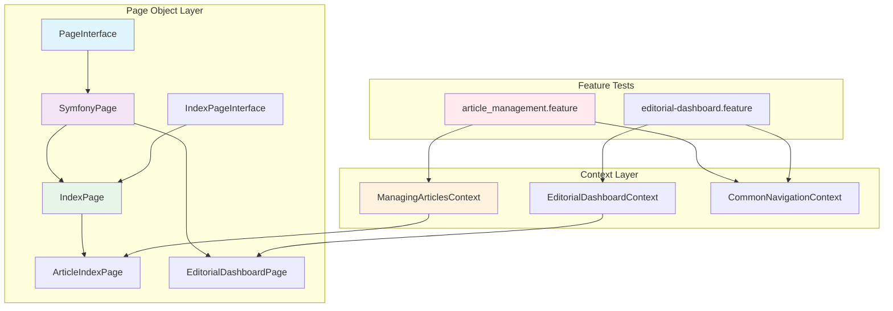

# Behat Admin Grid Testing Patterns

## Overview

This document outlines the Page Object patterns and testing strategies for admin grid interfaces, inspired by Sylius best practices and implemented for our Blog Context admin interfaces.

## Architecture Overview



## Page Object Patterns

### Base Page Architecture

#### PageInterface
```php
interface PageInterface
{
    public function open(array $urlParameters = []): void;
    public function isOpen(): bool;
    public function getUrl(array $urlParameters = []): string;
}
```

#### SymfonyPage Base Class
```php
abstract class SymfonyPage implements PageInterface
{
    public function __construct(
        protected readonly Session $session,
        protected readonly RouterInterface $router,
        protected array $parameters = []
    ) {}

    // Common functionality:
    // - Element finding with CSS selectors
    // - Wait for elements
    // - Session access
    // - Defined elements pattern
}
```

**Key Features:**
- Session and Router injection for navigation
- Element definition pattern with `getDefinedElements()`
- Wait mechanisms for dynamic content
- Consistent error handling

### Grid Page Objects

#### IndexPageInterface
```php
interface IndexPageInterface extends PageInterface
{
    public function countItems(): int;
    public function getColumnFields(string $columnName): array;
    public function sortBy(string $fieldName): void;
    public function isSingleResourceOnPage(array $fields): bool;
    public function deleteResourceOnPage(array $fields): void;
    public function filter(array $criteria): void;
    public function bulkDelete(): void;
    public function isEmpty(): bool;
    public function hasNoResultMessage(): bool;
}
```

#### IndexPage Implementation
Provides generic grid operations:
- **Item counting**: Handles empty grids and pagination
- **Column operations**: Extract data from specific columns
- **Sorting**: Click on column headers
- **Filtering**: Apply search and filter criteria
- **Bulk operations**: Select multiple items and perform actions
- **Resource identification**: Find specific items by field values

### Specific Page Objects

#### ArticleIndexPage
```php
final class ArticleIndexPage extends IndexPage implements ArticleIndexPageInterface
{
    public function hasArticleWithTitle(string $title): bool;
    public function hasArticleWithSlug(string $slug): bool;
    public function hasArticleWithStatus(string $status): bool;
    public function filterByStatus(string $status): void;
    public function searchByTitle(string $title): void;
    public function clickCreateArticle(): void;
    public function editArticle(string $title): void;
    public function deleteArticle(string $title): void;
}
```

**Domain-Specific Methods:**
- Article-specific search and filter operations
- CRUD operations tailored to articles
- Business logic validation (title, slug, status)

#### EditorialDashboardPage
```php
final class DashboardPage extends SymfonyPage implements DashboardPageInterface
{
    public function hasArticlesPendingReview(): bool;
    public function getArticlesPendingReviewCount(): int;
    public function hasArticleInPendingList(string $title): bool;
    public function reviewArticle(string $title): void;
    public function approveArticle(string $title): void;
    public function rejectArticle(string $title): void;
    public function hasReviewStatistics(): bool;
}
```

**Editorial-Specific Features:**
- Review workflow operations
- Pending article management
- Statistics and reporting
- Section-based navigation

## Context Patterns

### Focused Responsibility Contexts

#### ManagingArticlesContext
**Responsibility**: Article CRUD operations and grid management

```php
class ManagingArticlesContext implements Context
{
    private IndexPageInterface $indexPage;

    public function __construct(
        private readonly Session $session,
        private readonly RouterInterface $router,
    ) {
        $this->indexPage = new IndexPage($this->session, $this->router);
    }
    
    // Article-specific step definitions
    // Grid operations
    // CRUD workflows
    // Pagination and filtering
}
```

**Key Step Definitions:**
- `I should see the articles grid`
- `there are articles:` (with data table)
- `I should see :count articles in the grid`
- `I filter by status :status`
- `I search for article titled :title`

#### EditorialDashboardContext
**Responsibility**: Editorial workflow and review processes

```php
class EditorialDashboardContext implements Context
{
    private DashboardPageInterface $dashboardPage;

    public function __construct(
        private readonly Session $session,
        private readonly RouterInterface $router,
    ) {
        $this->dashboardPage = new DashboardPage($this->session, $this->router);
    }
    
    // Editorial-specific operations
    // Review workflow steps
    // Dashboard navigation
}
```

**Key Step Definitions:**
- `the page should load successfully`
- `I should see the pending articles section`
- `I should see :text in the pending grid`
- `I click :action for article :title`
- `I should see review statistics`

## Feature File Patterns

### Article Management Feature Structure

```gherkin
Feature: Article management in admin
  In order to manage blog content
  As an administrator
  I want to be able to view, create, update and delete articles

  Background:
    Given I am on the admin dashboard

  Scenario: View articles list in admin
    When I go to "/admin/articles"
    Then I should see "Articles" in the title
    And I should see the articles grid
    And the grid should have columns:
      | Column  |
      | Title   |
      | Status  |
      | Created |

  Scenario: Articles list with data
    Given there are articles:
      | title             | status    | created_at          |
      | My First Article  | draft     | 2025-01-01 10:00:00 |
      | Published Article | published | 2025-01-02 14:30:00 |
    When I go to "/admin/articles"
    Then I should see "My First Article" in the grid
    And I should see "Published Article" in the grid
```

### Editorial Dashboard Feature Structure

```gherkin
Feature: Editorial Dashboard for Article Review
  In order to manage article submissions and reviews
  As an editorial reviewer
  I want to access a dedicated dashboard

  Background:
    Given I am on the admin dashboard

  Scenario: View editorial dashboard
    When I go to "/admin/editorials"
    Then the page should load successfully

  Scenario: Empty pending review list
    Given there are no articles pending review
    When I go to "/admin/editorials"
    Then the page should load successfully
```

## Implementation Guidelines

### 1. Page Object Design Principles

**Single Responsibility**: Each page object represents one admin interface
```php
// ✅ Good: Focused on article index operations
class ArticleIndexPage extends IndexPage

// ❌ Bad: Mixed responsibilities
class AdminPage // handles articles, users, settings, etc.
```

**Business Language**: Use domain terminology in method names
```php
// ✅ Good: Business-focused methods
public function hasArticleWithTitle(string $title): bool
public function approveArticle(string $title): void

// ❌ Bad: Technical-focused methods
public function findRowByText(string $text): bool
public function clickButtonInRow(int $rowIndex): void
```

**Element Encapsulation**: Hide CSS selectors in page objects
```php
protected function getDefinedElements(): array
{
    return [
        'articles_table' => 'table.articles-grid, table',
        'create_button' => 'a.btn-primary, .create-button',
        'status_filter' => 'select[name*="status"]',
        'pending_articles_section' => '.pending-articles, #pending-articles',
    ];
}
```

### 2. Context Organization

**Domain-Driven Contexts**: Organize by business domain
```
tests/BlogContext/Behat/Context/Ui/Admin/
├── ManagingArticlesContext.php      # Article operations
├── EditorialDashboardContext.php    # Editorial workflow
├── ManagingCategoriesContext.php    # Category management
└── ContentModerationContext.php     # Moderation workflow
```

**Shared Navigation**: Extract common navigation to shared contexts
```php
// CommonNavigationContext for shared steps
#[Step('Given I am on the admin dashboard')]
#[Step('When I go to :path')]
#[Step('Then I should see :text in the title')]
```

### 3. Step Definition Patterns

**Descriptive Step Names**: Use business language
```gherkin
# ✅ Good: Clear business intent
Given there are articles pending review
When I approve article "My Article"
Then I should see the article in approved list

# ❌ Bad: Technical implementation details
Given there are 3 rows in pending_review table
When I click approve button for row 1
Then row should move to approved_articles table
```

**Data Table Usage**: For complex test data
```gherkin
Given there are articles:
  | title             | status    | author        | created_at          |
  | My First Article  | draft     | John Doe      | 2025-01-01 10:00:00 |
  | Published Article | published | Jane Smith    | 2025-01-02 14:30:00 |
```

**Flexible Assertions**: Handle different grid states
```php
#[Step('Then I should see :count articles in the grid')]
public function iShouldSeeArticlesInTheGrid(int $count): void
{
    if (0 === $count) {
        $this->iShouldSeeNoResultsInTheGrid();
        return;
    }

    $actualCount = $this->indexPage->countItems();
    
    // Be flexible with count - allow partial pages for pagination
    if (10 <= $count && 0 < $actualCount && $actualCount <= $count) {
        return;
    }
    
    Assert::eq($count, $actualCount, 'Expected article count mismatch');
}
```

## Testing Grid Operations

### Basic Grid Testing

```gherkin
Scenario: View empty grid
    Given there are 0 articles
    When I go to "/admin/articles"
    Then I should see the articles grid
    And I should see no results in the grid

Scenario: View populated grid
    Given there are 5 articles
    When I go to "/admin/articles"
    Then I should see the articles grid
    And I should see 5 articles in the grid
```

### Pagination Testing

```gherkin
Scenario: Pagination with default limit
    Given there are 15 articles
    When I go to "/admin/articles"
    Then I should see 10 articles in the grid
    And the current URL should contain "page=1" or no page parameter

Scenario: Navigate to page 2
    Given there are 15 articles
    When I go to "/admin/articles?page=2"
    Then I should see the articles grid
    And the current URL should contain "page=2"

Scenario: Change items per page limit
    Given there are 25 articles
    When I go to "/admin/articles"
    And I change the limit to "20"
    Then the current URL should contain "limit=20"
```

### Filtering and Searching

```gherkin
Scenario: Filter by status
    Given there are articles:
      | title      | status    |
      | Draft One  | draft     |
      | Published  | published |
    When I go to "/admin/articles"
    And I filter by status "draft"
    Then I should see "Draft One" in the grid
    And I should not see "Published" in the grid

Scenario: Search by title
    Given there are articles:
      | title           |
      | Important News  |
      | Random Article  |
    When I go to "/admin/articles"
    And I search for article titled "Important"
    Then I should see "Important News" in the grid
    And I should not see "Random Article" in the grid
```

### CRUD Operations

```gherkin
Scenario: Create new article
    When I go to "/admin/articles"
    And I click create new article
    Then I should see "Title" field
    And I should see "Content" field
    And I should see "Status" field

Scenario: Edit existing article
    Given there are articles:
      | title           | slug            |
      | Article to Edit | article-to-edit |
    When I go to "/admin/articles"
    And I edit article "Article to Edit"
    Then I should see "Title" field
    And the "Title" field should contain "Article to Edit"

Scenario: Delete article
    Given there are articles:
      | title             |
      | Article to Delete |
    When I go to "/admin/articles"
    And I delete article "Article to Delete"
    Then I should not see "Article to Delete" in the grid
```

## Best Practices

### 1. **Page Object Design**
- Keep page objects focused on single responsibility
- Use business language in method names
- Encapsulate CSS selectors in `getDefinedElements()`
- Provide meaningful error messages
- Handle different UI states gracefully

### 2. **Context Organization**
- One context per business domain or workflow
- Extract shared navigation to common contexts
- Use dependency injection for page objects
- Keep step definitions focused and readable

### 3. **Feature Writing**
- Use descriptive scenario names
- Include meaningful backgrounds
- Test both happy path and edge cases
- Use data tables for complex test data
- Keep scenarios focused on single behavior

### 4. **Maintenance**
- Regular review of page object methods
- Update selectors when UI changes
- Refactor common patterns into base classes
- Document complex test scenarios
- Monitor test execution time and stability

### 5. **Error Handling**
- Provide clear failure messages
- Handle timing issues with waits
- Gracefully handle missing elements
- Include debugging information in failures

## Configuration

### Service Registration
```php
// config/services_test.php
$services->load('App\\Tests\\BlogContext\\Behat\\', __DIR__.'/../tests/BlogContext/Behat/');
```

### Behat Suite Configuration
```php
// behat.dist.php
->withSuite(
    (new Suite('admin'))
        ->withPaths('features/admin')
        ->withContexts(
            ManagingArticlesContext::class,
            EditorialDashboardContext::class,
            DoctrineORMContext::class,
            CommonNavigationContext::class,
        )
)
```

This pattern provides a solid foundation for testing admin grid interfaces while maintaining readability, reusability, and alignment with business requirements.