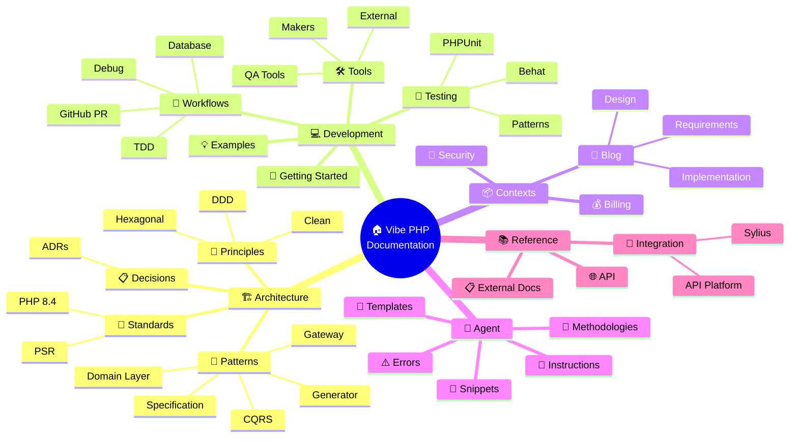

# Documentation Navigation Guide for AI Agents

## Overview

This guide helps AI agents navigate the project documentation efficiently. Different types of documentation are organized in specific locations for clarity and purpose.

## 🗺️ Interactive Documentation Map



## Documentation Structure Map

```
docs/
├── architecture/       # Architecture and technical patterns
│   ├── patterns/      # Implementation patterns (CQRS, Gateway, etc.)
│   ├── principles/    # Architectural principles (DDD, Hexagonal)
│   ├── standards/     # Coding standards (PSR, PHP 8.4)
│   └── decisions/     # Architecture Decision Records
├── development/        # Developer guides and tools
│   ├── getting-started/
│   ├── workflows/     # Development workflows
│   ├── testing/       # Testing guides and strategies
│   ├── tools/         # Development tools
│   │   ├── makers/    # Code generators
│   │   ├── external/  # External tools docs
│   │   └── qa-tools.md
│   └── examples/      # Implementation examples
├── contexts/          # Business domain documentation
│   ├── blog/
│   ├── security/
│   └── billing/
├── agent/             # AI agent specific documentation
│   ├── instructions/  # Agent behavior guidelines
│   ├── methodologies/ # Spec-driven methodology
│   ├── templates/     # Document templates
│   ├── snippets/      # Code snippets
│   └── errors.md      # Error tracking
├── reference/         # Quick references
│   ├── api/          # API documentation
│   ├── integration/   # Integration guides (Sylius, API Platform)
│   └── external-docs.md
└── archive/          # Historical documents
    ├── implementation-summaries/
    └── old-plans/
```

## Where to Find What

### 🤖 For Agent-Specific Instructions

**Location**: `@docs/agent/`

- **Instructions** (`@docs/agent/instructions/`):
  - How to behave and work
  - Coding standards to follow
  - Tool-specific guidelines
  
- **Workflows** (`@docs/agent/workflows/`):
  - Step-by-step processes
  - Command templates
  - Implementation guides

- **Errors** (`@docs/agent/errors.md`):
  - Learn from past mistakes
  - Check before attempting similar tasks

### 📋 For Business Context and Requirements

**Location**: `@docs/contexts/[context-name]/`

When working on a specific feature:
1. **Start here** to understand the business domain
2. Check the context's:
   - `architecture-overview.md` - Technical architecture
   - `prd.md` - Business requirements
   - `user-stories/` - Detailed feature specs
   - `technical-plan.md` - Implementation roadmap

Example: For blog features → `@docs/contexts/blog/`
- **UI Layer Implementation**: `@docs/contexts/blog/ui-layer-implementation.md` *(NEW)*

### 🔧 For Technical Patterns and Standards

**Location**: `@docs/architecture/`

Consult when implementing patterns:
- **CQRS**: `@docs/architecture/patterns/cqrs-pattern.md`
- **Gateways**: `@docs/architecture/patterns/gateway-pattern.md`
- **Domain Layer**: `@docs/architecture/patterns/domain-layer-pattern.md`
- **Generator**: `@docs/architecture/patterns/generator-pattern.md`
- **Specification**: `@docs/architecture/patterns/specification-pattern.md`

For coding standards:
- **PSR Standards**: `@docs/architecture/standards/psr-standards.md` *(MANDATORY - PSR-4)*
- **PHP Best Practices**: `@docs/architecture/standards/php-features-best-practices.md`

For integrations:
- **Sylius Admin UI**: `@docs/reference/integration/sylius-admin-ui-integration.md`
- **Sylius Stack**: `@docs/reference/integration/sylius-stack-integration.md`

### 🧪 For Testing Guidelines

**Location**: `@docs/development/testing/`

Before writing tests:
- **Testing Strategy**: `@docs/development/testing/README.md`
- **Behat Tests**: `@docs/development/testing/behat-guide.md`
- **Behat with Sylius**: `@docs/development/testing/behat-sylius-patterns.md`
- **Generator Pattern Testing**: `@docs/development/testing/generator-pattern-testing.md`

### 💡 For Implementation Examples

**Location**: `@docs/development/examples/`

See concrete examples:
- **Gateway Generator**: `@docs/development/examples/gateway-generator-usage.md`
- **Specification Pattern**: `@docs/development/examples/specification-pattern-usage.md`

### 🛠️ For Development Tools

**Locations**: 
- `@docs/development/tools/makers/` - Code generators
- `@docs/development/tools/external/` - External tools
- `@docs/development/tools/qa-tools.md` - Quality assurance

Tool documentation:
- **Makers**: DDD code generators
- **Symfony Components**: Messenger, Serializer, Validator
- **Testing Tools**: Foundry Bundle
- **Development Tools**: GitHub CLI

## Quick Decision Tree

```
Need to understand WHAT to build?
└── Go to: @docs/contexts/[context-name]/

Need to know HOW to implement a pattern?
└── Go to: @docs/architecture/patterns/[pattern-name].md

Need to see an EXAMPLE?
└── Go to: @docs/development/examples/

Need to write TESTS?
└── Go to: @docs/development/testing/

Need TOOL help?
└── Go to: @docs/development/tools/

Need AGENT-SPECIFIC guidance?
└── Go to: @docs/agent/instructions/

Encountered an ERROR before?
└── Check: @docs/agent/errors.md
```

## Common Scenarios

### Scenario 1: Implementing a New Feature
1. Read the PRD: `@docs/contexts/[context]/prd.md`
2. Check architecture: `@docs/contexts/[context]/architecture-overview.md`
3. Find the user story: `@docs/contexts/[context]/user-stories/US-XXX-*.md`
4. Apply patterns from: `@docs/reference/`
5. Follow workflows from: `@docs/agent/workflows/`

### Scenario 2: Creating a Gateway
1. Read pattern: `@docs/architecture/patterns/gateway-pattern.md`
2. See example: `@docs/development/examples/gateway-generator-usage.md`
3. Follow architecture: `@docs/agent/instructions/architecture.md`

### Scenario 3: Writing Tests
1. Check strategy: `@docs/development/testing/README.md`
2. For Behat: `@docs/development/testing/behat-guide.md`
3. For Sylius patterns: `@docs/development/testing/behat-sylius-patterns.md`
4. Follow TDD: `@docs/development/workflows/tdd-implementation-guide.md`

### Scenario 4: Database Changes
1. Read guidelines: `@docs/agent/instructions/doctrine-migrations.md`
2. Follow workflow: `@docs/development/workflows/database-migration-workflow.md`

### Scenario 5: Adding Admin UI
1. Read Sylius Admin UI guide: `@docs/reference/integration/sylius-admin-ui-integration.md`
2. Check UI implementation: `@docs/contexts/[context]/ui-layer-implementation.md`
3. Follow architecture patterns: `@docs/agent/instructions/architecture.md`

## Important References to Memorize

These are the most frequently needed documents:

1. **Architecture Rules**: `@docs/agent/instructions/architecture.md`
2. **CQRS Pattern**: `@docs/architecture/patterns/cqrs-pattern.md`
3. **Gateway Pattern**: `@docs/architecture/patterns/gateway-pattern.md`
4. **QA Tools**: `@docs/development/tools/qa-tools.md`
5. **Git Workflow**: `@docs/agent/instructions/git-workflow.md`

## Pro Tips

1. **Always check the context first**: Business requirements drive technical decisions
2. **Reference before implementing**: Patterns exist for consistency
3. **Examples clarify patterns**: When in doubt, check examples
4. **Errors are learning**: Check `@docs/agent/errors.md` to avoid repeated mistakes
5. **Cross-reference**: Documents often link to related resources

## Navigation Commands

You can use these phrases to quickly access documentation:

- "Check the CQRS pattern documentation"
- "Show me the blog context architecture"
- "What does the gateway pattern say about..."
- "Find the testing guide for..."
- "Look up the PHP best practices for..."

Remember: When in doubt, start with the business context (`@docs/contexts/`) and work your way to technical details (`@docs/reference/`).