# Act - Implementation Checklist

## Visual Workflow Guide

```mermaid
flowchart TD
    Start([🚀 Start Implementation])
    
    subgraph "Pre-Implementation"
        PRD{PRD reviewed?}
        Plan{Plan validated?}
        Deps{Dependencies OK?}
        Env{Environment ready?}
        Branch{Feature branch?}
    end
    
    subgraph "Code Quality Gates"
        PSR[✅ PSR-12 standards]
        Strict[✅ strict_types=1]
        Final[✅ Classes final]
        Private[✅ Private visibility]
        DDD[✅ DDD structure]
    end
    
    subgraph "Development Flow"
        Incremental[📝 Small commits]
        Testing[🧪 Run tests]
        Commits[💬 Meaningful messages]
        DRY[♻️ DRY principle]
        SOLID[🏗️ SOLID principles]
    end
    
    subgraph "Validation"
        Compile{Code compiles?}
        Syntax{No syntax errors?}
        Tests{Tests pass?}
        Manual{Manual testing OK?}
    end
    
    Start --> PRD
    PRD -->|Yes| Plan
    PRD -->|No| Fix1[Fix PRD]
    Fix1 --> Start
    
    Plan -->|Yes| Deps
    Plan -->|No| Fix2[Review Plan]
    Fix2 --> PRD
    
    Deps -->|Yes| Env
    Deps -->|No| Fix3[Install Dependencies]
    Fix3 --> Deps
    
    Env -->|Yes| Branch
    Env -->|No| Fix4[Setup Environment]
    Fix4 --> Env
    
    Branch -->|Yes| PSR
    Branch -->|No| Fix5[Create Branch]
    Fix5 --> Branch
    
    PSR --> Strict --> Final --> Private --> DDD
    DDD --> Incremental
    Incremental --> Testing --> Commits --> DRY --> SOLID
    SOLID --> Compile
    
    Compile -->|Yes| Syntax
    Compile -->|No| Debug1[Debug Compilation]
    Debug1 --> PSR
    
    Syntax -->|Yes| Tests
    Syntax -->|No| Debug2[Fix Syntax]
    Debug2 --> Compile
    
    Tests -->|Yes| Manual
    Tests -->|No| Debug3[Fix Tests]
    Debug3 --> Syntax
    
    Manual -->|Yes| Done([✅ Implementation Complete])
    Manual -->|No| Debug4[Fix Issues]
    Debug4 --> Tests
    
    style Start fill:#e1f5fe
    style Done fill:#c8e6c9
    style PRD fill:#fff3e0
    style Plan fill:#fff3e0
    style PSR fill:#f3e5f5
    style Tests fill:#ffebee
    style Fix1 fill:#ffcdd2
    style Fix2 fill:#ffcdd2
    style Fix3 fill:#ffcdd2
    style Fix4 fill:#ffcdd2
    style Fix5 fill:#ffcdd2
    style Debug1 fill:#ffcdd2
    style Debug2 fill:#ffcdd2
    style Debug3 fill:#ffcdd2
    style Debug4 fill:#ffcdd2
```



## Traditional Checklists

### Pre-Implementation
- [ ] PRD reviewed and approved
- [ ] Implementation plan validated
- [ ] Dependencies installed
- [ ] Development environment ready
- [ ] Created feature branch (if using Git)

### Code Quality Checklist
- [ ] Following PSR-12 coding standards
- [ ] Using `declare(strict_types=1)` in PHP files
- [ ] Classes are `final` by default
- [ ] Properties and methods are `private` by default
- [ ] Following DDD structure (Domain/Application/Infrastructure/UI)

### Development Checklist
- [ ] Write code incrementally (small commits)
- [ ] Run tests after each significant change
- [ ] Use meaningful commit messages
- [ ] Keep code DRY (Don't Repeat Yourself)
- [ ] Apply SOLID principles

### AI Agent Guidelines
When working with Claude Code:
1. **Be specific** in your requests
2. **Provide context** about what you're building
3. **Review generated code** before accepting
4. **Test incrementally** as you go

## Implementation Commands

```bash
# Inside Docker container
docker compose exec app bash

# Run tests (when available)
bin/phpunit

# Clear cache after changes
bin/console cache:clear

# Check code syntax
php -l src/**/*.php

# View routes
bin/console debug:router

# View services
bin/console debug:container
```

## Common Patterns

### Creating a New Context
```bash
# 1. Create directory structure
mkdir -p src/NewContext/{Domain,Application,Infrastructure,UI}

# 2. Create domain entity
# 3. Create repository interface
# 4. Create use case
# 5. Create controller
# 6. Wire up services
```

### Adding a New Feature
1. Start with the domain model
2. Define the use case
3. Implement infrastructure
4. Create UI/API layer
5. Add tests

## Validation Steps
- [ ] Code compiles without errors
- [ ] No syntax errors
- [ ] Tests pass (when available)
- [ ] Manual testing completed
- [ ] Code reviewed (self-review)
- [ ] Documentation updated

## Post-Implementation
- [ ] All acceptance criteria met
- [ ] Code committed with descriptive message
- [ ] PR created (if applicable)
- [ ] Deployment notes prepared
- [ ] Ready for Learn phase

## Troubleshooting

### Common Issues
1. **Dependency injection errors**
   - Check service configuration
   - Verify autowiring

2. **Route not found**
   - Clear cache
   - Check route configuration

3. **Class not found**
   - Check namespace
   - Run `composer dump-autoload`

### Debug Commands
```bash
# View logs
docker compose logs -f app

# Enter debug mode
docker compose run -e XDEBUG_MODE=debug app bash

# Check PHP info
php -i | grep -i xdebug
```

## Notes
- Take breaks every hour
- Document complex logic
- Ask for help when stuck
- Keep PRD visible while coding