# Step-by-Step Development Guide: DDD/Hexagonal/Clean Architecture

## Table of Contents

1. [Introduction](#introduction)
2. [Development Progression Overview](#development-progression-overview)
3. [Phase 1: Domain Foundations](#phase-1-domain-foundations)
4. [Phase 2: Use Cases (Application Layer)](#phase-2-use-cases-application-layer)
5. [Phase 3: Infrastructure](#phase-3-infrastructure)
6. [Phase 4: User Interface](#phase-4-user-interface)
7. [Phase 5: Integration](#phase-5-integration)
8. [Complete Example: Developing a Feature](#complete-example-developing-a-feature)

## Introduction

This guide presents the optimal order for developing a DDD/Hexagonal/Clean architecture with PHP and Symfony. The development order is crucial because it ensures that:

- Dependencies always follow the hexagonal architecture rule (inward)
- The domain remains pure and framework-independent
- Tests can be easily written at each step
- The architecture remains maintainable and scalable

### Fundamental Principles

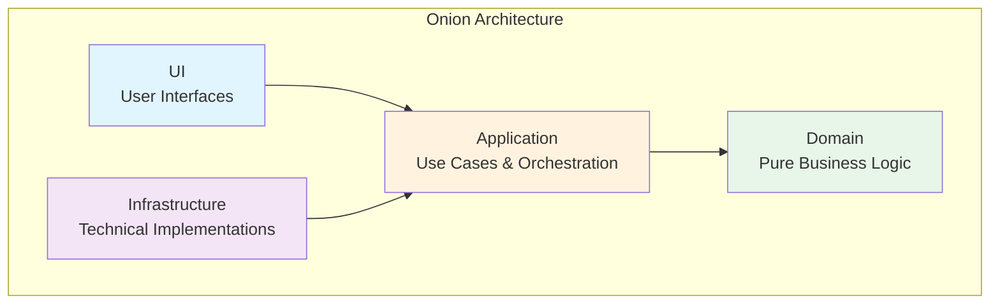

**Golden Rule**: Dependencies always point inwards. The domain depends on nothing.

## Development Progression Overview

```mermaid
graph LR
    subgraph "Phase 1"
        VO[Value Objects]
        EN[Entities]
        EV[Domain Events]
    end
    
    subgraph "Phase 2"
        UC[Use Cases]
        CMD[Commands/Queries]
        GW[Gateways]
    end
    
    subgraph "Phase 3"
        REPO[Repositories]
        DB[Database Entities]
        MIG[Migrations]
    end
    
    subgraph "Phase 4"
        API[REST API]
        WEB[Web UI]
        CLI[CLI]
    end
    
    subgraph "Phase 5"
        DI[Dependency Injection]
        CFG[Configuration]
        INT[Integration Tests]
    end
    
    VO --> EN --> EV --> UC --> CMD --> GW --> REPO --> DB --> MIG --> API --> WEB --> CLI --> DI --> CFG --> INT
```

## Phase 1: Domain Foundations

### 1.1 Start with Value Objects

Value Objects are the basic building blocks of the domain. They encapsulate the simplest business rules.

#### Creation Order:

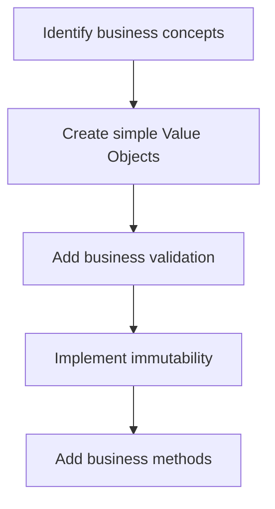

#### Example: ArticleId

```php
<?php
// src/BlogContext/Domain/Shared/ValueObject/ArticleId.php

declare(strict_types=1);

namespace App\BlogContext\Domain\Shared\ValueObject;

use Symfony\Component\Uid\Uuid;

final class ArticleId
{
    public function __construct(
        private(set) string $value,
    ) {
        if (!Uuid::isValid($value)) {
            throw new \InvalidArgumentException('Invalid article ID format');
        }
    }

    public function getValue(): string
    {
        return $this->value;
    }

    public function equals(self $other): bool
    {
        return $this->value === $other->value;
    }

    public function __toString(): string
    {
        return $this->value;
    }
}
```

#### Test First (TDD)

```php
<?php
// tests/BlogContext/Unit/Domain/Shared/ValueObject/ArticleIdTest.php

declare(strict_types=1);

namespace App\Tests\BlogContext\Unit\Domain\Shared\ValueObject;

use App\BlogContext\Domain\Shared\ValueObject\ArticleId;
use PHPUnit\Framework\TestCase;

final class ArticleIdTest extends TestCase
{
    public function testCreateWithValidUuid(): void
    {
        // Given
        $uuid = '550e8400-e29b-41d4-a716-446655440000';
        
        // When
        $articleId = new ArticleId($uuid);
        
        // Then
        self::assertSame($uuid, $articleId->getValue());
    }
    
    public function testCreateWithInvalidUuid(): void
    {
        // Then
        $this->expectException(\InvalidArgumentException::class);
        
        // When
        new ArticleId('invalid-uuid');
    }
}
```

### 1.2 Create Business Entities

Entities use Value Objects and add identity and business behavior.

#### Entity Structure

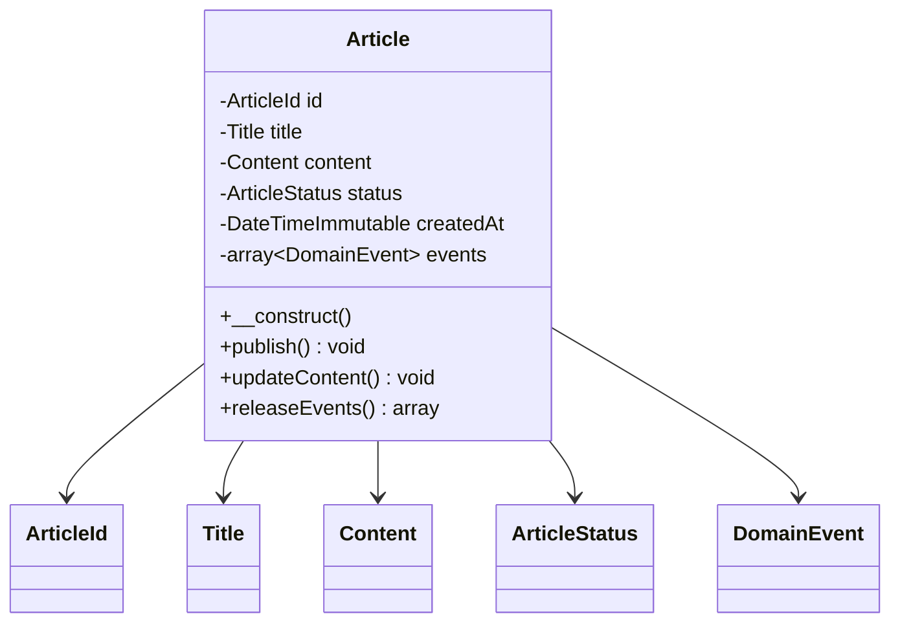

#### Example: Article Entity

```php
<?php
// src/BlogContext/Domain/CreateArticle/DataPersister/Article.php

declare(strict_types=1);

namespace App\BlogContext\Domain\CreateArticle\DataPersister;

use App\BlogContext\Domain\CreateArticle\Event\ArticleCreated;
use App\BlogContext\Domain\Shared\ValueObject\{ArticleId, Title, Content, ArticleStatus};

final class Article
{
    /** @var array<DomainEvent> */
    private array $events = [];

    public function __construct(
        private readonly ArticleId $id,
        private Title $title,
        private Content $content,
        private ArticleStatus $status,
        private readonly \DateTimeImmutable $createdAt,
    ) {
        $this->events[] = new ArticleCreated(
            articleId: $this->id,
            title: $this->title,
            createdAt: $this->createdAt,
        );
    }

    public function publish(): void
    {
        if (!$this->status->isDraft()) {
            throw new \DomainException('Only draft articles can be published');
        }
        
        $this->status = ArticleStatus::PUBLISHED;
        $this->events[] = new ArticlePublished($this->id, new \DateTimeImmutable());
    }

    public function releaseEvents(): array
    {
        $events = $this->events;
        $this->events = [];
        return $events;
    }
}
```

### 1.3 Define Domain Events

Events capture what happened in the domain.

```php
<?php
// src/BlogContext/Domain/CreateArticle/Event/ArticleCreated.php

declare(strict_types=1);

namespace App\BlogContext\Domain\CreateArticle\Event;

use App\BlogContext\Domain\Shared\ValueObject\{ArticleId, Title};

final readonly class ArticleCreated
{
    public function __construct(
        private ArticleId $articleId,
        private Title $title,
        private \DateTimeImmutable $createdAt,
    ) {}

    public function articleId(): ArticleId
    {
        return $this->articleId;
    }

    public function title(): Title
    {
        return $this->title;
    }

    public function createdAt(): \DateTimeImmutable
    {
        return $this->createdAt;
    }
}
```

## Phase 2: Use Cases (Application Layer)

### 2.1 Create Use Cases in the Domain

Creators, Updaters, etc., orchestrate the business logic.

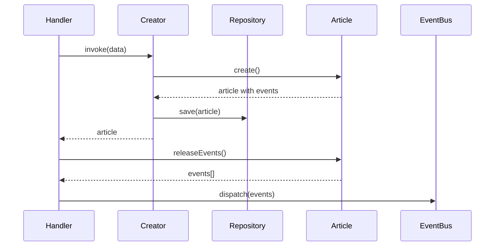

#### Example: Article Creator

```php
<?php
// src/BlogContext/Domain/CreateArticle/Creator.php

declare(strict_types=1);

namespace App\BlogContext\Domain\CreateArticle;

use App\BlogContext\Domain\CreateArticle\DataPersister\Article;
use App\BlogContext\Domain\Shared\Repository\ArticleRepositoryInterface;
use App\BlogContext\Domain\Shared\ValueObject\{ArticleId, Title, Content, Slug, ArticleStatus};

final readonly class Creator implements CreatorInterface
{
    public function __construct(
        private ArticleRepositoryInterface $repository,
    ) {}

    public function __invoke(
        ArticleId $articleId,
        Title $title,
        Content $content,
        Slug $slug,
        ArticleStatus $status,
        \DateTimeImmutable $createdAt,
    ): Article {
        // Check for uniqueness
        if ($this->repository->existsBySlug($slug)) {
            throw new ArticleAlreadyExists($slug);
        }

        // Create the article
        $article = new Article(
            id: $articleId,
            title: $title,
            content: $content,
            slug: $slug,
            status: $status,
            createdAt: $createdAt,
        );

        // Persist
        $this->repository->save($article);

        return $article;
    }
}
```

### 2.2 Implement CQRS

#### Commands (Write Operations)

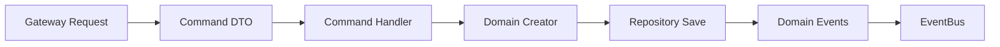

```php
<?php
// src/BlogContext/Application/Operation/Command/CreateArticle/Command.php

declare(strict_types=1);

namespace App\BlogContext\Application\Operation\Command\CreateArticle;

use App\BlogContext\Domain\Shared\ValueObject\ArticleId;

final readonly class Command
{
    public function __construct(
        public ArticleId $articleId,
        public string $title,
        public string $content,
        public string $slug,
        public string $status,
        public \DateTimeImmutable $createdAt,
    ) {}
}
```

```php
<?php
// src/BlogContext/Application/Operation/Command/CreateArticle/Handler.php

declare(strict_types=1);

namespace App\BlogContext\Application\Operation\Command\CreateArticle;

use App\BlogContext\Domain\CreateArticle\CreatorInterface;
use App\BlogContext\Domain\Shared\ValueObject\{Title, Content, Slug, ArticleStatus};
use App\Shared\Infrastructure\MessageBus\EventBusInterface;

final readonly class Handler
{
    public function __construct(
        private CreatorInterface $creator,
        private EventBusInterface $eventBus,
    ) {}

    public function __invoke(Command $command): void
    {
        // Transform data into Value Objects
        $title = new Title($command->title);
        $content = new Content($command->content);
        $slug = new Slug($command->slug);
        $status = ArticleStatus::fromString($command->status);

        // Execute business logic
        $article = ($this->creator)(
            articleId: $command->articleId,
            title: $title,
            content: $content,
            slug: $slug,
            status: $status,
            createdAt: $command->createdAt,
        );

        // Dispatch events
        foreach ($article->releaseEvents() as $event) {
            ($this->eventBus)($event);
        }
    }
}
```

#### Queries (Read Operations)

```php
<?php
// src/BlogContext/Application/Operation/Query/GetArticle/Query.php

declare(strict_types=1);

namespace App\BlogContext\Application\Operation\Query\GetArticle;

final readonly class Query
{
    public function __construct(
        public string $articleId,
    ) {}
}
```

### 2.3 Gateway Pattern

Gateways are the application's entry points with a middleware pipeline.

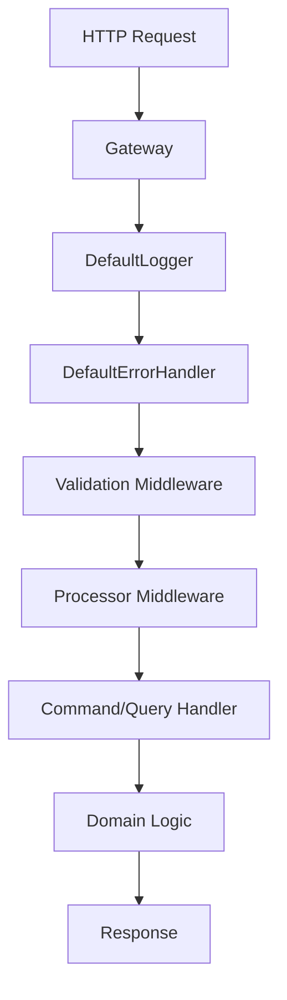

#### Gateway Structure

```
Application/Gateway/CreateArticle/
├── Gateway.php          # Extends DefaultGateway
├── Request.php          # Implements GatewayRequest
├── Response.php         # Implements GatewayResponse
└── Middleware/
    ├── Validation.php   # Business validation
    └── Processor.php    # Execute Command/Query
```

## Phase 3: Infrastructure

### 3.1 Implement Repositories

Repositories implement the interfaces defined in the domain.

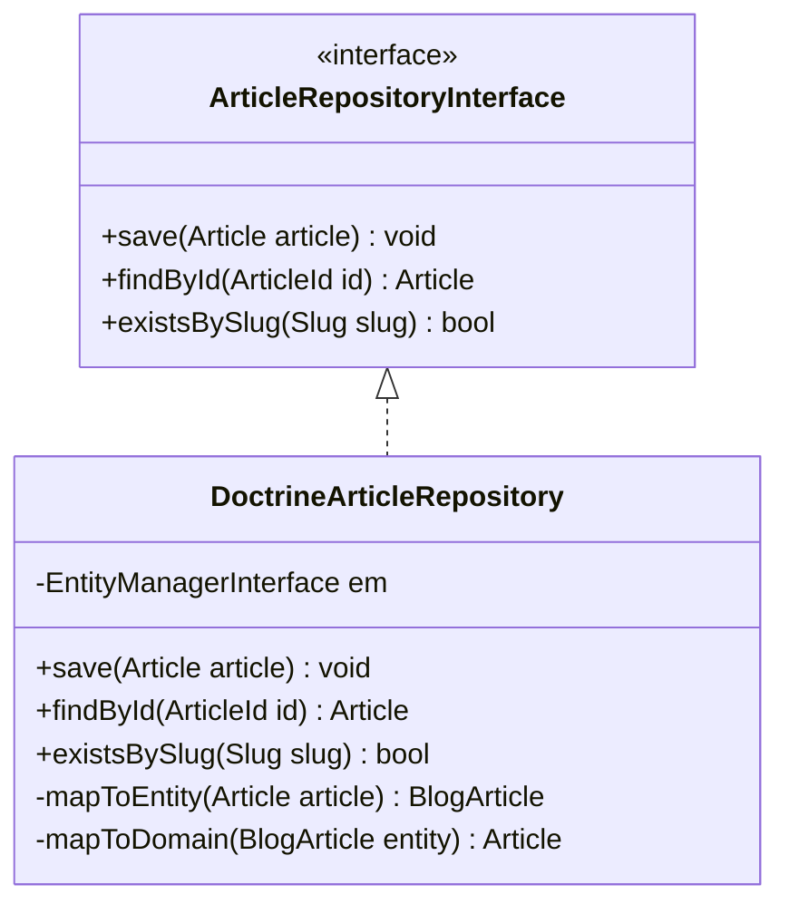

```php
<?php
// src/BlogContext/Infrastructure/Persistence/Doctrine/ORM/ArticleRepository.php

declare(strict_types=1);

namespace App\BlogContext\Infrastructure\Persistence\Doctrine\ORM;

use App\BlogContext\Domain\Shared\Repository\ArticleRepositoryInterface;
use App\BlogContext\Domain\CreateArticle\DataPersister\Article;
use App\BlogContext\Infrastructure\Persistence\Doctrine\ORM\Entity\BlogArticle;
use Doctrine\ORM\EntityManagerInterface;

final class ArticleRepository implements ArticleRepositoryInterface
{
    public function __construct(
        private readonly EntityManagerInterface $entityManager,
    ) {}

    public function save(Article $article): void
    {
        $entity = $this->mapToEntity($article);
        $this->entityManager->persist($entity);
        $this->entityManager->flush();
    }

    private function mapToEntity(Article $article): BlogArticle
    {
        return new BlogArticle(
            id: Uuid::fromString($article->id()->getValue()),
            title: $article->title()->getValue(),
            content: $article->content()->getValue(),
            slug: $article->slug()->getValue(),
            status: $article->status()->value,
            createdAt: $article->createdAt(),
        );
    }
}
```

### 3.2 Create Doctrine Entities

Doctrine entities are separate from domain entities.

```php
<?php
// src/BlogContext/Infrastructure/Persistence/Doctrine/ORM/Entity/BlogArticle.php

declare(strict_types=1);

namespace App\BlogContext\Infrastructure\Persistence\Doctrine\ORM\Entity;

use Doctrine\DBAL\Types\Types;
use Doctrine\ORM\Mapping as ORM;
use Symfony\Bridge\Doctrine\Types\UuidType;
use Symfony\Component\Uid\Uuid;

#[ORM\Entity]
#[ORM\Table(name: 'blog_articles')]
#[ORM\Index(columns: ['slug'], name: 'idx_articles_slug')]
#[ORM\Index(columns: ['status'], name: 'idx_articles_status')]
class BlogArticle
{
    #[ORM\Id]
    #[ORM\Column(type: UuidType::NAME, unique: true)]
    private Uuid $id;

    #[ORM\Column(type: Types::STRING, length: 200)]
    private string $title;

    #[ORM\Column(type: Types::TEXT)]
    private string $content;

    #[ORM\Column(type: Types::STRING, length: 250, unique: true)]
    private string $slug;

    #[ORM\Column(type: Types::STRING, length: 20)]
    private string $status;

    #[ORM\Column(type: Types::DATETIME_IMMUTABLE)]
    private \DateTimeImmutable $createdAt;

    public function __construct(
        Uuid $id,
        string $title,
        string $content,
        string $slug,
        string $status,
        \DateTimeImmutable $createdAt,
    ) {
        $this->id = $id;
        $this->title = $title;
        $this->content = $content;
        $this->slug = $slug;
        $this->status = $status;
        $this->createdAt = $createdAt;
    }
}
```

### 3.3 Manage Migrations

```bash
# Generate a migration after creating/modifying an entity
docker compose exec app bin/console doctrine:migrations:diff

# Check the generated migration
cat migrations/Version*.php

# Apply the migration
docker compose exec app bin/console doctrine:migrations:migrate
```

## Phase 4: User Interface

### 4.1 REST API with API Platform

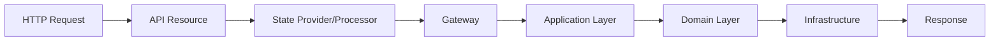

#### API Resource

```php
<?php
// src/BlogContext/UI/Api/Rest/Resource/ArticleResource.php

declare(strict_types=1);

namespace App\BlogContext\UI\Api\Rest\Resource;

use ApiPlatform\Metadata\ApiResource;
use ApiPlatform\Metadata\Get;
use ApiPlatform\Metadata\Post;

#[ApiResource(
    shortName: 'Article',
    operations: [
        new Get(
            uriTemplate: '/articles/{id}',
            provider: GetArticleProvider::class,
        ),
        new Post(
            uriTemplate: '/articles',
            processor: CreateArticleProcessor::class,
        ),
    ],
)]
final class ArticleResource
{
    public function __construct(
        public ?string $id = null,
        public ?string $title = null,
        public ?string $content = null,
        public ?string $slug = null,
        public ?string $status = null,
    ) {}
}
```

#### State Processor

```php
<?php
// src/BlogContext/UI/Api/Rest/Processor/CreateArticleProcessor.php

declare(strict_types=1);

namespace App\BlogContext\UI\Api\Rest\Processor;

use ApiPlatform\Metadata\Operation;
use ApiPlatform\State\ProcessorInterface;
use App\BlogContext\Application\Gateway\CreateArticle\Gateway;
use App\BlogContext\Application\Gateway\CreateArticle\Request;

final readonly class CreateArticleProcessor implements ProcessorInterface
{
    public function __construct(
        private Gateway $gateway,
    ) {}

    public function process(mixed $data, Operation $operation, array $uriVariables = [], array $context = []): mixed
    {
        /** @var ArticleResource $data */
        $request = Request::fromData([
            'title' => $data->title,
            'content' => $data->content,
            'slug' => $data->slug,
            'status' => $data->status ?? 'draft',
        ]);

        $response = ($this->gateway)($request);
        $responseData = $response->data();

        return new ArticleResource(
            id: $responseData['articleId'],
            title: $data->title,
            content: $data->content,
            slug: $responseData['slug'],
            status: $responseData['status'],
        );
    }
}
```

### 4.2 Admin Interface with Sylius

Structure for the admin UI:

```
UI/Web/Admin/
├── Form/
│   └── ArticleType.php      # Symfony Form
├── Grid/
│   └── ArticleGrid.php      # Grid Configuration
├── Resource/
│   └── ArticleResource.php  # Sylius Resource
├── Provider/
│   └── ArticleItemProvider.php
└── Processor/
    └── CreateArticleProcessor.php
```

## Phase 5: Integration

### 5.1 Symfony Configuration

#### Services Configuration

```yaml
# config/services.yaml
services:
    # Repositories
    App\BlogContext\Domain\Shared\Repository\ArticleRepositoryInterface:
        class: App\BlogContext\Infrastructure\Persistence\Doctrine\ORM\ArticleRepository

    # Creators
    App\BlogContext\Domain\CreateArticle\CreatorInterface:
        class: App\BlogContext\Domain\CreateArticle\Creator

    # Gateways
    App\BlogContext\Application\Gateway\:
        resource: '../src/BlogContext/Application/Gateway/'
        tags: ['controller.service_arguments']

    # API Processors/Providers
    App\BlogContext\UI\Api\Rest\:
        resource: '../src/BlogContext/UI/Api/Rest/'
        tags: ['api_platform.state_processor', 'api_platform.state_provider']
```

### 5.2 Event Bus Configuration

```yaml
# config/packages/messenger.yaml
framework:
    messenger:
        buses:
            event.bus:
                middleware:
                    - doctrine_transaction

        routing:
            'App\BlogContext\Domain\*\Event\*': event.bus
```

### 5.3 Integration Tests

#### Behat Test for the API

```gherkin
# features/blog/article-creation.feature
Feature: Article creation via API
  As an API consumer
  I want to create articles
  So that I can publish content

  Scenario: Successfully create an article
    When I make a POST request to "/api/articles" with JSON:
      """
      {
        "title": "My New Article",
        "content": "This is the article content",
        "slug": "my-new-article"
      }
      """
    Then the response should have status code 201
    And the response should contain JSON:
      """
      {
        "title": "My New Article",
        "slug": "my-new-article",
        "status": "draft"
      }
      """
```

## Complete Example: Developing a Feature

### Scenario: Add "Publish an Article" functionality

#### Step 1: Domain Layer

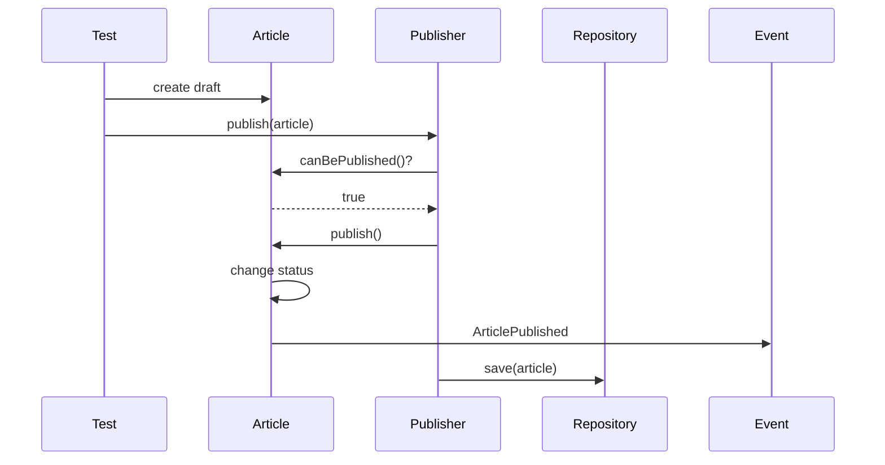

1. **Test First (TDD)**:
```php
// tests/BlogContext/Unit/Domain/PublishArticle/PublisherTest.php
public function testPublishDraftArticle(): void
{
    // Given
    $article = ArticleTestBuilder::create()
        ->withStatus(ArticleStatus::DRAFT)
        ->build();
    
    // When
    $publisher = new Publisher($this->repository);
    $publishedArticle = ($publisher)($article->id());
    
    // Then
    self::assertTrue($publishedArticle->status()->isPublished());
}
```

2. **Implement the Publisher**:
```php
// src/BlogContext/Domain/PublishArticle/Publisher.php
final readonly class Publisher implements PublisherInterface
{
    public function __construct(
        private ArticleRepositoryInterface $repository,
    ) {}

    public function __invoke(ArticleId $articleId): Article
    {
        $article = $this->repository->findById($articleId);
        
        if ($article === null) {
            throw new ArticleNotFound($articleId);
        }
        
        $article->publish();
        $this->repository->save($article);
        
        return $article;
    }
}
```

#### Step 2: Application Layer

1. **Command**:
```php
// src/BlogContext/Application/Operation/Command/PublishArticle/Command.php
final readonly class Command
{
    public function __construct(
        public string $articleId,
    ) {}
}
```

2. **Handler**:
```php
// src/BlogContext/Application/Operation/Command/PublishArticle/Handler.php
final readonly class Handler
{
    public function __construct(
        private PublisherInterface $publisher,
        private EventBusInterface $eventBus,
    ) {}

    public function __invoke(Command $command): void
    {
        $articleId = new ArticleId($command->articleId);
        $article = ($this->publisher)($articleId);
        
        foreach ($article->releaseEvents() as $event) {
            ($this->eventBus)($event);
        }
    }
}
```

3. **Gateway**:
```php
// src/BlogContext/Application/Gateway/PublishArticle/Gateway.php
final class Gateway extends DefaultGateway
{
    public function __construct(
        GatewayInstrumentation $instrumentation,
        ValidationMiddleware $validation,
        ProcessorMiddleware $processor,
    ) {
        parent::__construct([
            new DefaultLogger($instrumentation),
            new DefaultErrorHandler($instrumentation, 'BlogContext', 'Article', 'publish'),
            $validation,
            $processor,
        ]);
    }
}
```

#### Step 3: Infrastructure

1. **Update the Repository** if necessary
2. **Add an Event Listener** for side effects:
```php
// src/BlogContext/Infrastructure/EventListener/ArticlePublishedListener.php
final readonly class ArticlePublishedListener
{
    public function __invoke(ArticlePublished $event): void
    {
        // Send notification
        // Update cache
        // Index for search
    }
}
```

#### Step 4: UI Layer

1. **API Endpoint**:
```php
// Add to ArticleResource
new Patch(
    uriTemplate: '/articles/{id}/publish',
    processor: PublishArticleProcessor::class,
)
```

2. **Processor**:
```php
// src/BlogContext/UI/Api/Rest/Processor/PublishArticleProcessor.php
final readonly class PublishArticleProcessor implements ProcessorInterface
{
    public function __construct(
        private PublishArticleGateway $gateway,
    ) {}

    public function process(mixed $data, Operation $operation, array $uriVariables = [], array $context = []): mixed
    {
        $request = PublishArticleRequest::fromData([
            'articleId' => $uriVariables['id'],
        ]);

        $response = ($this->gateway)($request);
        
        return new ArticleResource(
            id: $uriVariables['id'],
            status: 'published',
        );
    }
}
```

#### Step 5: Integration Tests

```gherkin
# features/blog/article-publishing.feature
Feature: Article publishing
  As an editor
  I want to publish articles
  So that readers can access them

  Scenario: Publish a draft article
    Given there is a draft article with id "550e8400-e29b-41d4-a716-446655440000"
    When I make a PATCH request to "/api/articles/550e8400-e29b-41d4-a716-446655440000/publish"
    Then the response should have status code 200
    And the article should have status "published"
```

## Key Takeaways

### Development Order

1. **Always start with the domain** - It's the core of the application
2. **TDD at each step** - Test first, implementation second
3. **One layer at a time** - Don't mix responsibilities
4. **Continuous validation** - Run tests and QA after each step

### Architecture Rules

1. **Unidirectional dependencies** - Always inwards
2. **Domain purity** - No external dependencies in the domain
3. **Interface segregation** - Define interfaces in the domain
4. **Dependency inversion** - Infrastructure implements domain interfaces

### Development Workflow

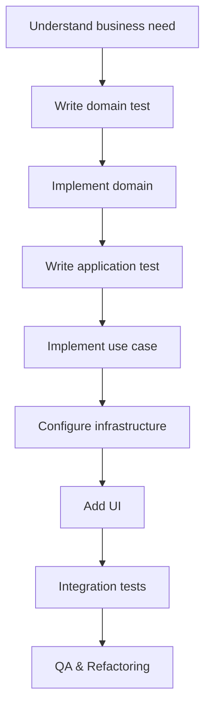

This approach ensures a solid, testable, and maintainable architecture that respects DDD, Hexagonal, and Clean Architecture principles.
