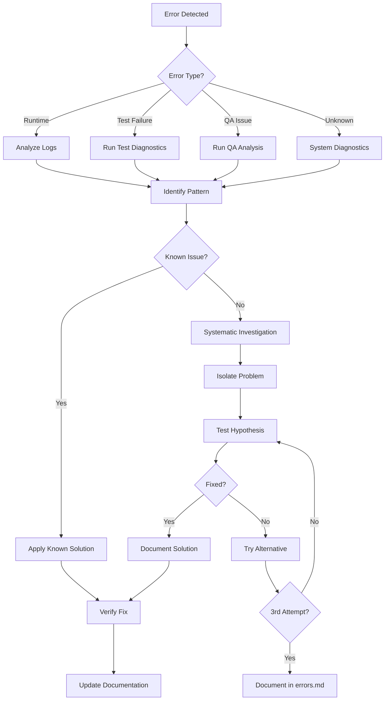

# Debug Workflow for AI Agents

## Overview

This workflow provides a systematic approach for AI agents to debug issues without interactive tools like Xdebug. It emphasizes automated diagnostics, pattern recognition, and structured problem-solving.

## Debug Process Flow



## Step-by-Step Debug Protocol

### 1. Initial Assessment

Use the `/debug` command to start:

```bash
# For general errors
/debug error "error message or context"

# For test failures
/debug test

# For QA issues
/debug qa

# For system diagnostics
/debug system
```

### 2. Error Classification

#### Runtime Errors
- **Symptoms**: 500 errors, exceptions, crashes
- **First Check**: `var/log/dev.log`
- **Common Causes**: Missing dependencies, permissions, configuration

#### Test Failures
- **Symptoms**: PHPUnit/Behat failures
- **First Check**: Test output with `-v` flag
- **Common Causes**: Database state, fixtures, assertions

#### QA Issues
- **Symptoms**: PHPStan errors, ECS violations
- **First Check**: Tool-specific output
- **Common Causes**: Type mismatches, style violations

#### Unknown Issues
- **Symptoms**: Unexpected behavior, no clear error
- **First Check**: System status, container logs
- **Common Causes**: Environment, resources, external services

### 3. Diagnostic Commands

#### Essential Debug Commands

```bash
# Container and service status
docker compose ps
docker compose logs app --tail=50

# PHP and Symfony status
docker compose exec app php -v
docker compose exec app bin/console about

# Database status
docker compose exec app bin/console doctrine:schema:validate
docker compose exec app bin/console doctrine:migrations:status

# Cache and permissions
docker compose exec app bin/console cache:clear
docker compose exec app ls -la var/cache var/log
```

#### Deep Diagnostics

```bash
# Memory and resources
docker compose exec app php -i | grep memory
docker stats --no-stream

# Dependency issues
docker compose exec app composer diagnose
docker compose exec app composer validate

# Route and service debugging
docker compose exec app bin/console debug:router
docker compose exec app bin/console debug:container
```

### 4. Investigation Techniques

#### A. Log Analysis Pattern

```bash
# Search for specific errors
docker compose exec app grep -n "Exception\|Error\|Fatal" var/log/dev.log | tail -20

# Find related log entries
docker compose exec app grep -B5 -A5 "error_keyword" var/log/dev.log

# Check timestamps
docker compose exec app tail -f var/log/dev.log
```

#### B. Code Inspection Pattern

```bash
# Find usage of problematic code
/grep "method_name" --glob "*.php"

# Check recent changes
git diff HEAD~1
git log --oneline -10

# Analyze specific file
/read path/to/suspicious/file.php
```

#### C. Isolation Testing

```bash
# Test single unit
docker compose exec app bin/phpunit tests/SpecificTest.php --filter testMethod

# Test with different data
docker compose exec app bin/console app:command --env=test --dry-run

# Minimal reproduction
# Create a simple test case to isolate the issue
```

### 5. Common Debug Patterns

#### Pattern 1: Class Not Found
```bash
# Check autoload
docker compose exec app composer dump-autoload
# Verify namespace and file location
# Check use statements
```

#### Pattern 2: Database Issues
```bash
# Validate schema
docker compose exec app bin/console doctrine:schema:validate
# Check migrations
docker compose exec app bin/console doctrine:migrations:status
# Test connection
docker compose exec app bin/console dbal:run-sql "SELECT 1"
```

#### Pattern 3: Permission Errors
```bash
# Fix common permission issues
docker compose exec app chmod -R 777 var/cache var/log
# Check file ownership
docker compose exec app ls -la var/
```

#### Pattern 4: Dependency Conflicts
```bash
# Check for conflicts
docker compose exec app composer why-not package/name
# Update dependencies
docker compose exec app composer update --dry-run
```

### 6. Debugging Without Xdebug

Since AI agents can't use interactive debuggers, use these alternatives:

#### A. Strategic Logging

```php
// Temporary debug points
\Symfony\Component\VarDumper\VarDumper::dump($variable);
error_log('Debug: ' . json_encode($data));

// Use Symfony logger
$this->logger->debug('Processing step X', ['data' => $data]);
```

#### B. Exception Enhancement

```php
// Add context to exceptions
throw new \RuntimeException(sprintf(
    'Failed to process: %s, Data: %s',
    $error,
    json_encode($context)
));
```

#### C. Test-Driven Debugging

```php
// Write a failing test that reproduces the issue
public function testProblematicScenario(): void
{
    // Arrange
    $input = 'problematic data';
    
    // Act & Assert
    $this->expectException(SpecificException::class);
    $this->service->process($input);
}
```

### 7. Solution Documentation

When a solution is found:

1. **Test the fix thoroughly**
   ```bash
   docker compose exec app composer qa
   ```

2. **Document in code**
   ```php
   // FIX: [Brief description of the issue and solution]
   // This prevents [specific error] when [condition]
   ```

3. **Update error log**
   - Add entry to `@docs/agent/errors.md`
   - Include reproduction steps
   - Document the solution

### 8. Debug Checklist

Before considering an issue "unsolvable":

- [ ] Checked all relevant logs?
- [ ] Cleared caches?
- [ ] Verified environment variables?
- [ ] Tested in isolation?
- [ ] Checked permissions?
- [ ] Validated configuration?
- [ ] Reviewed recent changes?
- [ ] Searched for similar issues in errors.md?
- [ ] Tried alternative approaches?
- [ ] Documented findings?

## Quick Reference

### Debug Commands
```bash
/debug error "context"    # General error debugging
/debug test              # Test failure analysis
/debug qa                # QA tool issues
/debug logs              # Log analysis
/debug system            # System diagnostics
```

### Key Files to Check
- `var/log/dev.log` - Application logs
- `var/log/test.log` - Test environment logs
- `.env` / `.env.local` - Environment configuration
- `config/packages/` - Package configuration
- `composer.json` / `composer.lock` - Dependencies

### Emergency Fixes
```bash
# Clear everything
docker compose exec app rm -rf var/cache/* var/log/*
docker compose exec app composer install
docker compose exec app bin/console cache:warmup

# Reset database
docker compose exec app bin/console doctrine:database:drop --force
docker compose exec app bin/console doctrine:database:create
docker compose exec app bin/console doctrine:migrations:migrate --no-interaction
```

## Remember

1. **Systematic approach**: Follow the workflow, don't skip steps
2. **Document everything**: Future debugging depends on good documentation
3. **Learn from errors**: Each debug session improves the process
4. **Ask for help**: After 3 attempts, document and seek assistance

The goal is not just to fix the immediate issue but to improve the debugging process for all future agents.