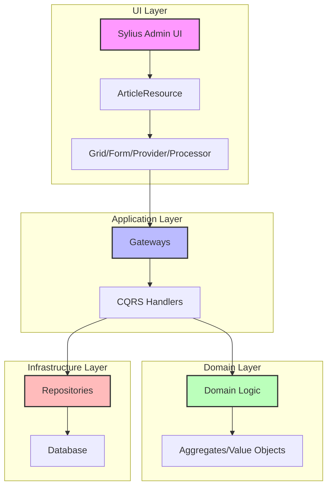

# Sylius Stack Integration Guide

## Overview

This guide explains how to integrate Sylius Stack admin UI with our DDD/Hexagonal architecture, providing a complete admin interface without breaking architectural boundaries.

## Architecture Integration

### Data Flow



### Key Principles

1. **Sylius as UI Adapter**: Sylius Stack acts purely as a presentation layer
2. **Gateway Integration**: All operations flow through existing Application Gateways
3. **No Domain Contamination**: Domain layer remains pure and unaware of Sylius
4. **Resource-Based Design**: Sylius resources represent UI state, not domain entities

## Implementation Structure

### Directory Organization

```
src/BlogContext/UI/Web/Admin/
├── Resource/
│   └── ArticleResource.php          # Sylius resource with attributes
├── Grid/
│   └── ArticleGrid.php             # Grid configuration
├── Form/
│   └── ArticleType.php             # Form definitions
├── Menu/
│   └── MenuBuilder.php             # Admin menu configuration
├── Provider/
│   ├── ArticleGridProvider.php     # List operations
│   └── ArticleItemProvider.php     # Single item operations
└── Processor/
    ├── CreateArticleProcessor.php  # Create operations
    ├── UpdateArticleProcessor.php  # Update operations
    └── DeleteArticleProcessor.php  # Delete operations
```

## Core Components

### 1. Resource Definition

Resources define API endpoints and their operations using attributes:

```php
#[AsResource(
    alias: 'app.article',
    section: 'admin',
    formType: ArticleType::class,
    templatesDir: '@SyliusAdminUi/crud',
    routePrefix: '/admin',
    driver: 'doctrine/orm',
)]
#[Index(
    grid: ArticleGrid::class,
)]
#[Create(
    processor: CreateArticleProcessor::class,
    redirectToRoute: 'app_admin_article_index',
)]
#[Show(
    provider: ArticleItemProvider::class,
)]
#[Update(
    provider: ArticleItemProvider::class,
    processor: UpdateArticleProcessor::class,
    redirectToRoute: 'app_admin_article_index',
)]
#[Delete(
    provider: ArticleItemProvider::class,
    processor: DeleteArticleProcessor::class,
)]
final class ArticleResource implements ResourceInterface
{
    public function __construct(
        public ?string $id = null,
        public ?string $title = null,
        public ?string $content = null,
        public ?string $slug = null,
        public ?string $status = null,
        public ?\DateTimeInterface $createdAt = null,
        public ?\DateTimeInterface $updatedAt = null,
        public ?\DateTimeInterface $publishedAt = null,
    ) {}
    
    public function getId(): ?string
    {
        return $this->id;
    }
}
```

**Key Attributes**:
- `AsResource`: Main configuration for the resource
- `Index`: List view with grid configuration
- `Create`: Form creation with processor
- `Show`: Detail view with provider
- `Update`: Edit form with provider and processor
- `Delete`: Deletion with provider and processor

**Editorial Workflow Resource**:

```php
#[AsResource(
    alias: 'app.editorial',
    section: 'admin',
    formType: ArticleType::class,
    templatesDir: '@SyliusAdminUi/crud',
    routePrefix: '/admin',
)]
#[Index(
    grid: EditorialArticleGrid::class,
)]
#[Show(
    provider: EditorialArticleItemProvider::class,
)]
#[Update(
    name: 'approve',
    provider: EditorialArticleItemProvider::class,
    processor: ApproveArticleProcessor::class,
    formType: ApproveArticleType::class,
    redirectToRoute: 'app_admin_editorial_index',
)]
#[Update(
    name: 'reject',
    provider: EditorialArticleItemProvider::class,
    processor: RejectArticleProcessor::class,
    formType: RejectArticleType::class,
    redirectToRoute: 'app_admin_editorial_index',
)]
final class EditorialArticleResource implements ResourceInterface
```

### 2. Grid Configuration

Grids handle data display and actions:

```php
final class ArticleGrid extends AbstractGrid implements ResourceAwareGridInterface
{
    public static function getName(): string
    {
        return self::class;
    }

    public function buildGrid(GridBuilderInterface $gridBuilder): void
    {
        $gridBuilder
            ->setProvider(ArticleGridProvider::class)
            ->setLimits([10, 20, 50])
            ->addField(StringField::create('title'))
            ->addField(StringField::create('status'))
            ->addField(DateTimeField::create('createdAt'))
            ->addActionGroup(
                MainActionGroup::create(
                    CreateAction::create()
                )
            )
            ->addActionGroup(
                ItemActionGroup::create(
                    UpdateAction::create(),
                    DeleteAction::create()
                )
            );
    }

    public function getResourceClass(): string
    {
        return ArticleResource::class;
    }
}
```

**Grid Features**:
- Pagination with configurable limits
- Sortable columns (automatic for most field types)
- Action groups (main for global, item for row-specific)
- Custom providers for data fetching
- Resource awareness for automatic routing

### 3. Providers (Read Operations)

Providers handle data retrieval using existing Query Gateways:

```php
final readonly class ArticleGridProvider implements DataProviderInterface
{
    public function __construct(
        private ListArticlesGateway $listArticlesGateway,
    ) {}

    public function getData(Grid $grid, Parameters $parameters): Pagerfanta
    {
        // Get current page and items per page from grid parameters
        $page = max(1, (int) $parameters->get('page', 1));
        $itemsPerPage = max(1, (int) $parameters->get('limit', 10));

        // Get criteria from parameters (for filtering)
        $criteria = $parameters->get('criteria', []);

        // Create gateway request
        $gatewayRequest = ListArticlesRequest::fromData([
            'page' => $page,
            'limit' => $itemsPerPage,
            // Add any filter criteria here if needed
        ]);

        // Execute gateway
        $gatewayResponse = ($this->listArticlesGateway)($gatewayRequest);
        $responseData = $gatewayResponse->data();

        // Transform response to ArticleResource objects
        $articles = [];
        if (isset($responseData['articles']) && is_array($responseData['articles'])) {
            foreach ($responseData['articles'] as $articleData) {
                if (is_array($articleData)) {
                    $articles[] = $this->transformToResource($articleData);
                }
            }
        }

        // Get total count from response
        $totalCount = $responseData['total'] ?? count($articles);

        // Create a FixedAdapter with the pre-paginated data
        $adapter = new FixedAdapter($totalCount, $articles);
        $pagerfanta = new Pagerfanta($adapter);

        // Set current page and max per page
        $pagerfanta->setCurrentPage($page);
        $pagerfanta->setMaxPerPage($itemsPerPage);

        return $pagerfanta;
    }

    private function transformToResource(array $data): ArticleResource
    {
        return new ArticleResource(
            id: $data['id'] ?? null,
            title: $data['title'] ?? null,
            content: $data['content'] ?? null,
            slug: $data['slug'] ?? null,
            status: $data['status'] ?? null,
            createdAt: isset($data['created_at']) && $data['created_at']
                ? new \DateTimeImmutable($data['created_at'])
                : null,
            updatedAt: isset($data['updated_at']) && $data['updated_at']
                ? new \DateTimeImmutable($data['updated_at'])
                : null,
            publishedAt: isset($data['published_at']) && $data['published_at']
                ? new \DateTimeImmutable($data['published_at'])
                : null,
        );
    }
}
```

**Provider Patterns**:
- Use `FixedAdapter` for pre-paginated data from gateways
- Transform gateway response arrays to resource objects
- Handle filtering criteria from grid parameters
- Return `Pagerfanta` instance for grid compatibility

### 4. Processors (Write Operations)

Processors handle data modifications using existing Command Gateways:

```php
final readonly class CreateArticleProcessor implements ProcessorInterface
{
    public function __construct(
        private CreateArticleGateway $createArticleGateway,
    ) {}

    public function process(mixed $data, Operation $operation, Context $context): mixed
    {
        /** @var ArticleResource $data */
        if (!$data instanceof ArticleResource) {
            throw new \InvalidArgumentException('Expected ArticleResource');
        }

        try {
            $gatewayRequest = CreateArticleRequest::fromData([
                'title' => $data->title,
                'content' => $data->content,
                'slug' => $data->slug,
                'status' => $data->status ?? 'draft',
                'createdAt' => new \DateTimeImmutable()->format(\DateTimeInterface::ATOM),
            ]);

            $gatewayResponse = ($this->createArticleGateway)($gatewayRequest);
            $responseData = $gatewayResponse->data();

            // Return updated resource with generated data
            return new ArticleResource(
                id: $responseData['articleId'],
                title: $data->title,
                content: $data->content,
                slug: $responseData['slug'] ?? $data->slug,
                status: $responseData['status'] ?? $data->status,
                createdAt: new \DateTimeImmutable(),
                updatedAt: new \DateTimeImmutable(),
                publishedAt: null,
            );
        } catch (\InvalidArgumentException $e) {
            throw new \InvalidArgumentException($e->getMessage(), 422, $e);
        } catch (ArticleAlreadyExists $e) {
            throw new \RuntimeException('Article with this slug already exists', 409, $e);
        } catch (GatewayException|\RuntimeException $e) {
            if (str_contains($e->getMessage(), 'already exists')) {
                throw new \RuntimeException('Article with this slug already exists', 409, $e);
            }
            throw $e;
        }
    }
}
```

**Processor Error Handling**:
- Validate input data type
- Transform domain exceptions to HTTP-appropriate exceptions
- Return fully populated resource objects
- Handle validation errors with 422 status
- Handle conflicts with 409 status

### 5. Menu Builder

The menu builder decorates the default Sylius admin menu to add custom navigation:

```php
#[AsDecorator(decorates: 'sylius_admin_ui.knp.menu_builder')]
final readonly class MenuBuilder implements MenuBuilderInterface
{
    public function __construct(
        private FactoryInterface $factory,
    ) {}

    public function createMenu(array $options): ItemInterface
    {
        $menu = $this->factory->createItem('root');

        // Add dashboard
        $menu
            ->addChild('dashboard', ['route' => 'sylius_admin_ui_dashboard'])
            ->setLabel('sylius.ui.dashboard')
            ->setLabelAttribute('icon', 'tabler:dashboard')
        ;

        // Add content management submenu
        $this->addContentSubMenu($menu);

        return $menu;
    }

    private function addContentSubMenu(ItemInterface $menu): void
    {
        $content = $menu
            ->addChild('content')
            ->setLabel('app.ui.content')
            ->setLabelAttribute('icon', 'tabler:file-text')
        ;

        $content->addChild('articles', ['route' => 'app_admin_article_index'])
            ->setLabel('app.ui.articles')
            ->setLabelAttribute('icon', 'tabler:article')
        ;
    }
}
```

Key features:
- Uses `#[AsDecorator]` attribute to replace the default menu builder
- Supports nested menu items with `addChild()`
- Icons use Tabler icon names (prefix with `tabler:`)
- Labels support translation keys

### 6. Form Types

Forms handle user input validation:

```php
final class ArticleType extends AbstractType
{
    public function buildForm(FormBuilderInterface $builder, array $options): void
    {
        $builder
            ->add('title', TextType::class, [
                'label' => 'app.ui.title',
                'required' => true,
                'constraints' => [
                    new Assert\NotBlank(message: 'app.article.title.not_blank'),
                    new Assert\Length(
                        min: 3,
                        max: 200,
                        minMessage: 'app.article.title.min_length',
                        maxMessage: 'app.article.title.max_length',
                    ),
                ],
                'attr' => [
                    'placeholder' => 'app.ui.enter_title',
                ],
            ])
            ->add('slug', TextType::class, [
                'label' => 'app.ui.slug',
                'required' => true,
                'constraints' => [
                    new Assert\NotBlank(message: 'app.article.slug.not_blank'),
                    new Assert\Regex(
                        pattern: '/^[a-z0-9\-]+$/',
                        message: 'app.article.slug.invalid_format',
                    ),
                ],
                'attr' => [
                    'placeholder' => 'app.ui.enter_slug',
                ],
            ])
            ->add('content', TextareaType::class, [
                'label' => 'app.ui.content',
                'required' => true,
                'constraints' => [
                    new Assert\NotBlank(message: 'app.article.content.not_blank'),
                    new Assert\Length(
                        min: 10,
                        minMessage: 'app.article.content.min_length',
                    ),
                ],
                'attr' => [
                    'rows' => 15,
                    'placeholder' => 'app.ui.enter_content',
                ],
            ])
            ->add('status', ChoiceType::class, [
                'label' => 'app.ui.status',
                'required' => true,
                'choices' => [
                    'app.ui.draft' => 'draft',
                    'app.ui.published' => 'published',
                    'app.ui.archived' => 'archived',
                ],
                'constraints' => [
                    new Assert\NotBlank(message: 'app.article.status.not_blank'),
                    new Assert\Choice(
                        choices: ['draft', 'published', 'archived'],
                        message: 'app.article.status.invalid_choice',
                    ),
                ],
            ]);
    }

    public function configureOptions(OptionsResolver $resolver): void
    {
        $resolver->setDefaults([
            'data_class' => ArticleResource::class,
            'translation_domain' => 'messages',
        ]);
    }

    #[\Override]
    public function getBlockPrefix(): string
    {
        return 'app_admin_article';
    }
}
```

**Form Best Practices**:
- Use translation keys for all labels and messages
- Add placeholders for better UX
- Configure comprehensive validation constraints
- Set appropriate HTML attributes (rows for textarea)
- Configure data_class to match resource
- Set translation_domain for proper message handling

## Configuration

### Resource Configuration

```php
// config/packages/sylius_resource.php
return static function (ContainerConfigurator $containerConfigurator): void {
    $containerConfigurator->extension('sylius_resource', [
        'mapping' => [
            'paths' => [
                '%kernel.project_dir%/src/BlogContext/UI/Web/Admin/Resource',
            ],
        ],
    ]);
};
```

### Admin Menu Configuration

The admin menu is configured by decorating the menu builder service according to [Sylius Stack documentation](https://stack.sylius.com/cookbook/admin_panel/menu#decorate-the-sidebar-menu):

```php
// src/BlogContext/UI/Web/Admin/Menu/MenuBuilder.php
#[AsDecorator(decorates: 'sylius_admin_ui.knp.menu_builder')]
final readonly class MenuBuilder implements MenuBuilderInterface
{
    public function __construct(
        private FactoryInterface $factory,
    ) {}

    public function createMenu(array $options): ItemInterface
    {
        $menu = $this->factory->createItem('root');

        $menu
            ->addChild('dashboard', [
                'route' => 'sylius_admin_ui_dashboard',
            ])
            ->setLabel('sylius.ui.dashboard')
            ->setLabelAttribute('icon', 'tabler:dashboard')
        ;

        $this->addContentSubMenu($menu);

        return $menu;
    }

    private function addContentSubMenu(ItemInterface $menu): void
    {
        $content = $menu
            ->addChild('content')
            ->setLabel('app.ui.content')
            ->setLabelAttribute('icon', 'tabler:file-text')
        ;

        $content->addChild('articles', ['route' => 'app_admin_article_index'])
            ->setLabel('app.ui.articles')
            ->setLabelAttribute('icon', 'tabler:article')
        ;
    }
}
```

**Important**: The menu must be configured via a decorator service, not through configuration files. This ensures proper integration with the Sylius Stack menu system.

## Testing

### Behat Integration

```gherkin
Feature: Article management in admin
  In order to manage blog content
  As an administrator
  I want to be able to view, create, update and delete articles

  Background:
    Given I am on the admin dashboard

  Scenario: Create new article
    When I go to "/admin/articles/new"
    And I fill in "Title" with "My New Article"
    And I fill in "Content" with "Article content"
    And I fill in "Slug" with "my-new-article"
    And I select "draft" from "Status"
    And I press "Create"
    Then I should see "Item has been successfully created."
    And I should be on "/admin/articles"

  Scenario: Edit existing article
    Given there is an article with title "Test Article"
    When I go to "/admin/articles"
    And I click "Edit" near "Test Article"
    And I fill in "Title" with "Updated Article"
    And I press "Save changes"
    Then I should see "Item has been successfully updated."
```

### Context Implementation

```php
final class ManagingBlogArticlesContext implements Context
{
    public function __construct(
        private Session $session,
        private ArticleResourceGenerator $articleResourceGenerator,
        private ListArticlesGateway $listArticlesGateway,
    ) {
    }

    /**
     * @When I go to the articles page
     */
    public function iGoToTheArticlesPage(): void
    {
        $this->session->visit('/admin/articles');
    }

    /**
     * @When I click :buttonText near :itemText
     */
    public function iClickButtonNearItem(string $buttonText, string $itemText): void
    {
        $page = $this->session->getPage();
        $row = $page->find('xpath', sprintf('//tr[contains(., "%s")]', $itemText));
        
        Assert::notNull($row, sprintf('Could not find row with text "%s"', $itemText));
        
        $button = $row->findLink($buttonText) ?? $row->findButton($buttonText);
        Assert::notNull($button, sprintf('Could not find button "%s"', $buttonText));
        
        $button->click();
    }

    /**
     * @Then I should see :count articles in the list
     */
    public function iShouldSeeArticlesInTheList(int $count): void
    {
        $page = $this->session->getPage();
        $rows = $page->findAll('css', 'table tbody tr');
        
        Assert::count($rows, $count);
    }
}
```

## Advanced Features

### Custom Grid Actions

```php
// In EditorialArticleGrid
->addActionGroup(
    ItemActionGroup::create(
        Action::create('review', 'show')
            ->setLabel('Review')
            ->setIcon('tabler:eye'),
        Action::create('approve', 'update')
            ->setLabel('Approve')
            ->setIcon('tabler:check')
            ->setOptions([
                'link' => [
                    'route' => 'app_admin_editorial_update',
                    'parameters' => [
                        'id' => 'resource.id',
                        'name' => 'approve',
                    ],
                ],
            ]),
        Action::create('reject', 'update')
            ->setLabel('Reject')
            ->setIcon('tabler:x')
            ->setOptions([
                'link' => [
                    'route' => 'app_admin_editorial_update',
                    'parameters' => [
                        'id' => 'resource.id',
                        'name' => 'reject',
                    ],
                ],
            ])
    )
)
```

### Multiple Update Operations

```php
// In EditorialArticleResource
#[Update(
    name: 'approve',
    provider: EditorialArticleItemProvider::class,
    processor: ApproveArticleProcessor::class,
    formType: ApproveArticleType::class,
    redirectToRoute: 'app_admin_editorial_index',
)]
#[Update(
    name: 'reject',
    provider: EditorialArticleItemProvider::class,
    processor: RejectArticleProcessor::class,
    formType: RejectArticleType::class,
    redirectToRoute: 'app_admin_editorial_index',
)]
```

### Custom Form Types for Actions

```php
final class RejectArticleType extends AbstractType
{
    public function buildForm(FormBuilderInterface $builder, array $options): void
    {
        $builder
            ->add('reason', TextareaType::class, [
                'label' => 'app.ui.rejection_reason',
                'required' => true,
                'constraints' => [
                    new Assert\NotBlank(message: 'app.editorial.reason.not_blank'),
                    new Assert\Length(
                        min: 10,
                        minMessage: 'app.editorial.reason.min_length',
                    ),
                ],
                'attr' => [
                    'rows' => 5,
                    'placeholder' => 'app.ui.enter_rejection_reason',
                ],
            ]);
    }

    public function configureOptions(OptionsResolver $resolver): void
    {
        $resolver->setDefaults([
            'data_class' => EditorialArticleResource::class,
            'translation_domain' => 'messages',
        ]);
    }
}
```

### Grid Filters

```php
// In grid configuration
->addFilter(
    StringFilter::create('status', ['pending_review'])
)
->addFilter(
    DateFilter::create('submittedAt')
        ->setLabel('app.ui.submitted_date')
)
->addFilter(
    SelectFilter::create('authorId')
        ->setLabel('app.ui.author')
        ->setChoices($this->getAuthorChoices())
)
```

### Handling Filters in Providers

```php
public function getData(Grid $grid, Parameters $parameters): Pagerfanta
{
    $criteria = $parameters->get('criteria', []);
    $sorting = $parameters->get('sorting', []);
    
    $gatewayRequest = ListArticlesRequest::fromData([
        'page' => $page,
        'limit' => $itemsPerPage,
        'status' => $criteria['status'] ?? null,
        'authorId' => $criteria['authorId'] ?? null,
        'sortBy' => key($sorting) ?? 'createdAt',
        'sortOrder' => current($sorting) ?? 'desc',
    ]);
    
    // ... rest of provider logic
}
```

## Error Handling

### Exception Transformation

```php
private function transformException(\Throwable $exception): \Throwable
{
    if ($exception instanceof GatewayException) {
        return match ($exception->getCode()) {
            404 => new NotFoundHttpException($exception->getMessage()),
            400 => new BadRequestHttpException($exception->getMessage()),
            409 => new ConflictHttpException($exception->getMessage()),
            default => $exception,
        };
    }
    
    return $exception;
}
```

## Performance Considerations

### Optimization Tips

1. **Lazy Loading**: Use providers for on-demand data loading
2. **Pagination**: Implement proper pagination in grid providers
3. **Caching**: Cache grid configurations and form types
4. **Batch Operations**: Use bulk actions for mass operations

### Monitoring

```php
final class InstrumentedProvider implements DataProviderInterface
{
    public function __construct(
        private DataProviderInterface $provider,
        private LoggerInterface $logger,
    ) {}

    public function getData(Grid $grid, Parameters $parameters): Pagerfanta
    {
        $start = microtime(true);
        $result = $this->provider->getData($grid, $parameters);
        $duration = microtime(true) - $start;
        
        $this->logger->info('Grid data loaded', [
            'grid' => $grid->getName(),
            'duration' => $duration,
            'count' => $result->count(),
        ]);
        
        return $result;
    }
}
```

## Migration Guide

### From Manual Controllers

1. **Remove Controllers**: Delete custom admin controllers
2. **Create Resources**: Define Sylius resources with attributes
3. **Implement Providers**: Create data providers using existing gateways
4. **Add Processors**: Implement state processors for write operations
5. **Update Routes**: Remove manual route definitions
6. **Test**: Verify all operations work through Behat tests

### From API Platform

1. **Reuse Logic**: Keep existing API Platform resources for API
2. **Add Admin Resources**: Create separate Sylius resources for admin
3. **Share Gateways**: Use same gateways for both APIs
4. **Consistent Validation**: Ensure form validation matches API validation

## Best Practices

### Resource Design

- **Keep Resources Simple**: Resources should only represent UI state
- **Use Attributes**: Configure everything through PHP attributes
- **Separate Concerns**: One resource per entity type
- **Type Safety**: Use typed properties and return types

### Provider/Processor Design

- **Single Responsibility**: One provider/processor per operation
- **Gateway Integration**: Always use existing gateways
- **Error Handling**: Transform exceptions appropriately
- **Logging**: Add logging for debugging and monitoring

### Testing

- **Feature Tests**: Use Behat for complete user journeys
- **Unit Tests**: Test providers and processors in isolation
- **Integration Tests**: Test gateway integration
- **Performance Tests**: Monitor grid loading times

## Troubleshooting

### Common Issues

1. **Grid Not Loading**: 
   - Check provider registration and gateway dependencies
   - Verify provider returns `Pagerfanta` instance
   - Check grid class has proper `getName()` method

2. **Form Validation Errors**: 
   - Verify form type configuration and constraints
   - Check that form data_class matches resource class
   - Ensure all required fields are present

3. **Route Not Found**: 
   - Ensure resource registration in `sylius_resource.php`
   - Check mapping paths include your resource directory
   - Run `bin/console debug:router | grep admin`

4. **Custom Actions Not Working**:
   - Verify the route name and parameters
   - Check that multiple Update attributes have unique names
   - Ensure processor handles the form name correctly

5. **Menu Not Appearing**:
   - Verify MenuBuilder uses `#[AsDecorator]` attribute
   - Check the decorator service ID is correct
   - Clear cache after menu changes

### Debug Commands

```bash
# Check registered resources
bin/console debug:container sylius.resource

# List all admin routes
bin/console debug:router | grep admin

# Check form types
bin/console debug:container | grep ArticleType

# Verify grid services
bin/console debug:container | grep Grid

# Check menu builder
bin/console debug:container | grep menu_builder
```

### Debugging Tips

1. **Enable Debug Mode**: Set `APP_ENV=dev` for detailed error messages
2. **Check Logs**: `tail -f var/log/dev.log`
3. **Use Web Profiler**: Check the Symfony toolbar for detailed request info
4. **Dump Variables**: Use `dump()` in Twig templates or `dd()` in PHP
5. **Check Service Wiring**: `bin/console debug:autowiring ProcessorInterface`

## Resources

- [Sylius Stack Documentation](https://stack.sylius.com/)
- [Sylius Resource Bundle](https://github.com/Sylius/SyliusResourceBundle)
- [Sylius Grid Bundle](https://github.com/Sylius/SyliusGridBundle)
- [Sylius Admin UI](https://github.com/Sylius/AdminUi)

## Summary

Sylius Stack integration provides a powerful admin interface while maintaining clean architecture:

- **No Domain Contamination**: Domain layer remains pure
- **Gateway Integration**: Reuses existing application logic
- **Resource-Based**: Auto-generates CRUD operations
- **Testable**: Complete Behat test coverage
- **Maintainable**: Clear separation of concerns

This approach ensures rapid admin development without compromising architectural integrity.