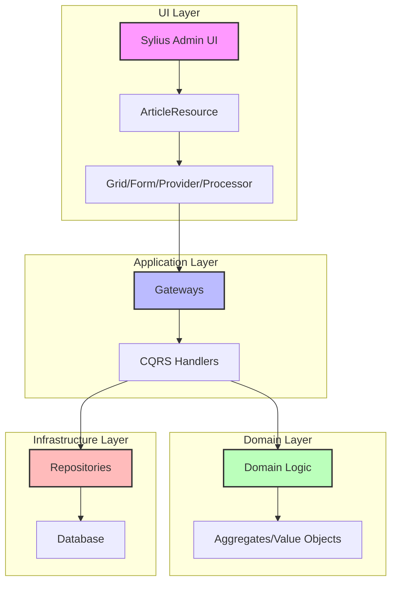

# Sylius Stack Integration Guide

## Overview

This guide explains how to integrate Sylius Stack admin UI with our DDD/Hexagonal architecture, providing a complete admin interface without breaking architectural boundaries.

## Architecture Integration

### Data Flow



### Key Principles

1. **Sylius as UI Adapter**: Sylius Stack acts purely as a presentation layer
2. **Gateway Integration**: All operations flow through existing Application Gateways
3. **No Domain Contamination**: Domain layer remains pure and unaware of Sylius
4. **Resource-Based Design**: Sylius resources represent UI state, not domain entities

## Implementation Structure

### Directory Organization

```
src/BlogContext/UI/Web/Admin/
├── Resource/
│   └── ArticleResource.php          # Sylius resource with attributes
├── Grid/
│   └── ArticleGrid.php             # Grid configuration
├── Form/
│   └── ArticleType.php             # Form definitions
├── Menu/
│   └── MenuBuilder.php             # Admin menu configuration
├── Provider/
│   ├── ArticleGridProvider.php     # List operations
│   └── ArticleItemProvider.php     # Single item operations
└── Processor/
    ├── CreateArticleProcessor.php  # Create operations
    ├── UpdateArticleProcessor.php  # Update operations
    └── DeleteArticleProcessor.php  # Delete operations
```

## Core Components

### 1. Resource Definition

Resources define API endpoints and their operations using attributes:

```php
#[AsResource(
    alias: 'app.article',
    section: 'admin',
    formType: ArticleType::class,
    templatesDir: '@SyliusAdminUi/crud',
    routePrefix: '/admin',
    driver: 'doctrine/orm',
)]
#[Index(grid: ArticleGrid::class)]
#[Create(processor: CreateArticleProcessor::class)]
#[Update(
    provider: ArticleItemProvider::class,
    processor: UpdateArticleProcessor::class,
)]
#[Delete(
    provider: ArticleItemProvider::class,
    processor: DeleteArticleProcessor::class,
)]
final class ArticleResource implements ResourceInterface
{
    public function __construct(
        public ?string $id = null,
        public ?string $title = null,
        public ?string $content = null,
        public ?string $slug = null,
        public ?string $status = null,
        public ?\DateTimeInterface $createdAt = null,
        public ?\DateTimeInterface $updatedAt = null,
        public ?\DateTimeInterface $publishedAt = null,
    ) {}
}
```

### 2. Grid Configuration

Grids handle data display and actions:

```php
final class ArticleGrid extends AbstractGrid implements ResourceAwareGridInterface
{
    public function buildGrid(GridBuilderInterface $gridBuilder): void
    {
        $gridBuilder
            ->setProvider(ArticleGridProvider::class)
            ->addField(StringField::create('title'))
            ->addField(StringField::create('status'))
            ->addField(DateTimeField::create('createdAt'))
            ->addActionGroup(
                MainActionGroup::create(CreateAction::create())
            )
            ->addActionGroup(
                ItemActionGroup::create(
                    UpdateAction::create(),
                    DeleteAction::create()
                )
            );
    }
}
```

### 3. Providers (Read Operations)

Providers handle data retrieval using existing Query Gateways:

```php
final readonly class ArticleGridProvider implements DataProviderInterface
{
    public function __construct(
        private ListArticlesGateway $listArticlesGateway,
    ) {}

    public function getData(Grid $grid, Parameters $parameters): Pagerfanta
    {
        $page = max(1, (int) $parameters->get('page', 1));
        $itemsPerPage = max(1, (int) $parameters->get('limit', 20));
        
        $gatewayRequest = ListArticlesRequest::fromData([
            'page' => $page,
            'limit' => $itemsPerPage,
        ]);
        
        $gatewayResponse = ($this->listArticlesGateway)($gatewayRequest);
        
        // Transform to ArticleResource objects
        return $this->transformToPagerfanta($gatewayResponse->data());
    }
}
```

### 4. Processors (Write Operations)

Processors handle data modifications using existing Command Gateways:

```php
final readonly class CreateArticleProcessor implements ProcessorInterface
{
    public function __construct(
        private CreateArticleGateway $createArticleGateway,
    ) {}

    public function process(mixed $data, Operation $operation, Context $context): mixed
    {
        $gatewayRequest = CreateArticleRequest::fromData([
            'title' => $data->title,
            'content' => $data->content,
            'slug' => $data->slug,
            'status' => $data->status ?? 'draft',
        ]);

        $gatewayResponse = ($this->createArticleGateway)($gatewayRequest);
        
        // Return updated resource
        return $this->transformToResource($gatewayResponse->data());
    }
}
```

### 5. Menu Builder

The menu builder decorates the default Sylius admin menu to add custom navigation:

```php
#[AsDecorator(decorates: 'sylius_admin_ui.knp.menu_builder')]
final readonly class MenuBuilder implements MenuBuilderInterface
{
    public function __construct(
        private FactoryInterface $factory,
    ) {}

    public function createMenu(array $options): ItemInterface
    {
        $menu = $this->factory->createItem('root');

        // Add dashboard
        $menu
            ->addChild('dashboard', ['route' => 'sylius_admin_ui_dashboard'])
            ->setLabel('sylius.ui.dashboard')
            ->setLabelAttribute('icon', 'tabler:dashboard')
        ;

        // Add content management submenu
        $this->addContentSubMenu($menu);

        return $menu;
    }

    private function addContentSubMenu(ItemInterface $menu): void
    {
        $content = $menu
            ->addChild('content')
            ->setLabel('app.ui.content')
            ->setLabelAttribute('icon', 'tabler:file-text')
        ;

        $content->addChild('articles', ['route' => 'app_admin_article_index'])
            ->setLabel('app.ui.articles')
            ->setLabelAttribute('icon', 'tabler:article')
        ;
    }
}
```

Key features:
- Uses `#[AsDecorator]` attribute to replace the default menu builder
- Supports nested menu items with `addChild()`
- Icons use Tabler icon names (prefix with `tabler:`)
- Labels support translation keys

### 6. Form Types

Forms handle user input validation:

```php
final class ArticleType extends AbstractType
{
    public function buildForm(FormBuilderInterface $builder, array $options): void
    {
        $builder
            ->add('title', TextType::class, [
                'label' => 'app.ui.title',
                'constraints' => [
                    new Assert\NotBlank(),
                    new Assert\Length(['min' => 3, 'max' => 200]),
                ],
            ])
            ->add('content', TextareaType::class, [
                'label' => 'app.ui.content',
                'constraints' => [
                    new Assert\NotBlank(),
                    new Assert\Length(['min' => 10]),
                ],
            ])
            ->add('status', ChoiceType::class, [
                'label' => 'app.ui.status',
                'choices' => [
                    'app.ui.draft' => 'draft',
                    'app.ui.published' => 'published',
                    'app.ui.archived' => 'archived',
                ],
            ]);
    }
}
```

## Configuration

### Resource Configuration

```php
// config/packages/sylius_resource.php
return static function (ContainerConfigurator $containerConfigurator): void {
    $containerConfigurator->extension('sylius_resource', [
        'mapping' => [
            'paths' => [
                '%kernel.project_dir%/src/BlogContext/UI/Web/Admin/Resource',
            ],
        ],
    ]);
};
```

### Admin Menu Configuration

The admin menu is configured by decorating the menu builder service according to [Sylius Stack documentation](https://stack.sylius.com/cookbook/admin_panel/menu#decorate-the-sidebar-menu):

```php
// src/BlogContext/UI/Web/Admin/Menu/MenuBuilder.php
#[AsDecorator(decorates: 'sylius_admin_ui.knp.menu_builder')]
final readonly class MenuBuilder implements MenuBuilderInterface
{
    public function __construct(
        private FactoryInterface $factory,
    ) {}

    public function createMenu(array $options): ItemInterface
    {
        $menu = $this->factory->createItem('root');

        $menu
            ->addChild('dashboard', [
                'route' => 'sylius_admin_ui_dashboard',
            ])
            ->setLabel('sylius.ui.dashboard')
            ->setLabelAttribute('icon', 'tabler:dashboard')
        ;

        $this->addContentSubMenu($menu);

        return $menu;
    }

    private function addContentSubMenu(ItemInterface $menu): void
    {
        $content = $menu
            ->addChild('content')
            ->setLabel('app.ui.content')
            ->setLabelAttribute('icon', 'tabler:file-text')
        ;

        $content->addChild('articles', ['route' => 'app_admin_article_index'])
            ->setLabel('app.ui.articles')
            ->setLabelAttribute('icon', 'tabler:article')
        ;
    }
}
```

**Important**: The menu must be configured via a decorator service, not through configuration files. This ensures proper integration with the Sylius Stack menu system.

## Testing

### Behat Integration

```gherkin
Feature: Article management in admin
  In order to manage blog content
  As an administrator
  I want to be able to view, create, update and delete articles

  Background:
    Given I am on the admin dashboard

  Scenario: Create new article
    When I go to "/admin/articles/new"
    And I fill in "Title" with "My New Article"
    And I fill in "Content" with "Article content"
    And I select "draft" from "Status"
    And I press "Create"
    Then I should see "Article has been successfully created"
```

### Context Implementation

```php
final class AdminContext extends MinkContext
{
    /**
     * @When I click :buttonText button for :itemText
     */
    public function iClickButtonForItem(string $buttonText, string $itemText): void
    {
        $row = $this->getSession()->getPage()
            ->find('xpath', sprintf('//tr[contains(., "%s")]', $itemText));
        
        $button = $row->findButton($buttonText);
        $button->click();
    }
}
```

## Advanced Features

### Custom Filters

```php
final class ArticleSearchFilter extends AbstractFilter
{
    protected function filterProperty(
        string $property,
        mixed $value,
        QueryBuilder $queryBuilder,
        QueryNameGeneratorInterface $queryNameGenerator,
        string $resourceClass,
        Operation $operation = null,
        array $context = []
    ): void {
        if ($property === 'search') {
            $alias = $queryBuilder->getRootAliases()[0];
            $queryBuilder
                ->andWhere("{$alias}.title LIKE :search")
                ->setParameter('search', "%{$value}%");
        }
    }
}
```

### Bulk Actions

```php
final class BulkPublishAction extends AbstractAction
{
    public function execute(array $resources, array $options = []): void
    {
        foreach ($resources as $resource) {
            $resource->status = 'published';
            // Process through UpdateArticleGateway
        }
    }
}
```

## Error Handling

### Exception Transformation

```php
private function transformException(\Throwable $exception): \Throwable
{
    if ($exception instanceof GatewayException) {
        return match ($exception->getCode()) {
            404 => new NotFoundHttpException($exception->getMessage()),
            400 => new BadRequestHttpException($exception->getMessage()),
            409 => new ConflictHttpException($exception->getMessage()),
            default => $exception,
        };
    }
    
    return $exception;
}
```

## Performance Considerations

### Optimization Tips

1. **Lazy Loading**: Use providers for on-demand data loading
2. **Pagination**: Implement proper pagination in grid providers
3. **Caching**: Cache grid configurations and form types
4. **Batch Operations**: Use bulk actions for mass operations

### Monitoring

```php
final class InstrumentedProvider implements DataProviderInterface
{
    public function __construct(
        private DataProviderInterface $provider,
        private LoggerInterface $logger,
    ) {}

    public function getData(Grid $grid, Parameters $parameters): Pagerfanta
    {
        $start = microtime(true);
        $result = $this->provider->getData($grid, $parameters);
        $duration = microtime(true) - $start;
        
        $this->logger->info('Grid data loaded', [
            'grid' => $grid->getName(),
            'duration' => $duration,
            'count' => $result->count(),
        ]);
        
        return $result;
    }
}
```

## Migration Guide

### From Manual Controllers

1. **Remove Controllers**: Delete custom admin controllers
2. **Create Resources**: Define Sylius resources with attributes
3. **Implement Providers**: Create data providers using existing gateways
4. **Add Processors**: Implement state processors for write operations
5. **Update Routes**: Remove manual route definitions
6. **Test**: Verify all operations work through Behat tests

### From API Platform

1. **Reuse Logic**: Keep existing API Platform resources for API
2. **Add Admin Resources**: Create separate Sylius resources for admin
3. **Share Gateways**: Use same gateways for both APIs
4. **Consistent Validation**: Ensure form validation matches API validation

## Best Practices

### Resource Design

- **Keep Resources Simple**: Resources should only represent UI state
- **Use Attributes**: Configure everything through PHP attributes
- **Separate Concerns**: One resource per entity type
- **Type Safety**: Use typed properties and return types

### Provider/Processor Design

- **Single Responsibility**: One provider/processor per operation
- **Gateway Integration**: Always use existing gateways
- **Error Handling**: Transform exceptions appropriately
- **Logging**: Add logging for debugging and monitoring

### Testing

- **Feature Tests**: Use Behat for complete user journeys
- **Unit Tests**: Test providers and processors in isolation
- **Integration Tests**: Test gateway integration
- **Performance Tests**: Monitor grid loading times

## Troubleshooting

### Common Issues

1. **Grid Not Loading**: Check provider registration and gateway dependencies
2. **Form Validation Errors**: Verify form type configuration and constraints
3. **Route Not Found**: Ensure resource registration in configuration
4. **Permission Denied**: Check security configuration and voters

### Debug Commands

```bash
# Check registered resources
bin/console debug:container sylius_resource

# Verify grid configuration
bin/console debug:grid article

# Test gateway directly
bin/console app:test-gateway list-articles
```

## Resources

- [Sylius Stack Documentation](https://stack.sylius.com/)
- [Sylius Resource Bundle](https://github.com/Sylius/SyliusResourceBundle)
- [Sylius Grid Bundle](https://github.com/Sylius/SyliusGridBundle)
- [Sylius Admin UI](https://github.com/Sylius/AdminUi)

## Summary

Sylius Stack integration provides a powerful admin interface while maintaining clean architecture:

- **No Domain Contamination**: Domain layer remains pure
- **Gateway Integration**: Reuses existing application logic
- **Resource-Based**: Auto-generates CRUD operations
- **Testable**: Complete Behat test coverage
- **Maintainable**: Clear separation of concerns

This approach ensures rapid admin development without compromising architectural integrity.