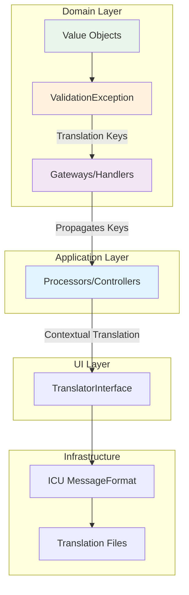

# Symfony Translation with ICU MessageFormat

## Overview

This document describes the implementation of the translation system using the Symfony Translation component with ICU MessageFormat support. The system maintains domain purity while providing advanced contextual translations.

## Architecture

### Fundamental Principle

- **Domain Layer**: Exceptions with translation keys (no translation)
- **Application Layer**: Propagation of translation keys
- **UI Layer**: Contextual translation as needed
- **Infrastructure Layer**: Configuration and translation services



## Configuration

### Translation Component

```php
// config/packages/translation.php
return static function (ContainerConfigurator $containerConfigurator): void {
    $containerConfigurator->extension('framework', [
        'translator' => [
            'default_path' => '%kernel.project_dir%/translations',
            'providers' => null,
            'fallbacks' => ['en'],
        ],
    ]);
};
```

### ICU MessageFormat

ICU MessageFormat support is automatically enabled via the `+intl-icu` suffix in translation file names.

## Translation File Structure

### Naming Convention

```
translations/
├── messages+intl-icu.en.yaml    # English (default)
├── messages+intl-icu.fr.yaml    # French
└── validators+intl-icu.en.yaml  # Validations (optional)
```

### Hierarchical Organization

```yaml
# Recommended structure
app:
  ui:
    title: "Vibe PHP - Content Management"
    welcome: "Welcome {username}"
  
blog:
  article:
    title: "Article"
    status:
      draft: "Draft"
      published: "Published"
      archived: "Archived"
  
validation:
  article:
    title:
      empty: "Title cannot be empty"
      too_short: "Title must be at least {min_length} characters"
    content:
      empty: "Content cannot be empty"
      too_short: "Content must be at least {min_length} characters"

error:
  article:
    not_found: "Article not found"
    already_exists: "Article with this slug already exists"
```

## ICU MessageFormat Features

### 1. Pluralization

```yaml
# Pluralization with variables
count: '{count, plural, =0 {no articles} =1 {one article} other {# articles}}'

# Usage examples
# count=0  → "no articles"
# count=1  → "one article" 
# count=5  → "5 articles"
```

### 2. Ordinals

```yaml
# Ordinal numbers
ranking: 'This is the {position, selectordinal, one {#st} two {#nd} few {#rd} other {#th}} most popular article'

# Usage examples
# position=1  → "This is the 1st most popular article"
# position=2  → "This is the 2nd most popular article"
# position=3  → "This is the 3rd most popular article"
# position=21 → "This is the 21st most popular article"
```

### 3. Dates and Times

```yaml
# Date formatting
published_date: 'Published on {date, date, full}'
published_time: 'at {time, time, short}'
published_datetime: 'Published {datetime, date, medium} at {datetime, time, short}'

# Usage examples with DateTimeImmutable
# date=2024-01-15     → "Published on Monday, January 15, 2024"
# time=14:30:00       → "at 2:30 PM"
# datetime=2024-01-15 14:30:00 → "Published Jan 15, 2024 at 2:30 PM"
```

### 4. Conditions

```yaml
# Conditional selection
article_status: '{status, select, draft {📝 Draft} published {✅ Published} archived {📦 Archived} other {❓ Unknown}}'

# Conditions with gender
greeting: '{gender, select, male {Dear Mr. {name}} female {Dear Mrs. {name}} other {Dear {name}}}'
```

### 5. Number Formatting

```yaml
# Numbers with formatting
price: '{amount, number, currency}'
percentage: '{value, number, percent}'
file_size: '{bytes, number, integer} bytes'

# Usage examples
# amount=29.99, currency=EUR → "€29.99"
# value=0.75 → "75%"
# bytes=1024 → "1,024 bytes"
```

## Implementation in Layers

### Domain Layer - ValidationException

```php
namespace App\BlogContext\Domain\Shared\Exception;

final class ValidationException extends \InvalidArgumentException
{
    private function __construct(
        string $message,
        private readonly string $translationKey,
        private readonly array $translationParameters = [],
        private readonly string $translationDomain = 'messages',
        ?\Throwable $previous = null,
    ) {
        parent::__construct($message, 0, $previous);
    }

    public static function withTranslationKey(
        string $translationKey,
        array $translationParameters = [],
        string|null $translationDomain = 'messages',
        string|null $fallbackMessage = null
    ): self {
        return new self(
            message: $fallbackMessage ?? "Validation failed: {$translationKey}",
            translationKey: $translationKey,
            translationParameters: $translationParameters,
            translationDomain: $translationDomain ?? 'messages',
        );
    }

    public function getTranslationKey(): string
    {
        return $this->translationKey;
    }

    public function getTranslationParameters(): array
    {
        return $this->translationParameters;
    }

    public function getTranslationDomain(): string
    {
        return $this->translationDomain;
    }
}
```

### Domain Layer - Value Objects

```php
// Example: Title Value Object
namespace App\BlogContext\Domain\Shared\ValueObject;

final class Title
{
    public function __construct(
        private readonly string $value,
    ) {
        $this->validate();
    }

    private function validate(): void
    {
        $trimmed = trim($this->value);
        
        if ('' === $trimmed) {
            throw ValidationException::withTranslationKey(
                translationKey: 'validation.article.title.empty',
                fallbackMessage: 'Title cannot be empty'
            );
        }

        if (mb_strlen($trimmed) < 3) {
            throw ValidationException::withTranslationKey(
                translationKey: 'validation.article.title.too_short',
                translationParameters: ['min_length' => 3, 'actual_length' => mb_strlen($trimmed)],
                fallbackMessage: 'Title is too short'
            );
        }

        if (mb_strlen($trimmed) > 200) {
            throw ValidationException::withTranslationKey(
                translationKey: 'validation.article.title.too_long',
                translationParameters: ['max_length' => 200, 'actual_length' => mb_strlen($trimmed)],
                fallbackMessage: 'Title is too long'
            );
        }
    }
}
```

### Application Layer - Symfony Constraints

```php
// Custom constraint for SEO validation
namespace App\BlogContext\Application\Gateway\PublishArticle\Constraint;

#[\Attribute]
final class SeoReady extends Constraint
{
    public string $titleTooShort = 'validation.seo.title.too_short';
    public string $contentTooShort = 'validation.seo.content.too_short';
    public string $missingMetaDescription = 'validation.seo.meta_description.missing';

    public function getTargets(): string
    {
        return self::CLASS_CONSTRAINT;
    }
}
```

### UI Layer - Contextual Translation

```php
// Example: API Platform Processor
namespace App\BlogContext\UI\Api\Rest\Processor;

final readonly class CreateArticleProcessor implements ProcessorInterface
{
    public function __construct(
        private CreateArticleGateway $createArticleGateway,
        private TranslatorInterface $translator,
    ) {}

    public function process(mixed $data, Operation $operation, array $uriVariables = [], array $context = []): mixed
    {
        try {
            // ... business logic
            return $response;
        } catch (ValidationException $e) {
            // Contextual translation for the API
            $message = $this->translator->trans(
                $e->getTranslationKey(),
                $e->getTranslationParameters(),
                $e->getTranslationDomain()
            );
            throw new BadRequestHttpException($message, $e);
        } catch (ArticleAlreadyExists $e) {
            $message = $this->translator->trans('error.article.already_exists', [], 'messages');
            throw new ConflictHttpException($message, $e);
        }
    }
}
```

## Best Practices

### 1. Translation Keys

**Recommended structure:**
```
{context}.{entity}.{field}.{error_type}
validation.article.title.empty
validation.article.content.too_short
error.article.not_found
app.ui.button.save
```

**Avoid:**
```
title_empty              # Too vague
article_title_empty      # No hierarchy
ArticleTitleEmpty        # Incorrect format
```

### 2. ICU Parameters

```yaml
# ✅ Correct: Typed and clear parameters
validation:
  article:
    title:
      too_short: 'Title must be at least {min_length, number} characters, got {actual_length, number}'
      length_range: 'Title must be between {min, number} and {max, number} characters'

# ❌ Avoid: Untyped parameters
validation:
  article:
    title:
      too_short: 'Title must be at least {min_length} characters'  # No number type
```

### 3. Pluralization

```yaml
# ✅ Correct: Special cases + general rule
count_articles: '{count, plural, =0 {no articles} =1 {one article} other {# articles}}'

# ✅ Correct: Complex pluralization
remaining_time: '{minutes, plural, =0 {less than a minute} =1 {one minute} other {# minutes}} remaining'

# ❌ Avoid: Logic in PHP code
# if ($count === 0) return 'no articles';
# if ($count === 1) return 'one article';
# return $count . ' articles';
```

### 4. Translation Domains

```php
// ✅ Separate by functional context
$this->translator->trans('validation.article.title.empty', [], 'messages');
$this->translator->trans('email.welcome.subject', [], 'emails');
$this->translator->trans('invoice.total', [], 'billing');

// ❌ Avoid: Everything in 'messages'
$this->translator->trans('email_welcome_subject', [], 'messages');
```

## Error Handling

### 1. Logs and Debugging

Translation keys remain in logs for debugging:

```php
// ✅ Log with translation key (easy debugging)
$this->logger->error('Validation failed', [
    'translation_key' => $exception->getTranslationKey(),
    'parameters' => $exception->getTranslationParameters(),
    'user_input' => $input
]);

// ❌ Log with translated text (hard debugging)
$this->logger->error('Title cannot be empty', ['user_input' => $input]);
```

### 2. Contexts Without Translation

Some contexts do not translate:
- **CLI Commands**: Display keys for debugging
- **Queue Workers**: Logs with keys only
- **Internal APIs**: Propagate keys without translation

```php
// CLI Command - no translation
if ($exception instanceof ValidationException) {
    $output->writeln("<error>Validation failed: {$exception->getTranslationKey()}</error>");
    return Command::FAILURE;
}
```

## Tests

### 1. Value Object Tests

```php
public function testTitleValidationWithTranslationKeys(): void
{
    $this->expectException(ValidationException::class);
    
    $exception = null;
    try {
        new Title('');
    } catch (ValidationException $e) {
        $exception = $e;
    }
    
    $this->assertNotNull($exception);
    $this->assertEquals('validation.article.title.empty', $exception->getTranslationKey());
    $this->assertEquals([], $exception->getTranslationParameters());
    $this->assertEquals('messages', $exception->getTranslationDomain());
}
```

### 2. ICU Translation Tests

```php
public function testIcuPluralTranslation(): void
{
    $translator = $this->getContainer()->get(TranslatorInterface::class);
    
    $this->assertEquals('no articles', $translator->trans('count', ['count' => 0]));
    $this->assertEquals('one article', $translator->trans('count', ['count' => 1]));
    $this->assertEquals('5 articles', $translator->trans('count', ['count' => 5]));
}
```

### 3. UI Integration Tests

```php
public function testApiErrorTranslation(): void
{
    $client = static::createClient();
    
    $client->request('POST', '/api/articles', [
        'json' => ['title' => '', 'content' => 'test']
    ]);
    
    $this->assertResponseStatusCodeSame(400);
    $response = json_decode($client->getResponse()->getContent(), true);
    $this->assertStringContains('Title cannot be empty', $response['detail']);
}
```

## Maintenance

### 1. Adding New Translations

1. **Add the key** in all language files
2. **Use in code** via ValidationException or constraints
3. **Test** the translation and ICU parameters
4. **Document** the new keys in this file

### 2. Migrating Existing Keys

```bash
# Search for hardcoded text
grep -r "Title cannot be empty" src/

# Replace with translation keys
# ValidationException::withTranslationKey('validation.article.title.empty')
```

### 3. Validating Translations

```bash
# Check ICU syntax
docker compose exec app bin/console translation:validate

# Search for missing keys
docker compose exec app bin/console debug:translation fr
```

## Advanced Usage Examples

### 1. Conditional Translation with Context

```php
// In a Processor with user context
$locale = $request->getLocale() ?? 'en';
$message = $this->translator->trans(
    'notification.article.published',
    [
        'title' => $article->getTitle(),
        'author' => $article->getAuthor(),
        'date' => $article->getPublishedAt(),
    ],
    'messages',
    $locale
);
```

### 2. Batch Translation

```php
// For lists or arrays
$statuses = ['draft', 'published', 'archived'];
$translatedStatuses = array_map(
    fn($status) => $this->translator->trans("blog.article.status.{$status}"),
    $statuses
);
```

### 3. Translation with Fallbacks

```php
// With custom fallback
$key = "custom.message.{$type}";
$message = $this->translator->trans($key, $parameters);

// If the key doesn't exist, ICU returns the key
if ($message === $key) {
    $message = $this->translator->trans('generic.error.message', $parameters);
}
```

## Continuous Integration

### 1. Validation in CI/CD

```yaml
# .github/workflows/ci.yml
- name: Validate translations
  run: |
    docker compose exec -T app bin/console translation:validate
    docker compose exec -T app bin/econsole debug:translation --only-missing
```

### 2. Translation Metrics

- Percentage of translated keys per language
- Missing or obsolete keys
- Usage of ICU features

## Handling Nested Exceptions in API

### Translation of Nested Exceptions

When integrating with API Platform, exceptions can be deeply nested. Here's how to handle them:

```php
// In API Processors
catch (GatewayException $e) {
    // Traverse all nested exceptions
    $current = $e;
    while ($current instanceof \Throwable) {
        if ($current instanceof ArticleAlreadyExists) {
            $message = $this->translator->trans('error.article.already_exists', [], 'messages');
            throw new ConflictHttpException($message, $e);
        }
        if ($current instanceof ValidationException) {
            $message = $this->translator->trans(
                $current->getTranslationKey(),
                $current->getTranslationParameters(),
                $current->getTranslationDomain()
            );
            throw new BadRequestHttpException($message, $e);
        }
        // Check for text patterns in deeply nested exceptions
        if ($current->getMessage() && str_contains($current->getMessage(), 'already exists')) {
            $message = $this->translator->trans('error.article.already_exists', [], 'messages');
            throw new ConflictHttpException($message, $e);
        }
        $current = $current->getPrevious();
    }
    
    // Handle validation errors from DefaultValidation middleware
    if (str_contains($e->getMessage(), 'validation.') && str_contains($e->getMessage(), 'DefaultValidation.php')) {
        $lines = explode("\n", $e->getMessage());
        $translatedLines = [];
        
        foreach ($lines as $line) {
            $line = trim($line);
            if (str_starts_with($line, 'validation.')) {
                $translatedLines[] = $this->translator->trans($line, [], 'messages');
            }
        }
        
        if ([] !== $translatedLines) {
            throw new UnprocessableEntityHttpException(implode("\n", $translatedLines), $e);
        }
    }
    
    throw $e;
}
```

### Key Points

1. **Domain Exceptions**: Never contain translations
2. **GatewayException**: Can contain exceptions nested at multiple levels
3. **Symfony Validation**: Errors may come from `DefaultValidation` middleware
4. **HTTP Codes**: Map exceptions correctly to HTTP codes (409 for conflicts, 422 for validation errors)

## Tests and Translation

### Unit Tests

```php
// Test translation keys, not messages
public function testValidationWithTranslationKeys(): void
{
    try {
        new Title('');
    } catch (ValidationException $e) {
        $this->assertEquals('validation.article.title.empty', $e->getTranslationKey());
        $this->assertEquals([], $e->getTranslationParameters());
        throw $e;
    }
}

// Test with parameters
public function testValidationWithParameters(): void
{
    try {
        new Title('Hi');
    } catch (ValidationException $e) {
        $this->assertEquals('validation.article.title.too_short', $e->getTranslationKey());
        $this->assertEquals([
            'min_length' => 5,
            'actual_length' => 2
        ], $e->getTranslationParameters());
        throw $e;
    }
}
```

### Behat Tests

Behat tests must consider that:
- Validation errors return specific HTTP codes
- Error messages are translated in the UI layer
- Some validations (like SEO) may require additional fields

```gherkin
# Expect 422 for validation errors
Then the response should have status code 422

# Expect 409 for conflicts
Then the response should have status code 409
```

## Troubleshooting

### 1. Common Issues

**Key not found:**
```
# Symptom: The key is returned instead of the translation
"validation.article.title.empty"

# Solution: Check for existence in +intl-icu files
```

**ICU Syntax Error:**
```
# Symptom: Exception during translation
MessageFormatter::formatMessage(): msgfmt_format_message: ...

# Solution: Validate ICU syntax
'{count, plural, =0 {none} other {#}}'  # ✅ Correct
'{count, plural =0 {none} other {#}}'   # ❌ Missing comma
```

**Missing parameters:**
```
# Symptom: [Argument Error] in translation
# Solution: Verify that all ICU parameters are provided
$this->translator->trans('message', ['count' => 5, 'name' => 'John']);
```

**Nested exception not translated:**
```
# Symptom: Code 500 instead of expected HTTP code (409, 422)
# Solution: Check nested exception handling in Processor
```

### 2. Debugging

```php
// Enable translation logs
# config/packages/dev/monolog.yaml
monolog:
    channels: ['translation']
    handlers:
        translation:
            type: stream
            path: '%kernel.logs_dir%/translation.log'
            channels: ['translation']
```

## Known Limitations

1. **SEO Meta Description**: SEO validation requires a `meta_description` field that doesn't currently exist in the infrastructure
2. **Test Mocks**: Unit tests require mocks for `SeoReadyValidator` as gateways are `final`
3. **Deeply Nested Exceptions**: Some exceptions from Symfony Messenger may be wrapped multiple times

## Implementation Checklist

When implementing translations:

- [ ] Add translation keys to all language files
- [ ] Use `ValidationException::withTranslationKey()` in Domain layer
- [ ] Add `actual_length` parameter for length validations
- [ ] Handle nested exceptions in UI Processors
- [ ] Map exceptions to correct HTTP status codes
- [ ] Test with translation keys, not messages
- [ ] Update Behat scenarios for expected status codes
- [ ] Document new translation keys

This documentation covers the entire translation system implemented with best practices, pitfalls to avoid, and solutions to problems encountered during implementation.
