# Behat Troubleshooting Guide

## Overview

This guide provides a systematic approach to debugging Behat test failures. Instead of random debugging, follow this decision tree and use the appropriate tools for each type of error.

## 🔄 Debug Decision Flow

```mermaid
flowchart TD
    A[🚨 Behat Test Failure] --> B{📝 What type of error?}
    
    B -->|❌ Assertion Failed| C[🎯 Isolate Scenario]
    B -->|🌐 HTTP Error 500/404/403| D[🔍 Test with CURL]
    B -->|🔍 Element Not Found| E[📄 Inspect HTML Output]
    B -->|💾 Database Error| F[🗃️ Check Fixtures/Migrations]
    B -->|⏱️ Timeout/Timing| G[🕐 Check Page Load]
    
    C --> H[behat --name='scenario name']
    D --> I[curl -v http://localhost/path]
    E --> J[HTML dump + screenshots]
    F --> K[doctrine:migrations:status]
    G --> L[Add waits/check selectors]
    
    H --> M{🎯 Error isolated?}
    I --> N{✅ Valid response?}
    J --> O{🔍 Element exists?}
    K --> P{📊 DB state OK?}
    L --> Q{⏰ Timing fixed?}
    
    M -->|✅ Yes| R[🔧 Debug Specific Issue]
    M -->|❌ No| S[🌍 Global Problem]
    
    N -->|❌ No| T[📋 Check Symfony Logs]
    N -->|✅ Yes| U[🧪 Check Test Logic]
    
    O -->|❌ No| V[🏗️ Check Page Structure]
    O -->|✅ Yes| W[🎭 Check CSS Selectors]
    
    P -->|❌ No| X[🔄 Reset DB/Run Fixtures]
    P -->|✅ Yes| Y[🧩 Check Test Data Logic]
    
    Q -->|❌ No| Z[🔧 Add explicit waits]
    Q -->|✅ Yes| AA[✨ Test passes]
    
    T --> BB[var/log/dev.log]
    V --> CC[Inspect HTML structure]
    X --> DD[Reset test database]
    Z --> EE[Wait for element/Ajax]
    
    style A fill:#ffebee
    style AA fill:#e8f5e8
    style BB fill:#fff3e0
    style CC fill:#f3e5f5
    style DD fill:#e1f5fe
    style EE fill:#fce4ec
```



## 🛠️ Debug Tools and Commands

### 1. **Isolation Commands**

#### Isolate Specific Scenario
```bash
# Run only the failing scenario
docker compose exec app vendor/bin/behat --name="View articles list in admin"

# With maximum verbosity for detailed output
docker compose exec app vendor/bin/behat --name="View articles list in admin" -vvv

# Multiple scenarios with similar names
docker compose exec app vendor/bin/behat --name="articles"
```

#### Filter by Tags
```bash
# Run only admin-related tests
docker compose exec app vendor/bin/behat --tags=@admin

# Exclude problematic tests temporarily
docker compose exec app vendor/bin/behat --tags="~@broken"

# Multiple tag filtering
docker compose exec app vendor/bin/behat --tags=@admin --tags=@grid
```

#### Dry Run (Check Syntax)
```bash
# Check if steps are properly defined without executing
docker compose exec app vendor/bin/behat --dry-run

# Check specific feature syntax
docker compose exec app vendor/bin/behat features/admin/article_management.feature --dry-run
```

### 2. **Direct Endpoint Testing**

#### CURL Commands
```bash
# Test GET endpoint directly
curl -v http://localhost/admin/articles

# Test with specific headers
curl -v -H "Accept: text/html" http://localhost/admin/articles

# Test POST endpoint with data
curl -v -X POST http://localhost/admin/articles \
  -H "Content-Type: application/x-www-form-urlencoded" \
  -d "title=Test&content=Content"

# Follow redirects
curl -v -L http://localhost/admin/articles/new

# Save response to file for inspection
curl -v http://localhost/admin/articles > /tmp/response.html
```

#### Check Response Details
```bash
# Check only HTTP status
curl -s -o /dev/null -w "%{http_code}" http://localhost/admin/articles

# Check response time
curl -s -o /dev/null -w "%{time_total}" http://localhost/admin/articles

# Full response headers
curl -I http://localhost/admin/articles
```

### 3. **Symfony Debug Tools**

#### Live Log Monitoring
```bash
# Monitor all logs in real-time
docker compose exec app tail -f var/log/dev.log

# Filter for errors only
docker compose exec app tail -f var/log/dev.log | grep ERROR

# Monitor specific channel
docker compose exec app tail -f var/log/dev.log | grep doctrine

# Clear logs before test
docker compose exec app > var/log/dev.log && vendor/bin/behat --name="scenario"
```

#### Symfony Console Debug
```bash
# Check routes
docker compose exec app bin/console debug:router | grep admin

# Check if specific route exists
docker compose exec app bin/console debug:router admin_articles_index

# Check service configuration
docker compose exec app bin/console debug:container --show-private

# Check parameters
docker compose exec app bin/console debug:config
```

### 4. **Database Debug**

#### Check Database State
```bash
# Check migration status
docker compose exec app bin/console doctrine:migrations:status

# Validate schema
docker compose exec app bin/console doctrine:schema:validate

# Check entity mapping
docker compose exec app bin/console doctrine:mapping:info

# SQL queries log
docker compose exec app bin/console doctrine:query:sql "SELECT * FROM blog_articles LIMIT 5"
```

#### Reset Test Database
```bash
# Complete database reset
docker compose exec app bin/console doctrine:database:drop --force --env=test
docker compose exec app bin/console doctrine:database:create --env=test
docker compose exec app bin/console doctrine:migrations:migrate --no-interaction --env=test

# Quick reset for development
docker compose exec app bin/console doctrine:schema:drop --force
docker compose exec app bin/console doctrine:schema:create
```

### 5. **HTML/Page Inspection**

#### Mink Debug Methods
Add these temporarily in your context for debugging:

```php
// In your context class, add these debug methods:

/**
 * Debug current page content
 */
private function debugPageContent(): void
{
    echo "\n=== CURRENT URL ===\n";
    echo $this->session->getCurrentUrl() . "\n";
    
    echo "\n=== PAGE HTML ===\n";
    echo $this->session->getPage()->getContent() . "\n";
    
    echo "\n=== PAGE TEXT ===\n";
    echo $this->session->getPage()->getText() . "\n";
}

/**
 * Debug specific elements
 */
private function debugElements(string $selector): void
{
    $elements = $this->session->getPage()->findAll('css', $selector);
    echo "\n=== FOUND " . count($elements) . " ELEMENTS FOR '$selector' ===\n";
    
    foreach ($elements as $i => $element) {
        echo "Element $i: " . trim($element->getText()) . "\n";
        echo "HTML: " . $element->getOuterHtml() . "\n\n";
    }
}

/**
 * Debug form fields
 */
private function debugFormFields(): void
{
    $fields = $this->session->getPage()->findAll('css', 'input, select, textarea');
    echo "\n=== FORM FIELDS ===\n";
    
    foreach ($fields as $field) {
        echo sprintf(
            "Name: %s, Type: %s, Value: %s\n",
            $field->getAttribute('name') ?? 'no-name',
            $field->getAttribute('type') ?? $field->getTagName(),
            $field->getValue() ?? 'no-value'
        );
    }
}
```

#### Screenshots and HTML Dumps
```php
// Enable in behat configuration
// These will automatically save on failure:
// - Screenshots: etc/build/screenshots/
// - HTML dumps: etc/build/html-dumps/

// Manual capture during test:
$this->session->getDriver()->getScreenshot(); // If supported
file_put_contents('/tmp/debug.html', $this->session->getPage()->getContent());
```

## 🚨 Common Error Patterns and Solutions

### 0. **Step Definition Issues** 🆕

#### Step Definition Conflicts
**Symptoms**: `Step "X" is already defined in Context1::method() Context2::method()`

**Debug Steps**:
```bash
# Find all conflicting step definitions
grep -r "Given.*step text" tests/

# Check which contexts are loaded
cat behat.dist.php | grep -A 10 "contexts"

# Run dry-run to see all undefined/conflicting steps
docker compose exec app vendor/bin/behat --dry-run
```

**Solutions**:
- **Remove duplicate**: Choose the most appropriate context and remove from others
- **Consolidate steps**: Use [Step Consolidation Guide](behat-step-consolidation-guide.md)
- **Rename step**: Make one more specific if both are needed

#### Undefined Steps
**Symptoms**: `undefined steps. Please choose the context to generate snippets`

**Debug Steps**:
```bash
# Generate missing step snippets
docker compose exec app vendor/bin/behat --append-snippets

# Check for typos in step definitions
grep -r "Given.*articles exist" tests/
grep -r "articles exist" features/
```

**Solutions**:
- **Add missing steps**: Implement the undefined step definitions
- **Fix typos**: Check step text matches exactly between .feature and context
- **Consolidate**: Use existing similar steps with multiple attributes

#### Context Not Loaded
**Symptoms**: Steps exist but Behat can't find them

**Debug Steps**:
```bash
# Check behat configuration
cat behat.dist.php

# Verify context class exists and namespace is correct
ls -la tests/BlogContext/Behat/Context/

# Check autoload
docker compose exec app composer dump-autoload
```

**Solutions**:
- **Update behat.dist.php**: Add context to suite configuration
- **Fix namespace**: Ensure context has correct namespace
- **Refresh autoload**: Run `composer dump-autoload`

### 1. **HTTP 500 Internal Server Error**

#### Symptoms
- CURL returns 500 status
- "The website is temporarily unable to service your request"

#### Debug Steps
```bash
# 1. Check Symfony logs immediately
docker compose exec app tail -n 50 var/log/dev.log

# 2. Test endpoint directly
curl -v http://localhost/admin/articles

# 3. Check if services are running
docker compose ps

# 4. Validate configuration
docker compose exec app bin/console debug:config
```

#### Common Causes
- **Database connection**: Check `DATABASE_URL` in `.env`
- **Missing dependencies**: Run `composer install`
- **Cache issues**: Clear cache with `bin/console cache:clear`
- **Permissions**: Check `var/` directory permissions
- **PHP errors**: Check PHP error logs

### 2. **HTTP 404 Not Found**

#### Symptoms
- Page not found errors
- CURL returns 404

#### Debug Steps
```bash
# 1. Check if route exists
docker compose exec app bin/console debug:router | grep admin

# 2. Check exact route pattern
docker compose exec app bin/console debug:router admin_articles_index

# 3. Test route generation
docker compose exec app bin/console router:match /admin/articles
```

#### Common Causes
- **Route not defined**: Check routing configuration
- **Wrong URL**: Verify the URL pattern in features
- **Missing controller**: Check if controller class exists
- **Route parameters**: Check required parameters

### 3. **Element Not Found**

#### Symptoms
- "Element with selector 'X' was not found"
- Mink cannot find expected elements

#### Debug Steps
```bash
# 1. Isolate scenario and add debug
behat --name="scenario" -vvv

# 2. Check actual HTML output
# Add debugPageContent() call in context

# 3. Test with CURL to see raw HTML
curl -v http://localhost/admin/articles > /tmp/page.html
```

#### Common Causes
- **CSS selector too specific**: Use more generic selectors
- **Page not fully loaded**: Add waits or check for AJAX
- **Wrong page**: Verify you're on the expected page
- **Dynamic content**: Element may be generated by JavaScript
- **Test data missing**: Ensure test data creates the expected elements

### 4. **Database Errors**

#### Symptoms
- SQLSTATE errors
- "No such table" errors
- Foreign key constraint failures

#### Debug Steps
```bash
# 1. Check migration status
docker compose exec app bin/console doctrine:migrations:status

# 2. Validate schema
docker compose exec app bin/console doctrine:schema:validate

# 3. Check test database
docker compose exec app bin/console doctrine:query:sql "SHOW TABLES" --env=test

# 4. Verify test data
docker compose exec app bin/console doctrine:query:sql "SELECT COUNT(*) FROM blog_articles" --env=test
```

#### Common Causes
- **Migrations not run**: Run `doctrine:migrations:migrate`
- **Test/dev database mismatch**: Ensure using correct environment
- **Fixtures not loaded**: Check DoctrineORMContext is configured
- **Entity mapping issues**: Validate entity annotations

### 5. **Assertion Failures**

#### Symptoms
- Expected vs actual value mismatches
- "Should see X but didn't" errors

#### Debug Steps
```bash
# 1. Isolate scenario
behat --name="specific scenario" -vvv

# 2. Add debug output in context
# Use debugPageContent() to see actual content

# 3. Check test logic
# Review step definition implementation
```

#### Common Causes
- **Exact text matching**: Use partial matching when appropriate
- **Case sensitivity**: Text may have different case
- **Whitespace issues**: Trim whitespace in comparisons
- **Dynamic content**: Content may change between test runs
- **Test data**: Verify test data creates expected content

### 6. **Timing Issues**

#### Symptoms
- Intermittent failures
- "Element not found" that sometimes works
- AJAX-related failures

#### Debug Steps
```bash
# 1. Run test multiple times
for i in {1..5}; do behat --name="scenario"; done

# 2. Add explicit waits
# In page objects or contexts

# 3. Check for AJAX calls
# Use browser dev tools if testing manually
```

#### Solutions
```php
// Add explicit waits in page objects
$this->session->wait(5000, "document.readyState === 'complete'");

// Wait for specific element
$this->session->wait(5000, "$('.expected-element').length > 0");

// Wait for AJAX to complete
$this->session->wait(5000, "$.active == 0"); // jQuery
```

## ✅ Systematic Resolution Checklist

### Before Debugging
- [ ] All Docker services are running (`docker compose ps`)
- [ ] Database migrations are applied (`doctrine:migrations:status`)
- [ ] No obvious PHP syntax errors (`composer qa:ecs`)
- [ ] Routes are properly defined (`debug:router`)

### During Debugging
- [ ] Error is isolated to single scenario (`--name`)
- [ ] Endpoint tested directly with CURL
- [ ] Symfony logs checked for errors
- [ ] HTML output inspected for actual content
- [ ] Database state verified with test data

### Common Quick Fixes
```bash
# Reset everything and try again
docker compose down && docker compose up -d
docker compose exec app composer install
docker compose exec app bin/console cache:clear
docker compose exec app bin/console doctrine:migrations:migrate --no-interaction

# Reset test database
docker compose exec app bin/console doctrine:database:drop --force --env=test
docker compose exec app bin/console doctrine:database:create --env=test
docker compose exec app bin/console doctrine:migrations:migrate --no-interaction --env=test

# Clear all caches
docker compose exec app rm -rf var/cache/*
docker compose exec app bin/console cache:warmup
```

## 🎯 Debug by Error Category

### Configuration Issues
1. Check `.env` files for correct values
2. Verify `behat.dist.php` configuration
3. Check service registration in `config/services_test.php`
4. Validate database configuration

### Page Object Issues
1. Verify element selectors in `getDefinedElements()`
2. Check method implementations in page objects
3. Ensure proper inheritance from base classes
4. Validate interface implementations

### Context Issues
1. Check step definition patterns (regex/attributes)
2. Verify dependency injection in constructors
3. Check method signatures match step patterns
4. Validate return types and assertions

### Test Data Issues
1. Verify Foundry factories are working
2. Check database fixtures are loaded
3. Ensure test data persists between steps
4. Validate entity relationships

## 📋 Quick Reference Commands

```bash
# Essential debug commands
docker compose exec app vendor/bin/behat --name="scenario" -vvv
curl -v http://localhost/admin/articles
docker compose exec app tail -f var/log/dev.log
docker compose exec app bin/console debug:router
docker compose exec app bin/console doctrine:migrations:status

# Reset commands
docker compose exec app bin/console cache:clear
docker compose exec app bin/console doctrine:database:drop --force --env=test && \
docker compose exec app bin/console doctrine:database:create --env=test && \
docker compose exec app bin/console doctrine:migrations:migrate --no-interaction --env=test

# QA commands
docker compose exec app composer qa:ecs
docker compose exec app composer qa:phpstan
docker compose exec app composer qa
```

## 🎯 Project-Specific Debug Commands

### Admin Interface Testing
```bash
# Test admin article management specifically
docker compose exec app vendor/bin/behat features/admin/article_management.feature

# Test editorial dashboard
docker compose exec app vendor/bin/behat features/admin/editorial-dashboard.feature

# Debug admin routes
docker compose exec app bin/console debug:router | grep admin

# Check admin access
curl -v http://localhost/admin/articles
curl -v http://localhost/admin/editorials
```

### Page Object Debug
```bash
# Run specific scenarios that use page objects
docker compose exec app vendor/bin/behat --name="View articles list in admin" -vvv
docker compose exec app vendor/bin/behat --name="Articles list with data" -vvv

# Check for Page Object related errors
docker compose exec app vendor/bin/behat --tags=@admin -vvv | grep -E "(PageInterface|SymfonyPage|IndexPage)"
```

### Factory and Test Data Debug
```bash
# Check Foundry factories
docker compose exec app bin/console debug:container | grep Factory

# Test database content after test data creation
docker compose exec app bin/console doctrine:query:sql "SELECT * FROM blog_articles LIMIT 10" --env=test

# Reset and check test database
docker compose exec app bin/console doctrine:database:drop --force --env=test
docker compose exec app bin/console doctrine:database:create --env=test
docker compose exec app bin/console doctrine:migrations:migrate --no-interaction --env=test
docker compose exec app bin/console doctrine:query:sql "SHOW TABLES" --env=test
```

### Context-Specific Debugging
```bash
# Debug BlogContext specifically
docker compose exec app vendor/bin/behat --name="articles" -vvv

# Check service registrations for contexts
docker compose exec app bin/console debug:container | grep Context

# Debug step definitions
docker compose exec app vendor/bin/behat -dl | grep -E "(articles|admin|editorial)"
docker compose exec app vendor/bin/behat -di | grep -E "(ManagingArticles|Editorial)"
```

### Docker Environment Debug
```bash
# Check all services are running
docker compose ps

# Check app service logs
docker compose logs app

# Check database service
docker compose logs database

# Restart services if needed
docker compose down && docker compose up -d

# Check port bindings
docker compose port app 80
```

### Symfony Configuration Debug
```bash
# Check test environment configuration
docker compose exec app bin/console debug:config --env=test

# Check if test services are loaded
docker compose exec app bin/console debug:container --env=test --show-private | grep -E "(test|behat)"

# Check routing in test environment
docker compose exec app bin/console debug:router --env=test | head -20

# Validate Doctrine configuration
docker compose exec app bin/console doctrine:schema:validate --env=test
```

## 🎓 Best Practices for Prevention

1. **Always test endpoints with CURL first** before writing Behat scenarios
2. **Use meaningful test data** that reflects real-world scenarios  
3. **Keep selectors flexible** with fallback options in page objects
4. **Add debug methods** to contexts during development
5. **Monitor logs** while developing new scenarios
6. **Use isolation frequently** to test individual scenarios
7. **Reset database state** regularly during development
8. **Check QA tools** before debugging complex test failures

This systematic approach will help you resolve Behat issues quickly and efficiently, moving from random debugging to methodical problem-solving.